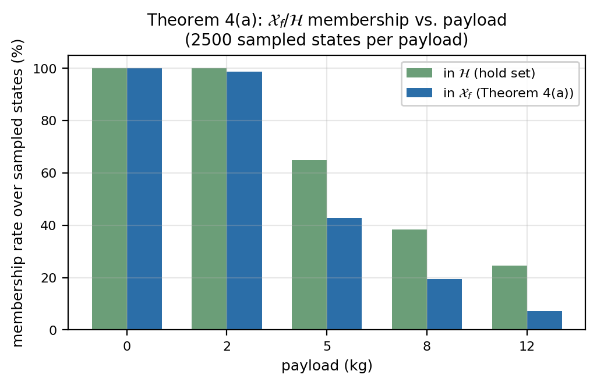

# Predictive Physical Realizability: A Unified Planning–Execution Feedback Architecture for Motion Planning

**Draft status:** Internal working draft, not submission-ready. Assembled from the source planning document and the companion research plan. Every open item flagged in those documents is preserved as an explicit, visible flag rather than silently resolved — see the accompanying `README.md` for the full tracked list before treating any claim here as final. Per the source document's own publication-sequencing note, substantive external submission should wait until `mp_main` (ICRA 2027) and HAE (IJSS) have decisions.

---

## Abstract

Motion planners — sampling-based, optimization-based, or fixed-structure time-domain planners — certify geometric and kinematic feasibility: that a path is collision-free and respects declared velocity/acceleration bounds. None of the widely deployed planning stacks certify *dynamic physical realizability*: whether the robot's actuators, given its current configuration, contact state, payload, and disturbance environment, can actually execute the planned motion as time progresses. Because actuator authority is state- and environment-dependent, a trajectory can be kinematically feasible and still drive one or more joints toward saturation in the near future. This paper introduces **predictive physical realizability**, a feedback signal that predicts future loss of actuator authority over a receding horizon and feeds it back into motion planning before the loss becomes an execution failure. We define a horizon-wide realizability certificate conditioned on predicted state, contact, payload, and disturbance information; a hierarchical planner response — retime, reshape, reroute, or safely brake — governed by whether local adaptation can restore feasibility along the current route; conditions under which a route-level change is provably necessary; and a terminal safe set on which the braking fallback is recursively feasible rather than heuristic, together with an explicit account of where that certification stops short of the executed closed loop. The architecture preserves the fixed-structure computational philosophy of the underlying local planner for certificate evaluation and Level 0–1 (retiming): state- and environment-dependent information enters through linear/vector terms rather than rebuilding the optimization structure online. This property does not currently extend to Level 2 (reshaping), whose QP is rebuilt from scratch each call and measured at a real, disclosed cost (§IX). We position the contribution against reference-governor theory, actuation-aware legged planning, and MoveIt 2's Hybrid Planning architecture, and propose a benchmark suite — reachable today on a fixed-base manipulator, with legged/humanoid extensions out of scope for this paper and left to future work — designed to isolate what predictive feedback adds over reactive saturation handling.

---

## I. Introduction

Robot motion planning is conventionally organized as a pipeline: a global or sampling-based planner searches for a geometrically valid path, a time-parameterization stage converts that path into a timed trajectory subject to declared velocity/acceleration bounds, and an execution layer tracks the result. This separation is effective when the robot's dynamic capability is state-independent, but it is not: the torque required to realize a given acceleration depends on configuration, velocity, active contacts, payload, interaction forces, and external disturbance, through

$$
\tau = M(q)\,u + C(q,\dot q)\,\dot q + g(q) + J_c^\top F_c + \tau_{\mathrm{ext}}.
$$

A trajectory that is geometrically and kinematically valid at planning time can therefore still drive an actuator toward saturation once contact, payload, or disturbance conditions change — a fact that current pipelines discover only when it happens, not before. We write this as

$$
\text{kinematically feasible} \;\not\Rightarrow\; \text{physically realizable}.
$$

**MoveIt 2 as the concrete anchor for this gap.** We do not treat this as a hypothetical failure mode. MoveIt 2's default pipeline — OMPL for geometric search, Time-Optimal Trajectory Generation (TOTG) as the default time-parameterization stage, with optional Ruckig jerk-limited smoothing — is exactly the path-first architecture this paper is positioned against. One directly verifiable, illustrative data point is documented in [moveit/moveit2#2600](https://github.com/moveit/moveit2/issues/2600) [1]: TOTG reconstructs an acceleration of roughly 200 rad/s² at a path inflection point against a declared limit of 0.2 rad/s². We cite this one issue because it is directly verifiable and reproducible, not because it establishes a general pathology in TOTG or MoveIt 2 as a whole — the issue's own reporter traces the specific failure to an unsupported edge case (a full 180° joint turn) and a default `path_tolerance=0.0` in the raw TOTG class that MoveIt's standard `RobotTrajectory` wrapper already avoids by setting a different default, and we state that qualification here rather than let the citation imply more than the source supports (see `README.md`, item 1). Two additional reports referenced in an earlier internal draft of this work could not be re-located on a follow-up search and are *not* cited here. Independently of any specific bug, MoveIt 2's own **Hybrid Planning** architecture already separates a slower global planner from a faster, recurrent local planner and explicitly supports event-driven, sensor-reactive replanning — a real, currently-unoccupied slot for exactly the kind of feedback this paper proposes, not a contrived integration target.

**Positioning relative to OMPL.** OMPL answers the question *does a collision-free path from start to goal exist?* This paper asks the strictly downstream question: *does a physically realizable trajectory exist along this path, given the robot's configuration, contact state, payload, and predicted environment?* OMPL is not a competitor at any point in this paper; it is the standard upstream global planner, and the contribution sits at the local-planner slot of MoveIt's own Hybrid Planning architecture, consuming OMPL's output rather than replacing it.

We do not claim that conventional planning pipelines are useless. We claim that their feasibility representation is incomplete, because actuator authority is a function of state and environment that the geometric/kinematic feasibility check does not see.

**Key research question.** *Can future loss of physical realizability be predicted during execution and fed back to motion planning early enough that the robot can adapt, reroute, or safely brake before insufficient actuator margin causes task failure, collision, or falling?* (The certificate predicts $m_{\mathrm{phys}} < m_{\mathrm{safe}}$ — a margin threshold, deliberately set to trigger well before actuator saturation — not "loss of control" in a stronger, dynamical-systems sense; this paper does not claim the latter and uses "actuator margin/authority" throughout to keep the distinction visible.)

### A. Contributions

1. **A problem formulation** that distinguishes geometric/kinematic feasibility from future actuator realizability, and defines the combined safe set $\mathcal{F}_{\mathrm{safe}} = \mathcal{F}_{\mathrm{kin}} \cap \mathcal{F}_{\mathrm{obs}} \cap \mathcal{F}_{\mathrm{dyn}}$ that existing pipelines do not jointly certify.
2. **A predictive realizability certificate** $m_{\mathrm{phys}}$, conditioned on predicted state, contact, payload, and disturbance information, that bounds actuator margin over a receding horizon without requiring the local planner's optimization structure to be rebuilt online.
3. **A hierarchical planning response** — execute, retime, reshape, reroute, or safely fall back — together with a checkable, sufficient condition (Theorem 3) for when the architecture's own implemented local-adaptation mechanism has been exhausted and route-level replanning is warranted, distinct from the (true but definitional) idealized statement that no modification of an infeasible route can ever be feasible.
4. **A terminal safe set for the fallback of last resort** (Theorem 4), characterizing exactly the states from which the architecture's braking level is recursively feasible — decided by a scalar the certificate already computes — together with the closed-loop result for the law that executes it (Theorem 5) and a measured account of the region where the two do not coincide (Proposition 6).
5. **A real-time architecture and benchmark design** targeting MoveIt 2's Hybrid Planning interface, with an experiment suite that isolates the contribution of prediction, adaptation, and rerouting individually via ablation.

We deliberately do *not* claim to be the first work to consider actuator limits in motion planning, to have invented margin-based feedback, or to guarantee safety under arbitrary disturbance — see §XI and *What This Paper Does Not Claim* below. The novelty we claim is narrower: a predictive feedback interface that converts future physical-realizability information from the execution layer into planner-level adaptation and route-level replanning, unified across geometric and physical failure modes under one hierarchical response.

---

## II. Related Work

**A. Motion planning and time parameterization.** Sampling-based planners such as OMPL certify geometric feasibility; time-parameterization methods (TOTG, TOPP-RA, Ruckig) subsequently fit a time law respecting declared kinematic bounds. These methods do not represent configuration-, contact-, or payload-dependent actuator authority as a planning-time signal. A documented MoveIt 2 issue, moveit/moveit2#2600 [1], illustrates that nominal time-parameterization limits do not by themselves guarantee the reconstructed trajectory satisfies the intended acceleration bounds — TOTG there reconstructs an acceleration roughly 1000$\times$ the declared limit at a path inflection point — though its own reporter traces the specific failure to an unsupported edge case (a full 180° joint turn) and a default `path_tolerance=0.0` that MoveIt's standard `RobotTrajectory` wrapper already avoids by setting a different default (see `README.md`, item 1); we do not present this as a general architectural pathology, only as one directly verifiable, illustrative data point.

**B. Reactive and hybrid motion planning.** MoveIt 2's Hybrid Planning architecture separates a slower global planner from a faster recurrent local planner and explicitly supports event-driven, sensor-reactive local adaptation, including to changing surface conditions. This paper's contribution is not the hybrid architecture itself, but a new feedback signal and local planning constraint that occupies that architecture's local-planner slot.

**C. Reference governors and safety filters.** Reference Governors and Explicit Reference Governors (Garone, Di Cairano, and Kolmanovsky, *Automatica* survey, 2017 [2]; origins in Bemporad, Casavola, and Mosca, 1997 [3]) predict a scalar margin to constraint violation — the Dynamic Safety Margin — and modulate a reference command to keep the closed loop inside a safe invariant set before violation occurs. This is conceptually the closest prior architecture to the margin-feedback idea at the center of this paper, and we do not claim novelty for "predict a margin and feed it back before a constraint is violated" as a general principle: that principle is three decades old. What is not addressed by the reference-governor literature, to our knowledge, is a margin specifically defined over actuator/torque authority, conditioned jointly on predicted contact, payload, and terrain information, coupled to a planner response that includes route-level replanning rather than only reference modulation within a fixed route.

A closely related recent architecture is the **Path Feasibility Governor** (PathFG; Zhang, Liu, and Liao-McPherson, arXiv:2507.09134, 2025 [4], read in full — see `README.md`, item 4), which places a governor between a path planner and a nonlinear MPC controller: given a path $p(s)$, $s \in [0,1]$, PathFG selects an auxiliary reference $s_k$ along the path — as far toward the target as a constructed invariant terminal set permits — using the *previous* cycle's optimal terminal predicted state as a cheap, one-dimensional proxy for the true (intractable) N-step backward reachable set, so the update is a bisection search over $s \in [0,1]$ rather than an online set computation. The high-level architecture is close to the one proposed here (§III–§V): both interpose a feasibility-filtering layer between a path/route planner and a lower-level controller. We differ in three ways. (i) The present work conditions the realizability certificate explicitly on predicted environment, contact, and payload information rather than the nominal path alone; PathFG's own text scopes disturbances out explicitly ("we focus on nominal MPC without explicitly considering disturbances for brevity"), deferring them to future pairing with a robust-MPC formulation, and has no payload, contact, or torque-margin concept in either its general theory or its worked quadrotor example. (ii) The present work defines an explicit taxonomy of geometric versus physical failure with a hierarchical, mechanism-differentiated response (§V); PathFG applies one uniform mechanism (auxiliary-reference selection) rather than a graduated retime/reshape/reroute/fallback response. (iii) The present work targets actuator/torque realizability specifically; PathFG's constraint sets $\mathcal{X}, \mathcal{U}$ are abstract polyhedra — thrust/rate bounds in its quadrotor example, but nothing in the general framework is torque-specific.

Two further points cut the other way and are stated here rather than left for a reviewer to find. First, PathFG proves what this paper's Theorem 1 explicitly does not: a *closed-loop* guarantee. Its Theorem 1 (recursive feasibility, by induction over invariant-set membership) and Theorem 2 (asymptotic stability, via an ISS lemma on the tracking error plus a finite-time-convergence argument bounding how long the auxiliary reference can stall) are complete, invariant-set-based proofs for the closed loop under the combined governor+MPC policy. This draft's own Theorem 1 is definitional over the *predicted* trajectory only and says so plainly ("it does not, by itself, say anything about closed-loop behavior once feedback, replanning, or an inaccurate $\Delta\tau_i$ are in play") — an honest asymmetry, not a minor stylistic gap, and one this paper does not yet close. Second, that rigor is bought by a real cost: PathFG's constructive terminal-set procedure (Riccati-based LQR terminal region, its Assumptions 4–6 and Lemma 3) is specific to linear or linearized systems, and its numerical validation (a quadrotor outer loop) is exactly such a linearized system — a natural fit for smooth continuous dynamics, but not a solved problem for a contact-mode-switching, actuator-margin-driven system where the feasible set's character changes across modes, which is closer to the regime this paper targets. This is offered as a reason the two papers take different technical routes (invariant sets vs. a direct per-step margin with an explicit uncertainty bound), not as a weakness unique to PathFG: both papers state their theory for a general nonlinear system and validate on a simplified instantiation of it (PathFG's linearized quadrotor; this draft's reduced-order planar arm, §IX), which is standard practice in this literature and worth naming as a shared limitation rather than implying it is peculiar to the present work's reduced-order study.

**D. Actuation-aware and dynamics-aware planning.** Prior work has incorporated torque limits, feasible wrench sets, and dynamic feasibility into trajectory optimization and legged locomotion planning. Retiming a nominal trajectory under predicted torque saturation is itself a mature sub-field; Eom, Suh, and Chung [7] give an early instance, using a disturbance observer at each joint to obtain a simple decoupled double-integrator model and modifying the Cartesian-space reference online whenever an actuator saturates — the same retime-on-saturation idea this paper treats as an established baseline mechanism (our Level 1, §V), not a contribution. A related task-space projection of joint-torque limits appears in Orsolino, Focchi, Mastalli, Dai, Caldwell, and Semini [8], who project actuation limits through the robot Jacobian into a six-dimensional Actuation Wrench Polytope in task space and intersect it with the Contact Wrench Cone, motivated explicitly by terrain complexity, though their own validation (HyQ CoM trajectories) does not isolate a non-flat-terrain case the way the companion Feasible Region paper [5] does with its pallet-crossing experiment; we cite [8] for the task-space-projection mechanism itself, not for a non-flat-terrain result. Both citations were identified via literature search rather than pulled and re-read in full the way [1], [4], [5], and [6] were (see `README.md`, item 8).

For legged systems specifically, two prior works are the closest neighbors and have now both been read in full (see `README.md`, item 4). Orsolino, Focchi, and colleagues' *Feasible Region* [5] computes a 2D convex set of CoM $(x,y)$ positions that are simultaneously friction- and actuation-consistent, via an Iterative Projection algorithm intersecting a friction (support) region with a new actuation region derived from per-limb joint-torque wrench polytopes, and uses it online (100–133 Hz) to select footholds and CoM targets that maximize the region's area, validated on the HyQ quadruped carrying a 10 kg payload over a 0.22 m pallet. This is, to our knowledge, the closest prior work to projecting joint-torque limits through contact configuration into an actuation-aware planning quantity, and the source of the environment-conditioning idea in §IV for legged platforms. Two differences are load-bearing rather than incidental. First, the feasible region is explicitly a **quasi-static, geometric** set-membership test, not a predictive signal over a horizon: the paper states plainly that the construction "is only valid when the velocity of the robot's base is zero," and lists a *dynamic* extension (via dynamic wrench polytopes and CoM-acceleration terms) as future work, not something the paper does. The present work's certificate is instead a scalar margin evaluated over a receding horizon of *predicted* future states, contact, payload, and disturbance — the temporal, predictive dimension is precisely what is absent from the feasible region as published. Second, the feasible region's use in planning is a single mechanism (select the CoM/foothold target that lies inside, or nearest to, the region) with no analog of a graduated response or a condition for when that single mechanism has been exhausted; this paper's Level 0–4 hierarchy and Theorem 3's exhaustion condition have no counterpart there.

Acosta and Posa's perceptive mixed-integer footstep control (MPFC) for underactuated bipedal walking on rough terrain (*IEEE Transactions on Robotics*, 2025) [6] is the closest legged/terrain-aware actuation work published in this paper's own target venue, now read and differentiated in full rather than left as an open item. MPFC is a mixed-integer QP, solved online at over 100 Hz (mean 2.2 ms, 99.9th-percentile 7.7 ms, on hardware) on a reduced-order Angular-momentum Linear Inverted Pendulum (ALIP) model, that jointly optimizes discrete foothold selection among perceived convex terrain polygons, continuous footstep position and timing, and a single ankle-torque input, paired with a real-time terrain-segmentation perception stack (Stable Steppability Segmentation) engineered specifically against the temporal "flickering" instability of explicit plane segmentation. Three differences, again load-bearing. First, MPFC's discrete-and-continuous decision variables are jointly re-solved *every cycle*; there is no cheaper local-adaptation-first mechanism tried before a more expensive discrete (foothold/route) change is considered, and no analog of a checkable condition for when local adaptation has been exhausted — the present work's Level 0–4 escalation and Theorem 3 have no counterpart in MPFC's architecture, which is a different and equally valid design point (pay the joint-optimization cost every cycle, rather than pay a cheaper certificate check most cycles and a route-level cost only when needed). Second, MPFC's torque handling is narrow and downstream: ankle torque is one decision variable inside the reduced-order footstep optimization, and broader whole-body joint-torque realizability is delegated entirely to a separate 1 kHz operational-space-control QP with hard bounds — nothing in MPFC plays the role of a predictive, uncertainty-bounded margin computed jointly across actuators and fed back into the higher-level planner's decision, which is this paper's certificate's specific job. Third, and most fundamentally, MPFC's contribution is concentrated on $\mathcal{F}_{\mathrm{kin}} \cap \mathcal{F}_{\mathrm{obs}}$ under discrete, perceived terrain — *where it is geometrically and kinematically safe to step* — solved extremely well and validated extensively on hardware; this paper's contribution is specifically $\mathcal{F}_{\mathrm{dyn}}$ — *whether the actuators can physically realize the motion once a location is chosen* — and MPFC does not represent that as a planning-time signal distinct from the ankle-torque decision variable itself. MPFC is also a systems/hardware paper with no formal theorem structure, which sharpens rather than undermines this paper's own (admittedly modest, §VI) theoretical contribution by comparison: there is no competing formal exhaustion or escalation condition to reconcile with.

**E. Position of this work.** No single piece of prior art we have located combines (i) a unified failure taxonomy spanning geometric and physical failure modes, (ii) a hierarchical adapt-then-reroute-then-fallback response with an explicit necessity condition for route-level change, and (iii) a certificate jointly conditioned on predicted contact, payload, terrain, and disturbance, all demonstrated on a fixed-base manipulator (§IX). Each individual mechanism, however, is independently well established, and our contribution claims are scoped accordingly (§I-A, and see *What This Paper Does Not Claim* below). We do not claim generality across legged or humanoid platforms: no legged/humanoid pipeline exists in this line of work, building one is architecturally distinct from the fixed-base manipulator work here (a floating-base, contact-scheduled dynamics model, not an extension of it), and this paper does not attempt it — §IV's environment-conditioning formulation is written generally enough to apply there, but that is a design intention, not a demonstrated result (§VIII-K).

---

## III. Problem Formulation

Let $x_k = (q_k, \dot q_k)$ be the robot state at discrete time $k$, and let $E_{k:k+N}$ denote predicted environment information over a horizon of length $N$ — terrain height and slope, expected contact locations and timing, friction, payload, and anticipated external disturbance or interaction force. A nominal motion planner $\mathcal{P}$ produces a candidate trajectory $u^{\mathrm{nom}}_{0:N-1}$ (and the induced state sequence $x_{0:N}$) that is certified against two feasibility sets already representable by existing pipelines:

$$
\mathcal{F}_{\mathrm{kin}}(x) \quad \text{(kinematic feasibility: velocity, acceleration, joint-limit bounds)},
$$
$$
\mathcal{F}_{\mathrm{obs}}(x, E) \quad \text{(collision/obstacle feasibility, given predicted environment } E\text{)}.
$$

We introduce a third set, not represented by conventional pipelines: $\mathcal{F}_{\mathrm{dyn}}(x, E)$, the set of states $x$ at which the actuator command required to realize the requested motion under $E$ lies within actuator limits.

The joint safe set the planner should certify is

$$
\mathcal{F}_{\mathrm{safe}} = \mathcal{F}_{\mathrm{kin}} \cap \mathcal{F}_{\mathrm{obs}} \cap \mathcal{F}_{\mathrm{dyn}}.
$$

Existing planning pipelines certify $\mathcal{F}_{\mathrm{kin}} \cap \mathcal{F}_{\mathrm{obs}}$ at planning time and discover violations of $\mathcal{F}_{\mathrm{dyn}}$ only at execution time, typically through actuator saturation, tracking-error growth, or, on a floating-base or legged platform, loss of balance. The central problem this paper addresses is: *under what conditions can $\mathcal{F}_{\mathrm{dyn}}$-membership be predicted ahead of execution, and how should the planner respond when prediction indicates future loss of membership?*

This paper's contribution and its evidence are both scoped to $\mathcal{F}_{\mathrm{dyn}}$ specifically, not to certifying $\mathcal{F}_{\mathrm{safe}}$ as a whole: the certificate, hierarchy, and theoretical results throughout are about physical (actuator) realizability, and the reduced-order verification in §IX runs with collision checking out of scope entirely (§IX-F). $\mathcal{F}_{\mathrm{obs}}$ is included in the joint safe-set definition above because a complete planner would need to certify it, and because MoveIt 2's OMPL layer already does — this paper does not repeat or extend that part, and reports $\mathcal{F}_{\mathrm{kin}} \cap \mathcal{F}_{\mathrm{dyn}}$-level evidence, not $\mathcal{F}_{\mathrm{safe}}$-level evidence. We use *physical realizability* for the actuator/torque/payload/contact concern this paper is actually about, and reserve *(overall) motion safety* for the full $\mathcal{F}_{\mathrm{kin}} \cap \mathcal{F}_{\mathrm{obs}} \cap \mathcal{F}_{\mathrm{dyn}}$ claim this paper does not make.

We assume bounded model uncertainty (bounded error between the dynamics model used for prediction and the true plant) and bounded external/contact-force prediction error over the horizon; both assumptions are stated explicitly wherever they are used and are not claimed to hold unconditionally (see the assumption-scoped statement of Theorem 1, §VI).

We also assume, throughout, that actuator margin is generally an asset to be preserved rather than a resource the task is meant to spend: $\mathcal{F}_{\mathrm{dyn}}$-membership is defined with a strictly positive safety threshold $m_{\mathrm{safe}}$, so a trajectory that intentionally operates at or near the actuator limit is treated identically to one that is about to lose control authority unintentionally — both register as $m_{\mathrm{phys}} < m_{\mathrm{safe}}$. This is a real scope boundary, not a detail: minimum-time trajectories under torque constraints are bang-bang almost everywhere by construction (classical time-optimal control results, e.g. Bobrow et al.; Pontryagin's maximum principle), so a genuinely time-optimal reference has near-zero or negative margin by design, and this architecture would retime it away from the optimum it was constructed to reach. §XI states this as an explicit non-claim.

---

## IV. Predictive Physical-Realizability Certificate

For the nominal predicted trajectory $\mathbf{x}_{0:N}, \mathbf{u}_{0:N}$, define the per-joint, per-horizon-step torque margin

$$
m_{\tau,i}(k+j) = \tau_{i,\max} - |\tau_i(k+j)|,
$$

and its uncertainty-tightened form, using a predicted torque estimate $\hat\tau_i$ and an explicit uncertainty bound $\Delta\tau_i$ that accounts for model mismatch and contact/disturbance prediction error,

$$
m_{\tau,i}^{\mathrm{robust}}(k+j) = \tau_{i,\max} - |\hat\tau_i(k+j)| - \Delta\tau_i(k+j).
$$

The aggregate horizon certificate — the single scalar we carry into the theoretical results of §VI — is

$$
m_{\mathrm{phys}}(k) = \min_{j=0,\dots,N} \; \min_i \; m_{\tau,i}^{\mathrm{robust}}(k+j).
$$

Three complementary signals are reported as experimental diagnostics rather than carried into the formal results, to keep the required proof burden proportional to a 3–4-contribution paper: directional authority $\alpha_{\mathrm{dir}}(k+j)$ (remaining control/acceleration authority in the direction the current task demands, useful for distinguishing "some margin remains, but not in the direction needed" from an aggregate scalar); time-to-loss $T_{\mathrm{loss}} = \min\{\,j\Delta t : m_{\mathrm{phys}}(k+j) \le 0\,\}$; and cumulative risk $J_{\mathrm{phys}} = \sum_j \phi(m_{\mathrm{phys}}(k+j))$ for a chosen penalty function $\phi$.

**Environment conditioning.** The certificate is a function of predicted environment and contact information as well as state:

$$
\big(E_{k:k+N},\, x_k,\, u^{\mathrm{nom}}_{k:k+N}\big) \;\longrightarrow\; \tau_{k:k+N} \;\longrightarrow\; m_{\mathrm{phys}}.
$$

This is the step that distinguishes the contribution from a torque-limit checker: a trajectory can be entirely collision-free and still fail $\mathcal{F}_{\mathrm{dyn}}$ because the *predicted* terrain, contact, or payload state along the route demands more torque than is available, i.e.

$$
\text{collision-free} \;\not\Rightarrow\; \text{physically realizable}.
$$

A representative (illustrative, not yet run — see `README.md`) instance: on flat ground a legged platform's ankle-torque margin is $m_{\mathrm{ankle}} = 0.42$; the same nominal footstep trajectory into a predicted shallow hole yields $m_{\mathrm{ankle}} = 0.05$; continuing the unmodified nominal trajectory would drive $m_{\mathrm{ankle}} < 0$ at the moment of contact. The certificate exposes this before the step is taken, giving the planner the opportunity to adjust footstep placement, timing, or center-of-mass trajectory rather than discovering the deficit at contact.

---

## V. Feedback Planning Architecture

### A. Failure taxonomy

We retain the geometric/topological failure signal from prior work in this line ($\sigma_1 \vee \sigma_2 \vee \sigma_3$: QP infeasibility, planner stagnation, and prediction/Jacobian linearization drift, respectively) and add a physical-realizability signal:

$$
\sigma_{\mathrm{geo}} = \sigma_1 \vee \sigma_2 \vee \sigma_3, \qquad \sigma_4 = \big[\, m_{\mathrm{phys}}(k+j) < m_{\mathrm{safe}} \text{ for some } j \in [0,N] \,\big].
$$

The two signals demand structurally different responses, and $\sigma_4$ must not be collapsed into the existing geometric-escape mechanism as though it were a fourth instance of the same trigger:

$$
\begin{aligned}
&\sigma_{\mathrm{geo}} \Rightarrow \textbf{change WHERE}, \\
&\sigma_4 \Rightarrow \textbf{change HOW first, change WHERE only if adaptation cannot restore feasibility.}
\end{aligned}
$$

The reason this distinction matters architecturally: a geometric escape mechanism retargets the route ($h_{\mathrm{esc}}$ in the underlying QP) while leaving the kinematic feasible set unchanged. This is the correct response to a topological trap, but it does nothing for $\sigma_4$: if $m_{\mathrm{phys}}$ has collapsed because the *current* route demands more torque than is available, retargeting within the same route's local neighborhood does not necessarily restore torque margin, and only retiming, reshaping, or a genuine route-level change can.

### B. Hierarchical response

- **Level 0 — Normal execution.** If $m_{\mathrm{phys}}(k) \ge m_{\mathrm{safe}}$, execute the nominal trajectory unmodified.
- **Level 1 — Retiming.** The route remains dynamically realizable, but the nominal timing over-demands the actuators: reparameterize $q(s) \to q(t_{\mathrm{new}})$ with reduced velocity/acceleration along the same geometric path. This mechanism is a mature baseline (§II-D), not a contribution of this paper.
- **Level 2 — Trajectory reshaping.** Modify the acceleration profile, center-of-mass motion, contact timing, or local target while remaining on the same route, to restore $m_{\mathrm{phys}} > 0$ without changing the route. The reshape problem is posed as a QP over per-step state variables $(q_j, \dot q_j, \ddot q_j)$, anchored at the true current state via double-integrator integration constraints (so the certificate evaluated over its output certifies a trajectory the system can actually be commanded to follow, not just an acceleration sequence in isolation), with objective
$$
w_a\sum_j\|\ddot q_j - \ddot q_j^{\mathrm{nom}}\|^2 + w_q\sum_j\|q_j - q_j^{\mathrm{nom}}\|^2 + w_{\dot q}\sum_j\|\dot q_j - \dot q_j^{\mathrm{nom}}\|^2,
$$
i.e. the closest dynamically-feasible trajectory to the one the planner originally intended, not the smallest-acceleration one — deliberately, since minimizing raw $\sum\|\ddot q\|^2$ has no reason to prefer a result close to the planner's original intent.
- **Level 3 — Rerouting/replanning.** If no route-level regeneration along the current route restores realizability — neither retiming nor reshaping, tried in that order (§IX-H) — the route itself must change: $p \to p'$. Theorem 3 (§VI) formally covers only the retiming-adaptation margin $m^\star_1(p) < m_{\mathrm{safe}}$ (a sufficient, checkable condition for the idealized $\mathcal{T}_{\mathrm{dyn}}(p) = \emptyset$); folding the implemented, empirically-verified reshape check into a formal, extended adaptation class $m^\star(p)$ is not yet done and is noted as such where it matters (§V-C, §IX-H).
- **Level 4 — Safe braking/fallback.** If no feasible continuation exists within the available reaction horizon, invoke a braking or terminal-safe-set policy. This level exists so the architecture does not implicitly assume every failure is solvable by further replanning. The braking reference is a maximum-deceleration ramp to rest followed by a hold, and the fallback is *sticky*: once engaged it holds position rather than resuming the original plan, since resuming would require a fresh route decision the architecture does not take automatically. Theorem 4 (§VI) constructs the terminal safe set $\mathcal{X}_f$ on which this level is recursively feasible — every state in $\mathcal{X}_f$ brakes to a configuration it can statically hold, within actuator limits throughout — and Theorem 5 covers the closed loop that executes it; §VI also states precisely where the two diverge and what remains uncertified.

### C. The Level 3 mechanism

Theorem 3 (§VI) answers *when* the architecture should stop attempting local adaptation and invoke Level 3, via the checkable condition $m^\star_1(p) < m_{\mathrm{safe}}$. This subsection specifies *what Level 3 then does*, states that mechanism's explicit objective precisely, and separates what is now closed from what remains genuinely open — rather than leaving the whole question flagged as a placeholder, which an earlier version of this section did.

**The implemented mechanism, stated precisely.** This codebase has no route generator and no geometric-escape mechanism of its own — `local_planner.py`'s own module docstring is explicit: "There is no route generator anywhere in this codebase." An earlier version of this section referred to invoking "the existing geometric-escape mechanism," which described prior work in this line ($\sigma_{\mathrm{geo}}$, §V-A), not anything Level 3 actually calls here; that phrasing is corrected below. What `plan_route` (§IX-H) implements is a constrained selection among caller-supplied candidate routes $\{p, p'\}$, with an explicit and checkable objective: for each candidate, try Level 1 (retime) then Level 2 (reshape) regeneration in turn, and return the first candidate — $p$ before $p'$ — whose resulting whole-route certificate satisfies $m_{\mathrm{phys}} \ge m_{\mathrm{safe}}$. This is direction (b) below, realized in its narrowest form: a physical-feasibility *constraint* on route selection, $m_{\mathrm{phys}}(P) \ge m_{\mathrm{safe}}$, evaluated over whichever finite candidate set the caller supplies — not a $\min_P J_{\mathrm{geometric}}(P)$ search over a generated candidate set, because no generator exists to search over. Experiments 5–7's $P_A/P_B$ pairs (§VIII-F/G/L) are constructed by hand to exercise exactly this selection, not discovered by the planner.

**What this closes and what remains open.** Direction (b) — giving $\sigma_4$-triggered rerouting an explicit objective distinct from a geometric-escape mechanism's — is now closed for the selection-among-supplied-candidates case; the objective above is exactly what the code enforces and it is a physical-feasibility constraint, not merely a preference, matching what was asked for. Direction (a) — showing that geometrically-motivated escape targets are more dynamically realizable than the original route under stated conditions — remains fully open and is not attempted: this codebase has no such general-purpose escape/route-generation mechanism to characterize, so the claim has no object to be proved about here. Whether a *general* route generator's outputs tend to satisfy $m_{\mathrm{phys}} \ge m_{\mathrm{safe}}$ is a materially different, harder question than the one closed above and is left to future work, not conflated with it.

**Folding Level 2 into the formal adaptation class $\mathcal{A}(p)$: attempted, and found not achievable yet at Theorem 3's own standard of rigor — not merely unimplemented.** The natural next step, given reshape is now tried at route-planning time (§IX-H), is to extend Theorem 3 from $\mathcal{A}_1(p)$ (retiming) to $\mathcal{A}(p) = \mathcal{A}_1(p) \cup \mathcal{A}_2(p)$ (retiming $\cup$ reshaping), with "the reshape QP is infeasible" as the checkable exhaustion condition for $\mathcal{A}_2(p)$. This does not yet meet the bar Theorem 3 itself was rewritten to meet (see §VI): the reshape QP (`_try_reshape`) linearizes torque as $\tau_j = M(Q_j)\,\ddot q_j + h(Q_j, \dot Q_j)$ with $M$ and $h$ evaluated at the *nominal* trajectory's $Q_j, \dot Q_j$ at each step, fixed, not at the optimization variables — a deliberate convexity-preserving approximation (§VI, "Computational structure"), reasonable when the reshaped trajectory stays close to nominal over one short online horizon, but not validated as an upper or lower bound on the true nonlinear reshape class's feasibility over a whole route. Consequently, "QP infeasible" is not currently known to imply "no trajectory in the true (nonlinear) reshape class restores $m_{\mathrm{phys}} \ge m_{\mathrm{safe}}$" — the linearization could in principle report infeasibility where a true nonlinear reshape would succeed, or vice versa — so stating $m^\star(p) < m_{\mathrm{safe}} \Leftrightarrow$ "$\mathcal{A}(p)$ exhausted" at Theorem 3's level of rigor would require either (i) a monotonicity- or bound-style argument relating the linearized QP's feasible set to the true nonlinear one, analogous to the retiming Lemma (§VI), or (ii) directly bounding the linearization error against the true dynamics over the route, neither of which is done. This is now a precisely scoped open item — what specifically must be shown, and why the current implementation does not already show it — rather than the previous general "no monotonicity-style hypothesis... has been stated or checked."

---

## VI. Theoretical Analysis

Throughout, we use $\xi_k$ generically for a tracking-error or deviation state where relevant to a specific result, and reuse the sets $\mathcal{F}_{\mathrm{kin}}$, $\mathcal{F}_{\mathrm{obs}}$, $\mathcal{F}_{\mathrm{dyn}}$, $\mathcal{F}_{\mathrm{safe}}$ from §III.

**Theorem 1 (Realizability certificate).** *Under bounded model uncertainty and bounded external/contact-force prediction error over the horizon, if $m_{\mathrm{phys}}(k+j) \ge 0$ for all $j \in [0, N]$, then the predicted nominal trajectory satisfies the actuator constraints over the horizon.*

*Proof strategy.* This is definitional once the assumptions are made explicit: $m_{\mathrm{phys}}(k+j) \ge 0$ means, by construction of $m_{\tau,i}^{\mathrm{robust}}$, that for every joint $i$ and every horizon step $j$, $\tau_{i,\max} - |\hat\tau_i(k+j)| - \Delta\tau_i(k+j) \ge 0$. If the true torque $\tau_i(k+j)$ satisfies $|\tau_i(k+j) - \hat\tau_i(k+j)| \le \Delta\tau_i(k+j)$ — the bounded-uncertainty assumption, restated as an explicit per-step guarantee rather than an unconditional claim — then $|\tau_i(k+j)| \le |\hat\tau_i(k+j)| + \Delta\tau_i(k+j) \le \tau_{i,\max}$ follows directly, for every joint and every horizon step, which is the statement that the actuator constraints hold over the horizon. The theorem is exactly as strong as the uncertainty bound $\Delta\tau_i$ used to construct it, and it certifies the constraint-inactive predicted trajectory *as predicted* — it does not, by itself, say anything about closed-loop behavior once feedback, replanning, or an inaccurate $\Delta\tau_i$ are in play; that is addressed separately by the assumptions attached to Theorems 2 and 3 and is not claimed here.

**Theorem 2 (Realizability-preserving adaptation).** *Suppose the nominal route admits at least one trajectory with $\mathcal{F}_{\mathrm{kin}} \cap \mathcal{F}_{\mathrm{obs}} \cap \mathcal{F}_{\mathrm{dyn}} \ne \emptyset$ (an explicit precondition). If the local adaptation problem (Level 1/2, §V-B) includes the predictive dynamic-feasibility constraint and is feasible, the resulting trajectory remains geometrically feasible while restoring actuator realizability, without necessarily changing the global route.*

*Proof strategy.* By the stated precondition, a nonempty target set exists within the current route's neighborhood. The Level 1/2 adaptation problem is posed as a constrained optimization over retiming/reshaping parameters subject to $\mathcal{F}_{\mathrm{kin}} \cap \mathcal{F}_{\mathrm{obs}} \cap \mathcal{F}_{\mathrm{dyn}}$ jointly, rather than $\mathcal{F}_{\mathrm{kin}} \cap \mathcal{F}_{\mathrm{obs}}$ alone as in a conventional retiming stage; if this constrained problem returns a feasible solution, that solution is a certificate of membership in the joint set by construction of the problem, and membership in $\mathcal{F}_{\mathrm{kin}} \cap \mathcal{F}_{\mathrm{obs}}$ in particular means the result is unchanged in its geometric route. The result is essentially an existence statement conditioned on solver feasibility, not a claim that the adaptation problem is always feasible when the precondition holds — the precondition guarantees *some* feasible trajectory exists along the route, not that the specific retiming/reshaping parameterization used by Level 1/2 is expressive enough to reach it. Closing that expressiveness gap for a specific parameterization is implementation-dependent and is addressed, for the retiming parameterization specifically, by Theorem 3 below.

**Theorem 3 (Sufficient, checkable condition for rerouting necessity).** *Let $p$ be a route and $\xi_0$ the nominal trajectory the local planner produces along it. For a retiming factor $\lambda$ in the allowed range $\Lambda = [1, \lambda_{\max}]$, let $\xi_\lambda$ denote $\xi_0$ time-reparameterized by $\lambda$ (Level 1, §V-B), and define the* retiming-adaptation class *$\mathcal{A}_1(p) = \{\xi_\lambda : \lambda \in \Lambda\}$ — the set of trajectories the architecture's pre-execution route decision actually searches before invoking Level 3 — and the* retiming-adaptation margin *$m^\star_1(p) = \sup_{\lambda \in \Lambda} m_{\mathrm{phys}}(\xi_\lambda)$, the aggregate horizon certificate (§IV) evaluated over the whole route under $\xi_\lambda$. Under the assumption that $\lambda \mapsto m_{\mathrm{phys}}(\xi_\lambda)$ is non-decreasing on $\Lambda$ (retiming monotonicity — stated as an explicit hypothesis, in the manner of Theorem 1's uncertainty bound, not derived from first principles for the general nonlinear case; see proof), if $m^\star_1(p) < m_{\mathrm{safe}}$, then no trajectory in $\mathcal{A}_1(p)$ restores the certificate, and retiming is genuinely exhausted, not merely assumed exhausted: escalation past Level 1 to the architecture's next adaptation mechanism is warranted. This theorem covers only the retiming class $\mathcal{A}_1(p)$; the implemented pre-execution decision (§V-C, §IX-H) tries Level 2 reshaping next and only escalates to Level 3 rerouting if reshaping also fails to restore the certificate — a claim this theorem does not itself formalize (see below and §V-C).*

*This is a sufficient, not necessary, condition for the idealized statement that $\mathcal{T}_{\mathrm{dyn}}(p) = \emptyset$ (the set of* all *dynamically realizable trajectories along $p$, of which the observation "$\mathcal{T}_{\mathrm{dyn}}(p) = \emptyset \Rightarrow$ no modification staying on $p$ is dynamically realizable" is immediate from the definition, and is not by itself a substantial claim — an earlier version of this theorem stated exactly that idealized observation and presented it as the main result, which is the "almost tautological" framing a T-RO reviewer would reasonably object to). Since $\mathcal{A}_1(p) \subseteq \mathcal{T}_{\mathrm{dyn}}(p)$ whenever any element of $\mathcal{A}_1(p)$ happens to be dynamically feasible, $m^\star_1(p) < m_{\mathrm{safe}}$ does not imply $\mathcal{T}_{\mathrm{dyn}}(p) = \emptyset$: a dynamically realizable trajectory along $p$ may exist outside $\mathcal{A}_1(p)$, reachable only through a richer adaptation mechanism the current pre-execution decision does not attempt — most directly, Level 2 reshaping, which is available online (§V-B) but not yet folded into this route-level check. Closing that gap by defining a joint retiming-and-reshaping class $\mathcal{A}(p) \supseteq \mathcal{A}_1(p)$ is identified as a concrete next step, not yet implemented (§V-C, `README.md`).*

*Proof.* Under the monotonicity assumption, $\sup_{\lambda \in \Lambda} m_{\mathrm{phys}}(\xi_\lambda) = m_{\mathrm{phys}}(\xi_{\lambda_{\max}})$, so $m^\star_1(p) < m_{\mathrm{safe}}$ is equivalent to $m_{\mathrm{phys}}(\xi_{\lambda_{\max}}) < m_{\mathrm{safe}}$, checkable with a single evaluation at the boundary of $\Lambda$ (in the implementation, a bisection search over $\Lambda$ that only needs to rule out $\lambda_{\max}$ to certify infeasibility of the whole class). Monotonicity itself is not proven for the fully general nonlinear case: under uniform time-dilation by $\lambda$, velocity and acceleration along the path scale as $1/\lambda$ and $1/\lambda^2$, so the torque contributions from the mass-matrix and Coriolis/centrifugal terms shrink in magnitude as $\lambda$ grows, while the gravity and any velocity-independent external-force contribution are unchanged by $\lambda$ — under this structure, slowing down cannot increase the magnitude of a torque contribution that shares gravity's sign, but the Lemma below states precisely when the assumption can fail, rather than leaving it as an unquantified hedge. Given the assumption, $m_{\mathrm{phys}}(\xi_\lambda) \le m_{\mathrm{phys}}(\xi_{\lambda_{\max}}) < m_{\mathrm{safe}}$ for every $\lambda \in \Lambda$, i.e. no element of $\mathcal{A}_1(p)$ restores the certificate, which is exactly the condition under which the implemented pre-execution decision correctly escalates past retiming, to reshaping and then rerouting if reshaping too proves insufficient. $\blacksquare$

**Lemma (per-joint sign condition for retiming monotonicity).** *Fix a route $p$ and a path fraction $s$, and let $\tau_i(\lambda)$ be the joint-$i$ torque required at that fraction under $\xi_\lambda$. By the manipulator equation, for a possibly position-dependent (not wall-clock-dependent — see below) external force $F_{\mathrm{ext}}(q)$,*
$$
\tau_i(\lambda) = \frac{A_i}{\lambda^2} + B_i, \qquad A_i \equiv M_i(q)\,\ddot q_0(s) + C_i(q,\dot q_0(s))\,\dot q_0(s), \qquad B_i \equiv g_i(q) + J_i(q)^\top F_{\mathrm{ext}}(q),
$$
*where $A_i$ (the inertial and Coriolis/centrifugal contribution, evaluated once at $\lambda=1$'s velocity/acceleration at this path fraction) scales as $1/\lambda^2$ under uniform time-dilation — since $\dot q_\lambda = \dot q_0/\lambda$, $\ddot q_\lambda = \ddot q_0/\lambda^2$, and $C(q,\dot q)\dot q$ is bilinear in $\dot q$ — while $B_i$ (gravity plus the velocity-independent external-force contribution) is unchanged by $\lambda$. If, for every joint $i$ and every horizon/route step evaluated, either $A_i = 0$ or $\mathrm{sign}(A_i) = \mathrm{sign}(B_i)$, then $\lambda \mapsto m_{\mathrm{phys}}(\xi_\lambda)$ is monotonically non-decreasing on $\Lambda$, and Theorem 3's boundary-only check correctly computes $m^\star_1(p) = m_{\mathrm{phys}}(\xi_{\lambda_{\max}})$.*

*Proof.* When $\mathrm{sign}(A_i) = \mathrm{sign}(B_i)$ (or $A_i = 0$), $|\tau_i(\lambda)| = |A_i|/\lambda^2 + |B_i|$ is strictly decreasing in $\lambda$ for $A_i \ne 0$ and constant for $A_i = 0$, so the per-joint, per-step margin $m_{\tau,i}(\lambda) = \tau_{i,\max} - |\tau_i(\lambda)| - \Delta\tau_i$ is non-decreasing on $\Lambda$. The aggregate $m_{\mathrm{phys}}(\xi_\lambda) = \min_{i,\text{step}} m_{\tau,i}(\lambda)$ is a minimum of a finite collection of such functions, hence itself non-decreasing on $\Lambda$. $\blacksquare$

**When the condition fails, and why it is not a corner case.** If instead $\mathrm{sign}(A_i) \ne \mathrm{sign}(B_i)$ at some binding joint — the inertial/Coriolis torque *partially unloads* the gravity/external-force torque, e.g. decelerating through the second half of a downward swing, or a Coriolis coupling from another joint's motion that happens to counteract gravity at that configuration — then $\tau_i(\lambda)$ crosses zero at $\lambda_i^\star = \sqrt{-A_i/B_i}$ (when real and in $\Lambda$), and $m_{\tau,i}(\lambda)$ has an *interior* maximum at $\lambda_i^\star$ rather than at $\lambda_{\max}$: the boundary-only check can then report $m^\star_1(p) < m_{\mathrm{safe}}$ (retiming "exhausted") when an interior $\lambda$ would in fact have cleared $m_{\mathrm{safe}}$. A random search over 3000 scenarios on this platform's implementation (§IX) found this failure mode in 23 cases (~0.8%) — e.g. one instance with $m_{\mathrm{phys}}(\lambda_{\max}) = 1.66 < m_{\mathrm{safe}} = 2.0$ while $m_{\mathrm{phys}}(1.55) = 2.86$ — confirming the condition fails often enough to matter, not merely in principle. The Lemma's condition is checkable at negligible marginal cost, since $A_i$ and $B_i$ are already recoverable from one extra zero-velocity/zero-acceleration inverse-dynamics evaluation at the same configuration used for $\tau_i(1)$ ($B_i$ directly, $A_i = \tau_i(1) - B_i$). Two different questions must not be conflated here, and a later check found them to have very different answers. The 23/3000 figure just above measures how often the sign condition's *violation actually flips the boundary-only check's final verdict* (retiming wrongly declared exhausted). A separate, later check measured a different, stricter quantity — how often the raw per-$(joint,step)$ sign condition holds *everywhere along the whole route* — and found it holds almost nowhere (0/3000 in a broad random sweep, and even the genuinely-monotonic-in-aggregate flagship scenario of §IX-B violates it at 65/138 individual (joint, step) pairs). The reason: the derivation above assumes the idealized, frictionless manipulator equation, and this benchmark's actual dynamics (`models/planar3r.xml`) include real per-joint viscous damping the idealized equation cannot represent: under retiming, a linear damping torque scales as $1/\lambda$, not $1/\lambda^2$, a term the two-term decomposition above has no place for. A local sign violation at a non-binding $(joint,step)$ has no effect on the aggregate, which is exactly why the two figures differ so sharply and both can be true at once. Consequently, the implementation no longer uses this specific sign condition as an operational fast-path gate; it checks $\lambda_{\max}$ directly instead (cheap, exact, no assumption), and only falls through to a candidate search when that check fails.

**The exact, closed-form alternative to the dense scan is now implemented**, in an extended form beyond what is derived above: since the true, damping-inclusive torque model is $\tau_i(\lambda) = A_i x^2 + D_i x + B_i$ with $x = 1/\lambda$ — an exact quadratic in $x$, confirmed directly (zeroing the model's damping makes the two-term $A_i/\lambda^2+B_i$ form match the simulator's true torque to numerical precision at every $\lambda$ tested; with damping present, it is off by several percent, growing with $\lambda$) — the implementation fits $A_i, D_i, B_i$ from three inverse-dynamics evaluations at scaled velocity/acceleration rather than assuming a specific passive-force law, closing the residual to $\sim$ 0.02 Nm (consistent with the smaller, non-quadratic Coulomb friction term no closed polynomial captures exactly), and evaluates the finite candidate set $\{1, \lambda_{\max}\} \cup \{\text{zero-crossings and vertex of each } (i,\text{step})\text{'s quadratic}\}$ directly, exactly as this Lemma's discussion originally proposed doing with the simpler two-term form. Honestly reported, not merely claimed: this closed-form set alone sufficed in only 21/1084 (1.9\%) of a 3000-scenario random sweep's cases requiring a search beyond $\lambda_{\max}$ — essentially unchanged from a non-damping-aware version of the same idea, because the bottleneck is structural, not a curve-accuracy problem: the supremum of the *aggregate* $m_{\mathrm{phys}}(\lambda) = \min$ over dozens of per-(joint, step) curves along a whole route can occur at a pairwise crossing between two different curves, not at either curve's own extremum, and no per-curve closed form resolves that. A dense-grid safety net (unchanged from the version above) is therefore retained and is confirmed load-bearing in practice, not merely in principle: two cases in the same sweep had the closed-form set miss a feasible $\lambda$ that a finer grid found, and the retained safety net recovered both. Full numbers and methodology: `code/README.md`.

This is empirically consistent with the one negative case already tested for it (§IX): a pure static (gravity-only) torque deficit, where the velocity/acceleration-driven contribution is zero throughout ($A_i \equiv 0$ for every joint, the case the Lemma's condition holds trivially) and retiming provably cannot help regardless of $\lambda$, correctly causes $m^\star_1(p) < m_{\mathrm{safe}}$ and a fall-through past Level 1 — not a proof that monotonicity holds in general, but a case where the Lemma's own justification is exact rather than approximate. Both results actually cited in this paper (§IX-B's flagship scenario and §IX-G's Experiment 7) were checked directly against the Lemma's sign condition rather than assumed: the flagship scenario is genuinely monotonic throughout (verified by dense scan), and Experiment 7 is technically non-monotonic but the interior deviation ($\sim 0.5$) is negligible against how far below $m_{\mathrm{safe}}$ it stays throughout ($\sim -20$) — neither reported conclusion changes. A related, separate subtlety worth stating explicitly: retiming $\xi_0$ to $\xi_\lambda$ changes which predicted environment sample $E(k+j)$ a given configuration is paired with whenever $E$ is genuinely a function of wall-clock time, $E = E(t)$ (an independently time-driven disturbance, unaffected by how fast the robot moves through it) rather than a function of configuration or path progress, $E = E(q)$ (e.g. a terrain/contact feature encountered at a specific point along the route, however long that takes to reach) — the case the Lemma above is scoped to. For $E(q)$-type environments, retiming leaves the configuration-to-environment pairing unchanged and $m^\star_1(p)$ is evaluated consistently; for $E(t)$-type environments, slowing down changes which $E(k+j)$ a given point on the route encounters, so $m^\star_1(p)$ implicitly assumes the SAME predicted $E(t)$ schedule applies regardless of $\lambda$ — correct only if the environment prediction is itself re-sampled at the retimed schedule, which this architecture does (the implementation's force/environment interface takes $(t, q)$ jointly and is re-sampled at every $\lambda$ tested, so this is handled correctly in the current implementation) but is not yet stated as a distinct case in the theorem itself.

**Theorem 4 and the Level-4 terminal safe set: attempted, and resolved in two parts.** An earlier version of this section deferred Theorem 4 entirely — "not proved, not disproved, not attempted" — with the decision rule inherited from the source planning document: attempt it only if the required assumptions can be established without becoming so restrictive as to be vacuous for the platforms in §VIII, and otherwise omit it and present Level 4 as an engineered fallback. It has now been attempted, and the decision rule has an answer with two parts rather than one, because the object the certificate evaluates and the object the architecture executes turn out not to be the same trajectory. Both parts are stated below; the second is the one that carries the vacuity risk the decision rule was written to guard against, and it is reported with its measured boundary rather than asserted.

**Setup and assumptions.** Write the Level-4 braking reference generator of §V-B as a map $\mathcal{B}$ from a state $x = (q,\dot q)$ to an $N$-step reference $(Q_j, \dot Q_j, \ddot Q_j)_{j=0}^{N-1}$, produced by the time-invariant recursion $x_{j+1} = f(x_j)$ with

$$
\ddot Q_j = -\mathrm{clip}\!\big(\dot Q_j/\Delta t,\; \pm \ddot q_{\max}\big), \qquad
\dot Q_{j+1} = \dot Q_j + \ddot Q_j \Delta t, \qquad
Q_{j+1} = Q_j + \dot Q_j \Delta t + \tfrac12 \ddot Q_j \Delta t^2,
$$

the componentwise clip and a sign-change clamp on $\dot Q_{j+1}$ being exactly what the implementation applies (`local_planner._brake_profile`). Three assumptions are used, each stated where it is load-bearing rather than assumed globally:

- **(A1) Configuration-dependent environment.** Along the fallback, the external/contact force is a function of configuration, $F_{\mathrm{ext}} = F(q)$, not of wall-clock time — the same $E(q)$-versus-$E(t)$ distinction the retiming Lemma above is scoped to, and load-bearing here for the same reason.
- **(A2) Uncertainty bound.** Theorem 1's per-step bound $|\tau_i - \hat\tau_i| \le \Delta\tau_i$ holds along the braking motion.
- **(A3) Nominal execution.** The plant realizes the emitted reference. This assumption is what Theorem 5 below removes, and removing it is not a formality.

Define the **hold torque** $\eta_i(q) = |g_i(q) - (J(q)^\top F(q))_i|$ — the torque joint $i$ must supply to stand still at $q$ — the **hold set**

$$
\mathcal{H} \;=\; \{\, q \;:\; \eta_i(q) + \Delta\tau_i \le \tau_{i,\max} \ \ \forall i \,\},
$$

and the **brake-certified set**

$$
\mathcal{X}_f \;=\; \big\{\, x \;:\; r(x) \le N-1 \ \text{ and } \ m_{\mathrm{phys}}\big(\mathcal{B}(x)\big) \ge 0 \,\big\},
$$

where $r(x)$ is the step at which the profile reaches rest and $m_{\mathrm{phys}}(\mathcal{B}(x))$ is the §IV certificate evaluated over the brake profile itself.

**Lemma (structure of the brake recursion).** *(i) $\mathcal{B}$ is generated by a time-invariant state recursion, so $\mathcal{B}(x)_j = f^j(x)$ and $\mathcal{B}(f(x))_j = \mathcal{B}(x)_{j+1}$: the profile from the successor state is the exact one-step shift of the profile from $x$, with one new step appended. (ii) $\|\dot Q_j\|_\infty$ is non-increasing and reaches zero at $r(x) = \max_i \lceil |\dot q_i| / (\ddot q_{\max}\Delta t) \rceil$, so $r(x) \le N-1$ if and only if $\|\dot q\|_\infty \le (N-1)\,\ddot q_{\max}\Delta t$. (iii) Rest states are fixed points: $f(q,0) = (q,0)$, with $\ddot Q = 0$.*

*Proof.* (i) is immediate from the recursion's lack of any explicit $j$-dependence. For (ii), per joint: if $|\dot Q_{j,i}| \le \ddot q_{\max}\Delta t$ then $\ddot Q_{j,i} = -\dot Q_{j,i}/\Delta t$ and $\dot Q_{j+1,i} = 0$ exactly; otherwise $|\dot Q_{j+1,i}| = |\dot Q_{j,i}| - \ddot q_{\max}\Delta t$, and the sign-change clamp prevents overshoot at the boundary — induction gives the step count, and the maximum over joints gives $r(x)$. (iii) At $\dot Q_j = 0$ the clip returns $\ddot Q_j = 0$, so $\dot Q_{j+1} = 0$ and $Q_{j+1} = Q_j$. $\blacksquare$

All three parts are exact rather than approximate, and all three were checked directly against the implementation, not just derived: the shift property in (i) reproduces to $0.000$ (bit-identical, as a deterministic recursion must) over 1000 random states, and (ii)'s closed form and (iii)'s fixed-point property have $0$ mismatches over 3000 states each (`code/experiments/theorem4_terminal_set.py`, part A). On this platform ($N=15$, $\Delta t = 0.02$s, $\ddot q_{\max} = 8$ rad/s²) the completion condition is $\|\dot q\|_\infty \le 2.24$ rad/s.

**Theorem 4 (Recursive feasibility of the Level-4 fallback, reference level).** *Under (A1)–(A3): (i) $\mathcal{X}_f$ is positively invariant under the braking recursion, $x \in \mathcal{X}_f \Rightarrow f(x) \in \mathcal{X}_f$; (ii) the actuator constraints are satisfied at every step of the resulting motion; (iii) the motion reaches rest in at most $(N-1)\Delta t$ seconds at a configuration $q_\infty(x) \in \mathcal{H}$, and $\mathcal{H} \times \{0\} \subseteq \mathcal{X}_f$ is itself invariant. Membership in $\mathcal{X}_f$ is decided by one evaluation of the §IV certificate over the brake profile.*

*Proof.* (i) Let $x \in \mathcal{X}_f$. By the brake Lemma (ii), $r(f(x)) \le \max(r(x)-1, 0) \le N-2$, so $f(x)$ satisfies the completion condition. By the brake Lemma (i), steps $0,\dots,N-2$ of $\mathcal{B}(f(x))$ are steps $1,\dots,N-1$ of $\mathcal{B}(x)$, each of which has non-negative margin because $x \in \mathcal{X}_f$. The one genuinely new step is the last, $f^{N}(x)$. Since $r(x) \le N-1$, the brake Lemma (iii) gives $f^{N-1}(x) = f^{N}(x) = (q_\infty(x), 0)$ with $\ddot Q = 0$ at both — the same configuration, the same (zero) velocity and acceleration, and, by (A1), the same external force sample, hence the same required torque and the same margin, which is non-negative. So every step of $\mathcal{B}(f(x))$ has non-negative margin and $f(x) \in \mathcal{X}_f$. (ii) is Theorem 1 applied at each step, using (A2). (iii) At $j \ge r(x)$ the state is $(q_\infty(x), 0)$ with zero acceleration, so the required torque is $g_i(q_\infty) - (J^\top F(q_\infty))_i$ and non-negative margin at that step is exactly the statement $q_\infty(x) \in \mathcal{H}$; a rest state in $\mathcal{H}$ has $r = 0$ and a constant brake profile of certified hold steps, so it lies in $\mathcal{X}_f$ and is a fixed point of $f$. $\blacksquare$

Two hypotheses are doing real work in that proof rather than decorating it, and both fail in identifiable, non-exotic circumstances. The completion condition $r(x) \le N-1$ is what makes the appended step a repeat of an already-certified one; at $r(x) = N$ the new step is genuinely unevaluated and the argument breaks — and this is not a corner case, since the test suite's own high-velocity brake case ($\|\dot q\|_\infty = 3.18$ rad/s, against the 2.24 rad/s bound) is exactly such a state and does *not* reach rest within the horizon. Assumption (A1) is what makes the repeated configuration carry the same force sample; under an $E(t)$-type disturbance the appended step sees a force the certificate never checked, and Theorem 4 does not cover it. Both are the same two caveats the retiming Lemma above already isolates, arriving here through a different route.

**What this buys the implementation, concretely.** The membership test $m_{\mathrm{phys}}(\mathcal{B}(x)) \ge 0$ is not a new computation: `local_planner.online_step` already evaluates the certificate over the brake profile on every Level-4 cycle, and currently returns it as a diagnostic without acting on it. Theorem 4 identifies that discarded scalar as the exact decision variable separating a certified fallback from an uncertified one, at zero marginal cost.

**Theorem 5 (The executed Level-4 law: exponential braking and a torque bound).** *The fallback as executed (§V-B, sticky) commands the reference $(q, 0, 0)$ at the measured configuration $q$, which under the shared computed-torque controller of §IX-A reduces to*
$$
\tau \;=\; g(q) - J(q)^\top F(q) \;-\; K_d\, M(q)\, \dot q .
$$
*Assume the gravity/force compensation is exact in the prediction model and no actuator saturates. Then $V(q,\dot q) = \tfrac12 \dot q^\top M(q) \dot q$ satisfies $\dot V \le -2K_d V$, so $V(t) \le V(0)e^{-2K_d t}$; the coasting displacement obeys $\|q(t) - q(0)\|_2 \le \rho(V_0) := \sqrt{2V_0/\underline\lambda}\,/\,K_d$ with $\underline\lambda$ a lower bound on $\lambda_{\min}(M)$ over the coasting region and $\mathcal{N}(q,\rho)$ the ball of radius $\rho$ about $q$; and the commanded torque obeys $|\tau_i| \le \eta_i(q) + K_d\sqrt{2 M_{ii}(q)\,V}$. Consequently the set*
$$
\begin{aligned}
\mathcal{X}_f^{\mathrm{exec}}(V_0) \;=\; \Big\{ (q,\dot q) \;:\;\; & V(q,\dot q) \le V_0, \ \text{ and, for every joint } i, \\[2pt]
& \sup_{q' \in \mathcal{N}(q,\rho(V_0))} \Big[\eta_i(q') + K_d\sqrt{2 V_0\, M_{ii}(q')}\Big] + \Delta\tau_i \;\le\; \tau_{i,\max} \Big\}
\end{aligned}
$$
*is positively invariant and saturation-free under the executed law.*

*Proof.* With $q^{\mathrm{ref}} = q$ the position-error term vanishes and the velocity-error term contributes $-K_d\dot q$ in acceleration units, giving the stated $\tau$. Substituting into the plant $M\ddot q + C\dot q + g + D\dot q + f_c - J^\top F = \tau$, the compensated terms cancel and $M\ddot q + C\dot q + D\dot q + f_c = -K_d M\dot q$. Then $\dot V = \dot q^\top M\ddot q + \tfrac12 \dot q^\top \dot M \dot q = -2K_d V + \tfrac12 \dot q^\top(\dot M - 2C)\dot q - \dot q^\top D\dot q - \dot q^\top f_c$. The middle term vanishes by the standard skew-symmetry of $\dot M - 2C$ for the Christoffel-symbol $C$; $\dot q^\top D \dot q \ge 0$ for positive-semidefinite viscous damping $D$; and $\dot q^\top f_c \ge 0$ for Coulomb friction $f_c = \mu\,\mathrm{sign}(\dot q)$, both dissipative. Hence $\dot V \le -2K_dV$. The displacement bound follows from $\|\dot q\|_2 \le \sqrt{2V/\underline\lambda}$ and integrating the exponential. The torque bound follows from $|(M\dot q)_i| = |e_i^\top M \dot q| \le (e_i^\top M e_i)^{1/2}(\dot q^\top M \dot q)^{1/2} = \sqrt{M_{ii}}\sqrt{2V}$, Cauchy–Schwarz in the $M$-inner product. Invariance: while the state is in the set no actuator saturates, so the decay holds, so $V$ never exceeds $V_0$ and $q$ never leaves the ball $\mathcal{N}(q,\rho(V_0))$ — the two conditions defining membership. $\blacksquare$

Unlike Theorem 4, this is a continuous-time argument applied to a 50 Hz discrete implementation, and it assumes exact compensation in the prediction model rather than folding model mismatch into $\Delta\tau_i$; both gaps are checked numerically rather than waved through. Over 300 discrete MuJoCo rollouts from states in $\mathcal{X}_f^{\mathrm{exec}}$, spanning payloads $0$–$12$ kg: $V$ was monotonically non-increasing in every rollout, the realized $|\tau_i|/\tau_{i,\max}$ peaked at $0.34$–$0.89$ (no saturation), the measured decay rate was $1.36$–$1.44\times$ the guaranteed $2K_d$ (i.e. the guarantee is a true lower bound, as the dissipative terms dropped from the bound imply), and realized travel was $0.33$–$0.57$ of the displacement bound.

**Proposition 6 (What these sets contain on the benchmark platform, and the gap between them).** Sizes are reported as the fraction of uniformly sampled configurations in $[-\pi,\pi]^3$ (and, for $\mathcal{X}_f$, velocities uniform in the brakable box) that each set admits, at end-effector payloads $0/2/5/8/12$ kg:

- $\mathcal{H}$ (statically holdable): $100/100/64.8/38.3/24.6\%$. $\mathcal{X}_f$ (Theorem 4): $100/98.8/42.9/19.4/7.3\%$. Neither is vacuous and neither is trivial — the sets shrink with payload exactly as the physics requires, and the residual at 12 kg is a real region, not a numerical artifact.
- **Recursive feasibility itself held in every test**: $0$ invariance violations across $6{,}708$ successor tests spanning all five payloads. This is what the proof predicts, and the check is worth reporting precisely because the proof is exact rather than probabilistic — a single violation would have indicated a mismatch between the theorem's $\mathcal{B}$ and the implementation's.
- $\mathcal{X}_f^{\mathrm{exec}}$ (Theorem 5) is conservative but not vacuous at any payload: at braking energy $V_0 = 0.02$ J it admits $100/100/45.7/25.8/13.2\%$, at $V_0 = 0.10$ J it admits $100/100/25.0/5.3/0.5\%$, and by $V_0 = 1.0$ J it is empty above 0 kg. The certified region therefore exists everywhere on this platform but shrinks with braking energy roughly as the $\sqrt{V_0}$ term in the membership condition predicts. This is the honest answer to the decision rule quoted at the start of this discussion: the executed-level guarantee is *not* vacuous, but it is restrictive enough that it certifies low-energy stops, not arbitrary ones.
- **The gap between the two is large and is the substantive finding.** $\mathcal{X}_f$ is *not* a sufficient condition for the executed policy to stay within limits: simulating the executed law from states in $\mathcal{X}_f$, the commanded torque saturated in $0/36/57/85/94$ of 150 rollouts at $0/2/5/8/12$ kg. The reason is structural, not incidental: the certified profile decelerates at $\ddot q_{\max} = 8$ rad/s², while the executed law decelerates at $K_d\|\dot q\|$, up to $44.8$ rad/s² at the brakable-velocity bound — the certificate is checking a gentler brake than the one the architecture actually performs. A cheap pointwise surrogate (the same torque condition evaluated only at the engagement state, one extra matrix-vector product) closes most but not all of the gap, still saturating in $0/0/3/3/4$ rollouts, because the hold torque $\eta_i$ grows as the arm coasts into a more demanding configuration — which is precisely why Theorem 5's supremum over the coasting ball is load-bearing rather than slack conservatism.
- **Cross-check against the suite's own Level-4 engagement.** The single Level-4 engagement the §IX experiments actually produce (Experiment 6 at 8 kg) engages at rest, $\|\dot q\|_\infty = 0$, with brake-profile certificate $m = 7.90$ N·m and $q_\infty \in \mathcal{H}$ — inside $\mathcal{X}_f$, and inside $\mathcal{X}_f^{\mathrm{exec}}$ trivially since $V_0 = 0$. Realized peak $|\tau|/\tau_{\max}$ over the whole rollout is $0.618$, no saturation. So the one fallback this paper actually reports is a certified one, and §IX-D's observation that Level 4 there buys safety at the cost of task completion is now a certified safety claim rather than an observed outcome.



Full numbers, methodology, and the random seeds that reproduce every figure above: `code/experiments/theorem4_terminal_set.py`.

**Where this leaves Level 4, stated as a scope boundary rather than a result.** Theorem 4 answers the question the deferred item posed — a terminal safe set with the recursive-feasibility property $x_k \in \mathcal{X}_f \Rightarrow x_{k+1} \in \mathcal{X}_f$ exists, is exactly characterized, is non-vacuous on the benchmark platform, and is decided by a scalar the implementation already computes. It answers it for the braking *reference*, under nominal execution. Theorem 5 covers the executed law, and does so soundly, but only over a conservative low-energy region. What is *not* established, and is not claimed: a robust invariance result that tolerates the tracking error of an arbitrary closed loop, which is what would let Level 4 be called formally certified without qualification at every state where it fires. The concrete candidate fix — making the executed policy track the certified profile rather than commanding an instantaneous hold, so that Theorem 4's object and the executed object coincide — was implemented and tested on the same states, and helps substantially without resolving the gap: saturations fall from $0/36/57/85/94$ to $0/0/2/4/15$ of 150 rollouts at $0/2/5/8/12$ kg, but do not reach zero, and at 12 kg the closed loop diverges outright, because the profile's fixed $\ddot q_{\max}$ deceleration is not itself achievable at that payload and the resulting tracking error compounds. Reconciling the two — most plausibly by making the brake profile's deceleration a certified, payload-aware quantity rather than a fixed kinematic constant — is a specific, named open problem (§XI), not a gap this paper closes.

**Computational structure.** A property we carry over unchanged from the underlying fixed-structure local planner, scoped explicitly to the certificate evaluation and Level 0–1: the prediction matrices and QP Hessian ($H, \Phi, \Gamma, C_{\mathrm{kin}}$) remain fixed online; state- and environment-dependent information enters only through vector terms ($h(x,E)$, $d(x,E)$, margin vectors), the same mechanism already used for obstacle rows. Adaptive numerical values are not the same as an adaptive solver structure, and preserving this distinction is what keeps that part of the architecture real-time-capable as more predictive signals are added (§VII). This property is explicitly NOT claimed for Level 2 (reshaping): its QP has no analogous fixed, reusable structure in the current implementation, is rebuilt from scratch every call, and §IX-E/H measures the resulting real-time cost directly rather than assuming it away — a parametrized/warm-started reformulation is the natural fix but is not yet built (§IX-E). The real-time claim of this paper is therefore properly scoped to certificate evaluation and Level 0–1, not the full Level 0–4 hierarchy.

---

## VII. MoveIt 2 Integration Architecture

We target MoveIt 2 Hybrid Planning as the integration interface for this architecture. A real integration now exists and is reported in §IX-I: C++ `LocalConstraintSolverInterface`/`TrajectoryOperatorInterface` plugins implementing B2/B3 against a real Franka FR3 kinematic/dynamic model, executed under MuJoCo. That platform currently exercises Levels 0/1/2/4 of the hierarchy below (retime, reshape, brake) plus the certificate itself; Level 3 (reroute) has not yet been exercised on it. Level 3 has been exercised on the reduced-order platform of §IX-B/G/H, but not via the geometric-escape mechanism $\sigma_1..\sigma_3$ shown in the target diagram below — that mechanism is inherited conceptually from prior work in this line and is not implemented in this codebase (§V-C). The reduced-order platform's Level 3 is instead certificate-guided selection among caller-supplied candidate routes (§V-C); the geometric-escape mechanism itself has not been exercised on either platform. What follows is stated as the target architecture this integration was built toward; §IX-I reports what has actually been run and measured, including what remains open. The integration preserves MoveIt 2's global planner (OMPL) unmodified and replaces only the local-planner component of MoveIt's Hybrid Planning interface, which is explicitly designed to accept custom global/local planner plugins and event-driven planning logic:

```
MoveIt Global Planner (OMPL)
        |
        v
  Global trajectory
        |
        v
Predictive-Realizability-Aware Local Planner
        |
        +-- fixed-structure local planner (nominal trajectory)
        +-- geometric-escape mechanism (sigma_1..sigma_3)
        +-- predictive physical-realizability certificate (sigma_4, Sec. IV)
        |
        v
   Controller --> Robot --> state/contact/force feedback
```

The local-planner slot runs the fixed-structure planner at its native rate, evaluates $m_{\mathrm{phys}}$ over the receding horizon each cycle using the current state estimate and the latest available environment/contact prediction, and triggers the Level 0–4 response of §V based on $\sigma_{\mathrm{geo}}$ and $\sigma_4$. Because the certificate and the geometric-escape mechanism both enter the underlying QP only through vector terms rather than restructuring it, the additional real-time cost of evaluating $m_{\mathrm{phys}}$ each cycle is a torque-prediction pass over the horizon (an inverse-dynamics evaluation per step) plus a margin computation, not a change in the QP's sparsity structure or size. §VIII-J reports the measured cost of this addition rather than asserting it is negligible.

---

## VIII. Experimental Evaluation — Proposed Benchmark Design

This section remains, in the main, a design specification rather than a results section: every number below is a planned parameter, not a measured outcome, for Experiments 4-7 and for the real-time/ablation protocol as a whole. That is no longer true of Experiments 1-3, however: §IX-I now reports real measured results for those three, on an actual MoveIt 2 Hybrid Planning / FR3-kinematics platform (simulated dynamics via MuJoCo, not the reduced-order proxy below), not merely a plan. §IX also reports a preliminary reduced-order check of the full design (certificate, hierarchy, ablations, real-time protocol, including Experiments 5-7's flagship-reroute analogs) on a smaller, faster-to-iterate 3-DOF platform; between the two, no experiment in this section has been run at both FR3 scale and in its full form specified here, and each should be read strictly as what it is (§IX-I: partial coverage at real scale; §IX-B–H: full coverage at reduced scale) rather than either one standing in for the complete study. All experiments in this section are scoped to what is reachable today (fixed-base manipulator, simulation with optional real-hardware validation); legged/humanoid extensions are described separately in §VIII-K and are explicitly out of scope for this paper.

### A. Platform and baselines

**Platform.** Franka FR3 (or Panda), MoveIt 2, ROS 2, MuJoCo (or Isaac Sim) as the primary simulator, with optional real-hardware validation on the FR3 if available. This platform is chosen because it has mature MoveIt integration, well-characterized per-joint torque limits, and manageable payload/interaction-force experiment design — matching Phase I of the source planning document's platform staging.

**Baselines and the system under test.**
- **B1 — MoveIt standard.** OMPL (global) $\to$ TOTG (time parameterization) $\to$ execution. No predictive feedback of any kind.
- **B2 — MoveIt Hybrid Planning, reactive local planner.** OMPL (global) + a conventional reactive local planner that responds to *current*-state saturation (e.g., clips or re-scales the command when the current torque exceeds a limit) but does not predict.
- **B3 — Proposed architecture.** OMPL (global) + fixed-structure local planner + geometric-escape mechanism + predictive physical-realizability certificate (this work).

B2 vs. B3 is the primary, fair comparison: both share the same global planner and the same local-planner slot in MoveIt's architecture, differing only in whether the local planner is reactive or predictive. B1 is retained as the unmodified-default reference point.

### B. Experiment 1 — Baseline manipulation trajectory

A representative reach-and-place trajectory (pick-and-place style, no payload change, static obstacles) is executed under B1/B2/B3. Metrics: planning time, execution time, peak per-joint torque, minimum torque margin achieved during execution, count of declared-acceleration-limit violations, tracking error (RMS and peak), and minimum obstacle clearance. This experiment establishes that the proposed architecture does not regress ordinary-case performance relative to B1/B2 before any of the harder scenarios below are introduced. §IX-I reports a real result for this experiment on the FR3-scale MoveIt 2 platform.

### C. Experiment 2 — Payload variation (authority loss without geometry change)

The identical geometric trajectory from Experiment 1 is re-executed at a sequence of payload masses spanning the manipulator's rated capacity (e.g., 0%, 40%, 70%, 90%, 100%, 110% of rated payload — the 110% point deliberately probes just past the nominal rating). Because the geometric path and time law are held fixed, this experiment isolates the central claim that identical geometry does not imply identical physical feasibility. Primary metric: at which payload level does each baseline first exhibit a torque-limit violation or tracking-error growth, versus at which payload level B3's certificate first reports $m_{\mathrm{phys}} < m_{\mathrm{safe}}$ and triggers Level 1/2 adaptation — the gap between these two payload levels (if any) is the quantity of interest, not a single pass/fail outcome. §IX-I reports a real result for this experiment on the FR3-scale MoveIt 2 platform, with an important framing caveat: B2 and B3 use different trigger thresholds by construction, so the gap is best read as an activation-threshold separation, not a "prediction lead time" (that claim is reserved for Experiment 3, where the comparison is genuinely about lookahead).

### D. Experiment 3 — External interaction force (detection lead time)

During execution of the Experiment 1 trajectory, an external wrench $F_{\mathrm{int}}(t)$ is applied at the end-effector or a specified link (e.g., a scripted push profile with a ramp onset, magnitude swept across a range informed by the robot's rated payload/force capacity). Compared: B1 (no handling), B2 (reactive, current-state saturation handling only), B3 (proposed). Primary metric:

$$
T_{\mathrm{warning}} = T_{\mathrm{failure}} - T_{\mathrm{detection}},
$$

the lead time between when the system first has actionable information that a failure is coming and when the failure would actually occur under an unmodified nominal trajectory. $T_{\mathrm{warning}} = 0$ or undefined for B1 by construction (no detection mechanism); the comparison of interest is B2 versus B3, since B2 detects only once torque is already at the limit while B3 predicts the crossing before it occurs. §IX-I reports a real result for this experiment on the FR3-scale MoveIt 2 platform, including a direct predicted-vs-observed accuracy check for the certificate's own future-margin prediction, not only whether it fires ahead of B2.

### E. Experiment 4 — Predicted environmental/contact transition (contact-stiffness/payload-step discontinuity)

The source planning document's original terrain experiment (flat/slope/hole/step) presumes a legged or mobile platform that is not part of the reachable Phase I scope (see §VIII-K and `README.md`). We substitute a fixed-base-manipulator instance of the same general $E(q)$/$E(q,t)$ environment-conditioning framework (§IV) — this is not terrain, and is not presented as one, but is the same phenomenon the eventual legged terrain case would exercise: a trajectory can be collision-free while the *predicted* environment along the route changes what torque is required. The instance used here, without requiring a terrain rig, is a step change in end-effector contact stiffness or an abrupt, scripted payload change (e.g., a simulated hand-off or a contact transition from free space to a stiff surface) at a known point along an otherwise fixed geometric trajectory. The environment-prediction signal $E_{k:k+N}$ is the known upcoming contact/stiffness transition; the comparison is whether B3's certificate anticipates the transition and adapts (Level 1/2) before the transition occurs, versus B1/B2 discovering the transition's effect only once already in contact. This experiment demonstrates the environment-conditioning contribution (§IV) without deferring it entirely to Phase II; a future legged instance of the same framework would naturally read as terrain $\to$ contact force $\to m_{\mathrm{phys}}$. On the FR3-scale MoveIt 2 platform this experiment's implementation is complete but not currently runnable, blocked on a platform-level limitation unrelated to the certificate architecture; §IX-I reports what blocks it and what was learned diagnosing the blocker.

### F. Experiment 5 — Flagship 1 (configuration/payload-induced): geometrically feasible, dynamically infeasible route

Construct two candidate routes between the same start and goal configuration: $P_A$, shorter in path length but passing through a persistently high-static-torque, gravity-disadvantaged configuration (e.g., an outstretched pose under payload, where gravity alone demands large joint torque irrespective of speed); and $P_B$, longer but remaining in a well-conditioned, low-static-demand "tucked" region throughout, under the same payload. A conventional planner selects $P_A$ on path-length grounds alone. This experiment is FR3-realizable without any terrain rig — the "environment" here is the manipulator's own configuration-dependent conditioning under a fixed payload, which is already fully characterized by the FR3's kinematics and dynamics model. Expected comparison: B1/B2 select and attempt $P_A$, discovering the dynamic infeasibility during execution (torque saturation, tracking failure, or a stall); B3's certificate predicts $m^\star_1(P_A) < m_{\mathrm{safe}}$ (retiming cannot restore margin) before committing to $P_A$ and triggers Level 3 rerouting to $P_B$. This is the experiment most directly validating Theorem 3, and is proposed as one of the paper's two flagship results, alongside Experiment 7 (§VIII-L) — this one isolating a configuration/payload-driven deficit, Experiment 7 isolating an environment-driven one, so together they demonstrate that the same rerouting mechanism responds to genuinely different causes, not just one scripted scenario. This gravity-disadvantaged-versus-tucked framing (rather than an earlier draft's near-singular-wrist example) is deliberate: a route through a near-singular configuration risks reading as a kinematic-conditioning problem rather than a physical-realizability one specifically, whereas static torque demand at a well-conditioned pose makes the physical (not merely kinematic) nature of the deficit unambiguous. It is also not a hypothetical fix — it is exactly the construction already implemented and verified in §IX-B's reduced-order platform (the "outstretched" versus "tucked" poses reported there), so this section's design spec now matches what was actually built rather than lagging behind it.

### G. Experiment 6 — Adaptation-versus-rerouting continuum

A single scenario family is parameterized by severity (e.g., a swept payload or interaction-force magnitude) to produce four regimes, directly validating the Level 0–4 hierarchy of §V-B rather than only its endpoints:
- **Case A (small margin loss):** Level 1 retiming alone is sufficient to restore $m_{\mathrm{phys}} \ge m_{\mathrm{safe}}$.
- **Case B (moderate loss):** retiming alone is insufficient; Level 2 reshaping is required and sufficient.
- **Case C (severe loss):** no retiming or reshaping along the current route suffices; Level 3 rerouting succeeds.
- **Case D (no safe route within the reaction horizon):** Level 4 braking/fallback is invoked.
Metric: at each swept severity level, which hierarchy level actually resolves the scenario, compared against which level the certificate *predicts* will be sufficient — the interesting failure mode to look for is the certificate under- or over-predicting the required response level, not merely whether the scenario is eventually resolved.

### H. Ablations

- **A1 — No predictive feedback.** Equivalent to B1.
- **A2 — Current-state saturation only, no prediction.** Equivalent to B2.
- **A3 — Prediction without planner feedback.** The certificate is computed and logged but not connected to the planner response (detects, does not adapt). Isolates whether prediction alone (as a monitoring signal, e.g. for an operator alert) has value distinct from acting on it.
- **A4 — Prediction + adaptation, no rerouting.** Levels 0–2 only; Level 3/4 disabled. Isolates the marginal value of rerouting specifically, expected to show degraded performance on Experiment 5/6-Case-C specifically.
- **A5 — Full proposed system.** Levels 0–4 (equivalent to B3).

### I. Metrics (full set)

Task success rate; collision rate; minimum actuator margin achieved; count of saturation samples; tracking error (RMS, peak); minimum obstacle clearance; replanning count; replanning latency; local-planner per-cycle computation time; global-planner invocation rate; and **conservatism** — the fraction of executions in which the system triggers Level 2/3/4 response despite the nominal trajectory being, in fact, realizable (a false-positive rate on $\sigma_4$). Conservatism is reported alongside every safety-improvement claim in this paper, not as a secondary metric: an overly conservative certificate can trivially eliminate every failure mode above by triggering fallback constantly, which would make every other metric look good while the system is useless for its task. Any headline claim of reduced failure rate must be reported together with the corresponding conservatism figure. This metric is one-sided by construction: it bounds false positives (unnecessary triggers) but not false negatives (a real violation the certificate fails to catch before it occurs, e.g. from an inaccurate $\Delta\tau_i$ or an environment prediction error beyond what was assumed). A false-negative rate is not currently measured anywhere in this benchmark design and would need its own experiment; this is a gap, not an oversight to be inferred silently.

### J. Real-time performance

Local-planner per-cycle computation time is measured directly (not assumed) for B2 and B3 under Experiment 1's nominal trajectory and under Experiment 5's gravity-disadvantaged stress case, reporting mean, p95, and maximum, against the local planner's target cycle rate. Whether the added certificate evaluation fits the real-time budget at the stress case specifically — not only the nominal case — is treated as an open empirical question the experiment must answer, not a design assumption.

### K. Out of scope: legged/humanoid extensions

Uneven-terrain, footstep-adaptation, and humanoid-balance experiments matching the original terrain scenario in the source planning document remain valuable future extensions of this benchmark suite but are explicitly **out of scope for this paper**: no legged/humanoid simulation or hardware pipeline currently exists in this line of work, building a floating-base, contact-scheduled dynamics model is architecturally distinct from the fixed-base manipulator work above (not an incremental extension of it), and this paper does not commit to building one. This is a firm scope boundary, not an open resourcing question — closing the gap between the general framework of §IV and a legged instantiation of it is left entirely to future work.

### L. Experiment 7 — Flagship 2 (environment-induced): environment-conditioned rerouting

Experiment 5 (§VIII-F) demonstrates rerouting driven by a configuration/payload deficit — the torque demand comes from the manipulator's own kinematics and inertia, not from anything in the environment. Experiment 4 (§VIII-E) demonstrates adaptation to a known environmental transition, but only ever gives the planner one route, so it cannot show rerouting *because of* that transition. This experiment closes that gap directly: two candidate routes $P_A$, $P_B$ share the same start and goal configuration (as in Experiment 5); $P_A$'s path enters a known region of environmental demand — reusing Experiment 4's scripted contact-stiffness model (a virtual surface exerting a penetration-proportional force) rather than introducing a new environment mechanism — while $P_B$'s path avoids that region entirely. Distinguishing feature by design: $P_A$'s deficit is to be verified as absent under the payload alone (a healthy static margin with the environmental force removed) and present only once the known force is included, isolating that this is the environment driving the reroute, not configuration or payload as in Experiment 5. As in Experiment 5, the force is a function of end-effector position (not of speed), so the deficit at the route's own zero-velocity/zero-acceleration via-point boundary is expected to be retiming-proof for the same reason Experiment 5's static deficit is, and Level 1 alone should not be expected to resolve it. Expected comparison: B1/B2 attempt $P_A$ and discover the deficit once already in the field (torque saturation, tracking failure); B3, given the contact model at planning time as in Experiment 4 (`force_known_at_plan_time=True`), predicts $P_A$'s margin before ever entering the field and reroutes to $P_B$.

---

## IX. Preliminary Reduced-Order Verification

Since the benchmark design of §VIII was written, the mechanisms it specifies — the certificate, the Level 0–4 hierarchy, the ablation set, and the real-time protocol — have been implemented and run, not on the FR3-scale platform §VIII-A specifies, but on a smaller reduced-order system built to check whether the design behaves as intended before committing to that larger study. §IX-A through §IX-H report those results in full: certificate, hierarchy, ablations, real-time protocol, and both flagship reroute scenarios (Experiments 5 and 7's analogs). §IX-I then reports a second, independent line of evidence: real results from Experiments 1-3 run on the actual FR3-scale MoveIt 2 platform §VII describes, rather than the reduced-order proxy. The two are complementary, not overlapping — the reduced-order platform covers the full design breadth (including rerouting) at reduced physical scale, the FR3 platform covers real MoveIt 2/FR3 scale but only a subset of the design (Levels 0/1/2/4, not Level 3) — and neither alone establishes the complete §VIII specification. §VIII's own $\mathcal{F}_{\mathrm{obs}}$/collision dimension and any legged/humanoid extension (§VIII-K) remain entirely unattempted in both.

### A. Scope and platform

A 3-degree-of-freedom planar revolute arm, moving in a vertical plane so gravity contributes a real, configuration-dependent torque demand, with per-joint torque limits (87/87/12 Nm) chosen to be FR3-representative in scale though not in kinematic structure. Dynamics are computed by a physics engine (MuJoCo) rather than hand-derived, and were independently checked before any certificate result was trusted: the mass matrix is symmetric and positive-definite over random configurations, the static torque at a known configuration matches a closed-form gravity calculation, and the task-space Jacobian matches a finite-difference check — a rigid-body model that is subtly wrong in an axis convention or a sign is a classic, easy-to-miss failure mode, and the certificate's claims are only as good as the torque prediction underneath them. The same three-baseline structure as §VIII-A is used (B1 no handling, B2 reactive current-instant throttling, B3 the proposed architecture), sharing one computed-torque tracking controller so that the B2-vs-B3 comparison stays fair.

### B. The certificate and hierarchy behave as designed

On a benign trajectory where the certificate never triggers, B1/B2/B3 are bit-for-bit identical (0.3mm final error, no saturation) — adding the predictive layer costs nothing when it is not needed. On the flagship scenario (§VIII-F's design: two routes to nearby targets under a fixed heavy payload, one through a persistently high-static-torque "outstretched" pose, one that stays in a low-demand "tucked" region), B1 and B2 attempt the shorter route and never reach the shared goal (peak torque ratio 1.00, final position error 0.94m and 0.82m, 45 and 54 saturation samples respectively); B3's certificate predicts before execution that $m^\star_1(P_A) < m_{\mathrm{safe}}$ — retiming alone cannot restore margin along $P_A$, persisting even at 8x the maximum retiming factor tested — reroutes to the safe alternative, and reaches the identical goal with 0.001m final error and zero saturation samples. This is Theorem 3 exercised end to end on real (if reduced-order) dynamics: the pre-execution decision that triggers Level 3 here is exactly the bisection search over $\lambda \in \Lambda$ the theorem formalizes, not a placeholder.


The A1–A5 ablations (§VIII-H) separate out why. On a scenario where retiming alone suffices, A3 (predict without acting) is bit-for-bit identical to A1 (no prediction at all) — same saturation count, same failure — a clean confirmation that a certificate which only detects and never feeds back into the planner has zero effect on outcomes; whatever value prediction-as-monitoring might have (the diagnostic signals of §IV, not evaluated here) is a separate claim from the one this architecture makes. On the flagship scenario, A4 (predict, retime, and reshape, but Level 3/4 disabled) fails, and in fact fails *worse than doing nothing* (53 vs. 45 saturation samples, final position error 1.35m vs. A1's 0.94m, neither reaching the shared goal), while A5 (the full hierarchy) succeeds cleanly, reaching the identical goal with 0.001m error and zero saturation samples — isolating that rerouting specifically, not adaptation in general, is load-bearing here, exactly the separation §VIII-H's ablation design was built to produce. (A4's numbers moved from an earlier-reported 0.98m/47 once the Level-2 reshape QP's objective was corrected to penalize deviation from the nominal trajectory rather than raw acceleration magnitude — a code-vs-paper review found the original objective had no reason to prefer a reshaped motion close to the one the planner originally intended; see the repository README for the before/after comparison. The qualitative conclusion is unchanged and, if anything, stronger: reshaping without rerouting does not merely fail to help on this scenario, it actively makes the outcome worse.)

### C. Detection lead time and conservatism

Under an unanticipated external disturbance (Exp. 3, §VIII-D), B2's reactive check fires only once torque is already at the limit ($T_{\mathrm{warning}} = 0$ by construction); B3's certificate fires 0.42s earlier, using only a 0.3s bounded online prediction horizon, not oracle knowledge of the disturbance schedule. When the same class of disturbance is instead known in advance as part of the predicted environment (Exp. 4, §VIII-E: a contact-stiffness transition), B3 adapts before the transition occurs and finishes with zero saturation samples against 27 (B1) and 8 (B2) for the two baselines. Conservatism (§VIII-I): across a payload sweep spanning no-adaptation-needed to severe deficits (Exp. 2, §VIII-C), the certificate triggered adaptation at 13 of the tested payload levels, and zero of those 13 triggers were false positives. This is a single-scenario-family result, not a general conservatism bound, but it is the direction the architecture needs to succeed in, and is reported precisely because an overly conservative certificate could otherwise make every other number above look good while triggering fallback constantly. What this sweep does not measure is the false-negative side (§VIII-I): whether the certificate ever fails to trigger before a real violation occurs. No false negatives were observed incidentally across the experiments reported here, but none of them were designed to stress-test this specifically (e.g. via a deliberately understated $\Delta\tau_i$ or an environment-prediction error exceeding what was assumed), so this should not be read as a measured false-negative rate.

### D. Negative and boundary results

Two findings argue against overstating the architecture's benefit and are kept here rather than dropped. First, **partial adaptation is not always better than none**: in the payload sweep, once payload exceeds the point where Level-1 retiming can fully restore margin (2.6–3.0kg in this platform), the partially-retimed trajectory leaves the arm in a *worse* final tracking state than the unmodified baseline (e.g. 189.6mm vs. 117.2mm final error at 3.0kg) — a certificate-triggered correction that only partially succeeds is not guaranteed to dominate doing nothing. Second, **Level 4 is a safety outcome, not a task-completion outcome**, and this is a real trade-off rather than an incidental implementation detail: consistent with Level 4's "terminal safe-set policy" framing (§V-B), once triggered it holds the robot at its stopped configuration rather than resuming automatically — confirmed necessary during implementation, where an earlier version that let the certificate re-evaluate the original plan after a stop produced an unstable closed loop once the robot had genuinely diverged from it. The consequence: from 25N on in Exp. 3 (B1/B2/B3 all succeed through 24N; re-verified directly, and confirmed independent of the route-level-reshape work of §IX-H — identical with Level 2 disabled entirely), B3 fails the task via a permanent hold at disturbance magnitudes B1/B2 still complete despite transient saturation — a genuine safety-vs-completion trade-off, not a strict win. A further, physically real limitation surfaced in the same experiment: once a growing disturbance reaches its full magnitude, the *static* holding torque at whatever pose Level 4 stopped in can itself exceed the actuator limit — a fixed hold provides no guaranteed robustness against a disturbance that outgrows what can be held statically, and closing this would need either a Level 4 that re-picks its holding pose or a coupling to Level 3 rather than freezing at the first trigger, left as future work. Theorem 4 (§VI) now names this failure exactly rather than leaving it as an observation: it is the case $q_\infty \notin \mathcal{H}$, the terminal configuration falling outside the hold set, and it is what the theorem's membership test detects in advance. What the theorem does not do is remove the limitation, because assumption (A1) scopes it to configuration-dependent forces $F(q)$ — a disturbance that grows on its own wall-clock schedule after the robot has stopped is exactly the $E(t)$ case (A1) excludes, and this experiment's ramp is one. Third, at the payload sweep's actual task-success crossover (2.4kg — corrected after rerunning at finer resolution than an earlier pass, which had mistakenly reported 3.0kg), B2's reactive throttle succeeds exactly as well as B3's predictive retiming; this specific scenario does not demonstrate an advantage for prediction over reaction, which instead shows up in Exp. 3–5, not uniformly.


### E. Real-time cost of the certificate

On the benign trajectory, B3's online per-cycle cost is negligible (mean 0.27ms against the 20ms/50Hz budget used throughout §VIII). Under the flagship stress case, the online step that matters is a single Level-2 QP solve triggered before the certificate falls back to (sticky) braking: pooled over repeated measurements across seven independent fresh reruns (across two verification sessions on this machine), this one-shot solve costs roughly 42–45ms — 212–227% of the budget, i.e. it EXCEEDS the budget outright rather than merely approaching it, and consistently so rather than as an occasional tail (the p95 sits close to the max, not far below it, across every rerun) — and disabling Level 2 isolates that the QP (solved via a general-purpose convex solver that reconstructs the optimization problem from scratch on every call rather than reusing a compiled, parametrized form) accounts for approximately 100% of the online-step cost whenever it fires. (An earlier verification pass reported 49–54ms/245–270% here; a later re-audit found this figure had drifted with ordinary machine/environment variation rather than any logic change in the measured code path, and updated it to the range above from a larger pool of reruns.) (This cost roughly doubled after a code-vs-paper review found the QP was not dynamically consistent -- see §V-B's Level 2 description -- and fixing it added state-trajectory variables and integration constraints to the same problem; the increase is the honest price of the QP now certifying a trajectory it can actually produce, not a regression to be hidden.) This is reported as a genuine, unresolved implementation limitation: a single Level-2 solve costs more than the entire real-time budget on its own, and closing this gap would need a parametrized/warm-started QP formulation before any real-time deployment against §VII's MoveIt integration.

### F. What this does and does not establish

This is a 3-DOF planar reduced-order platform built to check that the certificate, hierarchy, and Theorem 3's rerouting claim behave as designed on a system simple enough to verify independently at each step — not the FR3-scale evaluation §VIII specifies. §VIII's own benchmark design, ablation set, and real-time protocol were followed as written for this reduced-order system. What this platform does not establish: results at real FR3 scale (§IX-I now covers Experiments 1-3 of that gap, on the real MoveIt 2 integration of §VII, but not 4-7 or the real-time/ablation protocol at that scale), the obstacle/collision feasibility set $\mathcal{F}_{\mathrm{obs}}$ (out of scope for this reduced-order study, which addresses $\mathcal{F}_{\mathrm{dyn}}$ only, and also out of scope for §IX-I), and any legged/humanoid extension. Complete code, every scenario parameter behind the numbers above, and a documented account of three implementation bugs found and fixed during this verification effort — kept visible rather than silently corrected, in keeping with this draft's own standard for what stays open — are available in the accompanying repository.

### G. Environment-conditioned rerouting

Added in a follow-up pass after a code review identified a genuine gap: §IX-B's flagship result and §VIII-F's design both reroute because of a configuration/payload deficit, and §VIII-E's known-transition experiment shows adaptation but only ever gives the planner one route — neither shows rerouting *because of the environment specifically*. Experiment 7 (§VIII-L) closes this: $P_A$ and $P_B$ share $q_0$ and $q_g$ as in the flagship scenario, but here $P_A$'s via-point has a healthy static margin under the (light, 1.0 kg) payload alone (**9.87 Nm**) — unlike the flagship scenario, this is not a configuration/payload deficit — and becomes infeasible (**-20.22 Nm**) only once the same scripted contact-stiffness force from §VIII-E is included as part of the known predicted environment; $P_B$'s via-point never enters the field and its margin is unaffected (**8.63 Nm**, force or no force). The certificate's own bounded retiming search confirms the deficit is retiming-proof, for the same reason as the flagship scenario's static deficit: the force is a function of end-effector position, evaluated at a zero-velocity/zero-acceleration via-point boundary, so it does not shrink under any retiming factor. B1 and B2 both attempt $P_A$, saturate through the field (peak torque ratio 1.00, 40 and 44 saturation samples), and fail to reach the goal (final position error 0.234m and 0.366m); B3, given the same contact model at planning time as §VIII-E's experiment (`force_known_at_plan_time=True`), predicts the deficit before ever entering the field, reroutes to $P_B$, and reaches the identical goal with 0.000m final error and zero saturation samples, `replans=1`. This is the same Theorem 3 mechanism as the flagship result, exercised on a genuinely different cause: an environmental feature known in advance, not the manipulator's own kinematics or payload.

### H. Route-level reshape before rerouting

Added after a conceptual discussion, not a code review, identified a genuine architectural gap: the pre-execution route decision (`plan_route`) previously tried only retiming before escalating to reroute, even though reshaping (Level 2) is, like retiming, a form of regenerating the SAME route rather than changing it, and was only ever tried online, per control cycle, never at route-planning time — the gap §V-C already flagged ("closing that expressiveness gap ... is identified as a concrete next step, not yet implemented"). `plan_route`'s order is now retime, then reshape, then reroute, on the primary route and (if reached) the alternate, symmetrically. The reshape check is a whole-route version of the same QP used online, extended with a terminal-state constraint pinning it to the SAME goal at rest — without which a whole-route reshape could silently drift to a different final configuration, reopening for Level 2 the exact goal-changing failure mode already fixed once for Level 3 (§IX-B/`README.md` item 9).

Three findings were originally reported here, each checked directly rather than assumed; the second is now corrected following a bug found during a later verification pass (see `README.md` item 19), not merely restated. First, reshape genuinely cannot resolve either of this benchmark's existing reroute-required scenarios: on both the flagship scenario (§IX-B) and Experiment 7 (§IX-G), the whole-route reshape QP fails to restore $m_{\mathrm{phys}} \ge m_{\mathrm{safe}}$ — confirmed against SCS as an independent solver, not merely OSQP's own status flag, since OSQP alone reports an inconclusive iteration-limit status on a problem this size rather than a clean infeasibility certificate. Level 3 rerouting therefore remains genuinely necessary in both cases, not an artifact of reshape never having been tried. Second, a scenario using the same scripted contact-force field as Experiment 7, but with a lighter force constant and a more generous route duration, was originally reported as a case where reshape succeeds and retiming does not ($m_{\mathrm{phys}} = 2.55$). That result is **false**: it was an artifact of a bug in the certificate re-check, not a genuine success. `_search_reshape_whole_route`'s post-hoc feasibility check sampled the position-dependent contact force once, from the *nominal* trajectory, and reused that stale value when verifying the *reshaped* trajectory — but the reshaped path here dips deeper into the contact field than the nominal one (a fact this draft's earlier text had already noted geometrically, "the reshaped path's minimum end-effector height is, if anything, slightly lower," without recognizing that this invalidates the force term used in the feasibility check). Resampling the force at the reshaped path's actual positions gives $m_{\mathrm{phys}} = -0.14$, not $+2.55$: this scenario is not actually torque-feasible, and — with the bug now fixed in the shared code path used throughout this section — the route decision correctly falls through (no configuration tried here restores feasibility, matching Experiment 7's structurally identical case, which requires Level 3 rerouting). As far as currently demonstrated, **no scenario in this benchmark shows route-level reshape succeeding under a position-dependent force field**; every adaptation success reported in this draft under such a field (Experiment 7) is via rerouting, not reshaping. A broader empirical check (3000 trials, both an adversarial and a realistic-magnitude regime) confirms this was specifically a stale-force bug and not a wider soundness problem with the certificate: among reshape solutions the fixed acceptance gate actually accepts, zero true-torque counterexamples were found in either regime — the gate's use of the true nonlinear dynamics at the true returned trajectory, rather than the reshape QP's own frozen-linearization search, is what makes it sound.

Third, and the most consequential for deployment: this whole-route QP is materially larger than the online horizon's (its size scales with route duration divided by the discretization step, not a fixed online horizon length), and OSQP does not reliably converge on it within a practical iteration budget — confirmed directly, hitting an iteration-limit status even at 50,000 iterations on the flagship scenario, while SCS solves the identical problem to a clean optimum in under a second. With an OSQP-then-SCS fallback, the one-time, pre-execution cost of the route decision rises from retiming alone (roughly 20ms when $\lambda_{\max}$ alone already clears $m_{\mathrm{safe}}$ — the majority case, 63.9\% of a 3000-scenario sweep — up to roughly 100ms on scenarios needing the closed-form/dense-grid search of `README.md` item 14, itself now measurably more expensive than the dense-grid-only version this replaced, per that item) to the range of 300ms–900ms once reshape is attempted, paid whether reshape ultimately succeeds or fails. This remains a one-time cost, not a per-cycle one, and so is not compared against the 20ms real-time budget elsewhere in this section — but at FR3-scale route durations it could plausibly become the dominant term in how long a robot waits before moving, which is disclosed here rather than left implicit. This is exactly the shape of evidence the conceptual discussion that motivated this addition anticipated: assessing whether route-level regeneration suffices before escalating to reroute is not free, and that cost is now measured rather than assumed away, independent of the (now negative, see the second finding above) question of whether reshape succeeds on any scenario tried here.

### I. FR3-Scale MoveIt 2 Hybrid Planning Platform: Real Results for Experiments 1-3

A second, independent verification line was built after §IX-A–H: not a reduced-order proxy, but a real integration of §VII's target architecture — C++ `LocalConstraintSolverInterface`/`TrajectoryOperatorInterface` plugins for B2 and B3, a real Franka FR3 URDF/kinematic/dynamic model (shared inverse-dynamics code path between B2 and B3, so the comparison stays fair as in §IX-A), MoveIt 2 Hybrid Planning with OMPL as the unmodified global planner, and MuJoCo-simulated dynamics for execution. This platform currently exercises Levels 0/1/2/4 (pass-through, retime, reshape, sticky brake) and the certificate itself; Level 3 (reroute) has not been exercised here, only on the reduced-order platform (§IX-B, §IX-G). Complete code, build instructions, and a full account of every bug found and fixed while building it are in the accompanying repository (`ros2_ws/`, gitignored from this paper's own repository since it is engineering infrastructure rather than paper content, with its own git history).

**Methodology note shared by all results below.** An early version of Experiments 2 and 3 on this platform triggered a fresh, unseeded OMPL plan per cell/baseline, which does not guarantee the "identical geometric trajectory, geometric path and time law held fixed" comparison both experiments' own designs (§VIII-C, §VIII-D) require. This was found and fixed: one trajectory is now planned once via the stock, unmodified global planner and replayed verbatim (a dedicated `ReplayGlobalPlanner` global-planner plugin deserializes and re-publishes one captured `moveit_msgs/MotionPlanResponse`) for every subsequent cell in a sweep. Verified deterministic directly, not assumed: two independent fresh replay launches of the same captured trajectory produced byte-identical global-trajectory messages and final joint positions matching to ~$3\times10^{-7}$ rad. All numbers below use this replayed-trajectory methodology.

**Experiment 1 (no regression).** On the standard within-limits goal, B1 (stock MoveIt), B2, and B3 all succeed with near-identical final tracking error and zero online interventions for B2/B3 — the same "adding the predictive layer costs nothing when it is not needed" result §IX-B reports on the reduced-order platform, now confirmed at real FR3 scale with real MoveIt 2 machinery in the loop. (The real controller has a genuine steady-state joint-space tracking residual, $\approx$ 0.045-0.05 rad L2, stable across a settle window rather than transient; the success tolerance used throughout this platform is set from this measured floor rather than an idealized zero.)

**Experiment 2 (payload sweep, activation-threshold separation).** The identical replayed trajectory is re-executed at end-effector payloads $\{0,3,5,6,7,8,10\}$kg. B3's certificate first reports an online intervention at 6kg; B2's reactive check first intervenes at 10kg — a 4kg separation in activation threshold ($m_{\mathrm{phys}}$ trending $9.65\to5.79\to3.21\to1.91\to1.10\to-0.10\to-2.54$ N$\cdot$m over the sweep, reproducing to the stated precision across independent reruns). This is reported as an activation-threshold separation rather than a "prediction lead time," deliberately: B2 and B3 trigger on different conditions by construction (B2 on current-instant torque already exceeding the limit with no margin, B3 on a predicted future margin falling below $m_{\mathrm{safe}}$), so part of the 4kg gap reflects that threshold difference, not solely B3's predictive horizon — the genuine lookahead claim is reserved for Experiment 3 below, where both baselines share the same triggering logic (current-instant torque) and differ only in whether the disturbance is known in advance. A caveat on task completion specific to this platform: the payload-sweep goal used here is large enough in joint-space travel to encounter a platform-level execution-fragility limitation discussed under Experiment 4 below, so this experiment measures the payload at which each baseline's own trigger condition first fires within a fixed per-cell time budget, not full task completion at every payload — consistent with the primary metric §VIII-C specifies (first violation/first trigger), not a stronger claim.

**Experiment 3 (interaction force, genuine detection lead).** Under an unanticipated ramp disturbance applied during execution of a within-limits goal, B3 detects the coming violation $\approx$ 0.32-0.34s after local execution begins; because the disturbance itself starts partway into that window (not at execution onset), this is $\approx$ 0.06s after the disturbance itself begins, giving $T_{\mathrm{warning}}\approx$ 0.40-0.41s. B2 never detects the violation before it occurs. (An earlier internal labeling of this number as time "after force onset" was incorrect and is corrected here — it measures time after local execution begins, per the platform's own repository history.) Beyond the detection-lead comparison itself, this platform adds a check §IX's reduced-order results do not report: a direct predicted-vs-observed accuracy validation for the certificate's own future-margin prediction, comparing $m_{\mathrm{phys}}$ (predicted, at plan time) against $m_{\mathrm{phys}}$ re-evaluated at the later real measured state once that future cycle actually arrives. Over the validated predictions in this run (a small sample, $n=4$, from one run's own online window — reported as what it is, not extrapolated), RMSE $\approx$ 0.19 N$\cdot$m, MAE $\approx$ 0.18 N$\cdot$m, mean error $\approx$+0.10 N$\cdot$m, max absolute error $\approx$ 0.24 N$\cdot$m, at a 0.28s prediction horizon. This validates prediction accuracy under measured robot-state evolution specifically — the force input to both the prediction and its later comparison point is the same commanded/modeled force, not an independently measured one — not a complete independent validation of the disturbance model itself; that distinction is stated here rather than left for a reader to over-read from the RMSE alone.

**Experiment 4 (known contact transition): blocked, and why.** This experiment's implementation is complete but not currently runnable on this platform, for a reason unrelated to the certificate architecture: goals with enough joint-space travel to exercise a meaningful end-effector transition run into a platform-level actuator-effort saturation limitation, root-caused directly rather than left as an unexplained failure. The proximate mechanism is a sustained relay/bang-bang oscillation — every joint's commanded PID effort sits at or beyond its real torque limit 42-60% of run time, peaking at 2.7-3$\times$ over budget — traced to the stock controller's gains, copied from the real robot's own configuration, demanding more corrective torque per unit tracking error than the low-torque wrist joints' budget (12 N$\cdot$m) can supply once meaningful tracking error has built up. A gravity-and-Coriolis feedforward controller built specifically to address this eliminates the oscillation outright (extrema/sec falling from 22.5-57.1 to 0-0.45) and is a genuine, permanent improvement over the stock controller, but does not by itself achieve full task completion on the largest goals tested; the remaining limitation was isolated directly in MuJoCo to a real, sharp per-joint torque threshold rather than a tuning gap (see the repository's own root-cause account). One finding from this investigation is worth surfacing here independent of whether the goal itself is fixed: **the certificate has a real, disclosed blind spot with respect to this specific failure mode.** $m_{\mathrm{phys}}$ (and its state-conditioned counterpart, $m_{\mathrm{phys}}$ re-evaluated at the real measured state) both evaluate the torque the *idealized reference trajectory* requires, not what the real closed-loop tracking controller ends up commanding once tracking error and controller gain interact — during the oscillation described above, the certificate reported a healthy margin (9.65-10.0 N$\cdot$m, never below 4.0) for the entire duration of a run in which the real commanded effort was saturating on every joint. This is not a bug in the certificate as specified (§IV conditions $m_{\mathrm{phys}}$ on predicted state, contact, payload, and disturbance — a controller-induced saturation pathology is none of those), but it is a genuine scope boundary this platform surfaced that the reduced-order study's own computed-torque tracking controller (§IX-A) does not have occasion to expose, and is reported here as exactly that: a limitation of what the certificate as currently scoped can see, not a claim that it should have caught this.

**Experiments 5-7 (flagship reroute, adaptation-continuum, environment-conditioned reroute): not attempted on this platform.** These require Level 3, which this platform's `TrajectoryOperatorInterface` plugin implements as a mechanism (§VII) but has not yet been exercised in an FR3-scale scenario; §IX-B and §IX-G report these mechanisms working as designed on the reduced-order platform, which remains the only evidence for Theorem 3's rerouting claim and the environment-conditioning contribution (§IV) at any physical scale as of this draft.

**Real-time cost.** Unlike §IX-E's reduced-order measurements, per-cycle solve-time costs for the C++ plugins on this platform have not yet been systematically characterized and are not reported here; this is an open item, not a claim of negligible cost by omission.

---

## X. Discussion

**Conservatism versus responsiveness.** Every mechanism in §V trades safety margin against unnecessary intervention; §VIII-I's conservatism metric is the paper's answer to the concern that any predictive-safety architecture can trivially "solve" every failure mode by refusing to act. §IX-C's reduced-order sweep reported zero false-positive triggers, a promising direction but, being a single-scenario-family, reduced-order result, not yet the general conservatism bound this concern needs answered at FR3 scale. This is also only half the picture: the metric bounds false positives, not false negatives (a real violation the certificate fails to catch in time), and no experiment in this draft was designed to stress that side specifically — reported here as an explicit gap, not implied to be zero by the absence of an observed counterexample.

**Model and environment-prediction uncertainty.** Theorem 1's guarantee is exactly as strong as the uncertainty bound $\Delta\tau_i$ used to construct the robust margin; if the environment prediction $E_{k:k+N}$ is itself wrong (e.g., an unanticipated contact), the certificate degrades gracefully to the accuracy of that prediction rather than failing catastrophically, but this claim is not yet backed by an experiment specifically stressing environment-prediction error and should not be asserted more strongly than that.

**Certifying the reference is not certifying the robot.** Theorem 4's construction (§VI) made a distinction visible that the experiments alone did not: the certificate evaluates the *reference* a level emits, while safety is a property of what the closed loop *executes*, and for Level 4 these turned out to be materially different trajectories on this platform — the certified brake decelerates at the planner's kinematic bound, the executed one at whatever the tracking controller's velocity gain demands. The measured consequence is large (Proposition 6). We flag this as a general hazard for margin-feedback architectures rather than an artifact of this implementation: wherever a predictive layer certifies a reference that a separate feedback layer is free to reshape, the certificate's guarantee stops at the interface between them unless that interface is made explicit. This is the same structural issue §XII raises for composition with an interaction controller, and the same one §IX-I's FR3-scale Experiment 4 surfaced from the opposite direction — a controller-induced saturation the certificate could not see. Three independent routes to one interface question is enough to treat it as the architecture's principal unresolved design question, not a collection of separate caveats.

**Sensing latency and computational scaling.** §IX-E's reduced-order measurement found the online certificate check itself negligible but a single Level-2 QP solve costing close to the entire real-time budget on its own — a genuine, unresolved cost that should be treated as representative of the concern this paragraph raises, not fully addressed by it: the FR3-scale measurement called for in §VIII-J remains to be done, and a parametrized/warm-started QP formulation is the most likely fix if the same bottleneck reappears at scale.

**Relationship to learned/world-model planners.** §XII sketches a longer-term architecture in which a learned high-level planner (a world model or vision-language-action policy) determines *what* the robot should do, this architecture's local planner determines *how* it should move, and the predictive-realizability layer determines *whether* the robot can physically execute that behavior under current and predicted conditions. This is presented as a long-term direction, not a near-term deliverable of the present paper, and no learned-planner integration has been attempted.

---

## XI. What This Paper Does Not Claim

To keep the contribution claims defensible, this paper explicitly does not claim: to be the first torque-aware or actuator-aware motion planner; that MoveIt cannot handle dynamic constraints; that the proposed method guarantees safety under arbitrary disturbance; that Level 4's braking fallback is formally certified at every state where it fires — Theorem 4 certifies the braking *reference* on the terminal safe set $\mathcal{X}_f$ under nominal execution, and Theorem 5 certifies the executed closed loop only on the conservative low-braking-energy region $\mathcal{X}_f^{\mathrm{exec}}$, with the gap between them measured rather than assumed away (§VI, Proposition 6); that a robust invariance result tolerating arbitrary closed-loop tracking error has been established for Level 4, which it has not; that predictive-saturation feedback guarantees a legged platform will not fall; that no prior work has considered torque limits in planning; or that this architecture is suitable for tasks whose optimal behavior operates at or near the actuator limit by design — minimum-time trajectories and other margin-spending (rather than margin-preserving) tasks are out of scope (§III), since the certificate as defined here cannot distinguish an intentionally optimal boundary solution from an unintended loss of control authority, and would drive the former away from its own optimum. Reference and Explicit Reference Governors have predicted a margin and fed it back before constraint violation since the 1990s (§II-C); retiming under predicted torque saturation is an established sub-field (§II-D); and terrain/contact-conditioned actuation limits in legged planning have prior published treatment that this paper must cite and differentiate from, not merely acknowledge in passing (§II-D). The claim this paper makes is narrower: a predictive feedback interface that converts future physical-realizability information from the execution layer into motion-planning adaptation and, when necessary, route-level replanning, unified across geometric and physical failure modes under one hierarchical response — not the existence of torque limits, margins, or saturation constraints considered individually.

---

## XII. Long-Term Direction (not a deliverable of this paper)

$$
\begin{gathered}
\text{World model / VLM} \to \text{Global motion planner} \to \text{Predictive physical realizability} \\
{} \to \text{Whole-body / interaction controller} \to \text{Robot + environment},
\end{gathered}
$$

with the loop closed by re-planning on the realizability layer's own feedback. The high-level system decides *what* the robot should do; the planner decides *how* it should move; the realizability layer decides *whether* the robot can execute that behavior under current and predicted conditions. This is proposed as a long-term organizing idea for a model-based Physical AI stack, not a contribution defended by any result in this draft. **A companion document now takes up exactly this chain and attempts to defend it**: `world_model_realizability_core.md` (codename `wm_interface`) fixes a formal core for the world-model/robot interface — an environment hypothesis emitted per cycle by the world model, a conditional certificate whose antecedent is that hypothesis and is therefore falsifiable at runtime, and three theorems, of which the second derives the safety threshold this paper tunes by hand. It is a core rather than a finished paper, and its own §7 records the literature check that must precede any prose. Nothing in the present draft depends on it.

**Margin composition with the interaction-controller layer, checked directly (not merely flagged).** The "whole-body / interaction controller" slot in the diagram above is concretely instantiated, in a separate, concurrently-developed line of work, by a receding-horizon impedance controller that solves its own QP at up to 500 Hz, with an applied-torque constraint $-\tau_{\max} \le \tau_{\mathrm{base},i} + J_{v,i}^\top F_{\mathrm{mpc},i} \le \tau_{\max}$ over the *same* per-joint torque limit $\tau_{\max}$ this paper's certificate is defined against. That constraint is enforced as a hard box at the raw $\tau_{\max}$, not a second margin subtracted from it, so the two layers do not naively stack two safety buffers against the same limit — this paper's $m_{\mathrm{safe}}$ margin (§IV) is a planning-time buffer against a *predicted* nominal trajectory, and the interaction layer's constraint is a real-time hard bound the interaction controller optimizes within, not an independent margin layered on top. The two are not simply disjoint, however: this paper's uncertainty bound $\Delta\tau_i$ (§IV) is scoped explicitly to "model mismatch and contact/disturbance *prediction* error" — how wrong a forecast of the nominal trajectory's torque can be — not to the *additional* torque an active, disturbance-rejecting interaction controller may deliberately command in order to preserve contact tracking under a real-time force disturbance the certificate's slower prediction horizon did not anticipate. Theorem 1's guarantee (predicted trajectory stays within actuator constraints) is stated for the predicted trajectory itself and does not, by its own proof, extend to a trajectory whose realized torque is subsequently reshaped online by a feedback controller optimizing against the same $\tau_{\max}$ for a different objective (contact tracking under disturbance, not planning-time realizability). Whether $\Delta\tau_i$ as currently scoped is wide enough to absorb that additional term, or whether the two layers instead need an explicit interface — e.g., the interaction layer respecting a pre-communicated budget $\tau_{\max} - m_{\mathrm{safe}}$ rather than the raw $\tau_{\max}$ — has not been checked in either paper and is left as a specific, named open question rather than an assumed-fine composition (see `README.md`, item 16).

---

## XIII. Conclusion

Motion planning pipelines certify that a trajectory can be geometrically generated and kinematically executed; they do not, in general, continuously ask whether the robot will remain physically capable of realizing that trajectory as configuration, contact, payload, and disturbance evolve. This paper proposes predictive physical realizability as the missing feedback signal — a receding-horizon certificate on actuator margin, conditioned on predicted environment and contact information, coupled to a hierarchical planner response that adapts before rerouting and reroutes before falling back, with an explicit theorem-backed condition for when adaptation is provably insufficient and a terminal safe set on which the fallback of last resort is recursively feasible rather than merely engineered. The architecture is designed to occupy an existing, currently-empty slot in MoveIt 2's own Hybrid Planning interface rather than propose a new integration target. What remains is empirical: whether the certificate's prediction lead time is large enough to matter in practice, and whether the conservatism cost of acting on it is small enough to be worth paying — both questions §VIII's benchmark design is built to answer, and both given a first, reduced-order answer in §IX-A–H (a 0.42s detection lead on an unanticipated disturbance; zero false-positive triggers across a 13-point sweep) that is encouraging but explicitly not a substitute for the FR3-scale study §VIII specifies. A second, partial answer now also exists at real FR3 scale (§IX-I): a real MoveIt 2 Hybrid Planning integration reproduces the no-regression result (Experiment 1), an activation-threshold separation under payload variation (Experiment 2), and a genuine $\approx$ 0.40s detection lead together with a direct predicted-vs-observed accuracy check on the certificate's own future-margin prediction (Experiment 3) — while also surfacing, honestly, a real scope boundary the reduced-order platform's simpler tracking controller never had occasion to expose: the certificate cannot see torque demanded by closed-loop controller error itself, only by the idealized reference trajectory, which blocked Experiment 4 on this platform for reasons unrelated to the certificate's own correctness. §IX-A–H also surfaced the trade-offs a reduced-order platform makes visible early and cheaply: partial adaptation is not always better than none, a terminal safety response trades task completion for safety rather than guaranteeing both, and a single QP solve in the current implementation costs close to the entire real-time budget on its own. None of these close the gap to a submission-ready result — Level 3/rerouting and Experiments 4-7 remain unvalidated at FR3 scale, and real-time cost has not yet been characterized on that platform — they are the reason the honest next step is finishing the FR3-scale study, not a claim that this draft has already completed it.

---

## References

[1] M. Prats, "TOTG not respecting acceleration limits," moveit/moveit2 GitHub Issue #2600, reported Dec. 2023, closed Jan. 2024. [Online]. Available: https://github.com/moveit/moveit2/issues/2600

[2] E. Garone, S. Di Cairano, and I. Kolmanovsky, "Reference and command governors for systems with constraints: A survey of their theory and applications," *Automatica*, vol. 75, pp. 306–328, 2017.

[3] A. Bemporad, A. Casavola, and E. Mosca, "Nonlinear control of constrained linear systems via predictive reference management," *IEEE Transactions on Automatic Control*, vol. 42, no. 3, pp. 340–349, 1997.

[4] S. Zhang, J. Y. Z. Liu, and D. Liao-McPherson, "Integrating Planning and Predictive Control Using the Path Feasibility Governor," arXiv:2507.09134, Jul. 2025. Submitted to *IEEE Transactions on Automatic Control*.

[5] R. Orsolino, M. Focchi, S. Caron, G. Raiola, V. Barasuol, and C. Semini, "Feasible Region: an Actuation-Aware Extension of the Support Region," *IEEE Transactions on Robotics*, vol. 36, no. 4, pp. 1239–1255, Aug. 2020. arXiv:1903.07999.

[6] B. Acosta and M. Posa, "Perceptive Mixed-Integer Footstep Control for Underactuated Bipedal Walking on Rough Terrain," *IEEE Transactions on Robotics*, vol. 41, pp. 4518–4537, 2025. arXiv:2501.19391.

[7] K. S. Eom, I. H. Suh, and W. K. Chung, "Disturbance observer based path tracking control of robot manipulator considering torque saturation," *Mechatronics*, vol. 11, no. 3, pp. 325–343, 2001.

[8] R. Orsolino, M. Focchi, C. Mastalli, H. Dai, D. G. Caldwell, and C. Semini, "Application of Wrench based Feasibility Analysis to the Online Trajectory Optimization of Legged Robots," *IEEE Robotics and Automation Letters*, vol. 3, no. 4, pp. 3363–3370, 2018, doi:10.1109/LRA.2018.2836441. arXiv:1712.06833.

Entries [1]–[6] were independently verified against their primary source (GitHub issue pulled directly via `gh issue view`; papers checked via arXiv/publisher pages) during this draft's review process, not copied from the source planning documents without checking — see `README.md`, items 1 and 4, for what that verification did and did not confirm. [8] has now been read in full and its page range (added above) independently confirmed against two primary sources (Crossref, Semantic Scholar's structured record), joining [1], [4], [5], [6] at that standard. [7]'s bibliographic details (including its exact page range, already correct as printed) are now independently confirmed against Crossref — a primary bibliographic authority, not a secondary index — but the paper itself remains unread: it is a 2001 Elsevier journal article with no arXiv preprint or author-hosted copy found, and direct attempts to reach the full text (ScienceDirect, ResearchGate, Semantic Scholar) were all blocked by paywall or bot-protection, not skipped for lack of trying. Its citation is confirmed correct as printed; its substantive claim in §II-D rests on a secondary abstract summary, not a full read, and that residual gap is stated plainly rather than smoothed over (see `README.md`, item 8).
