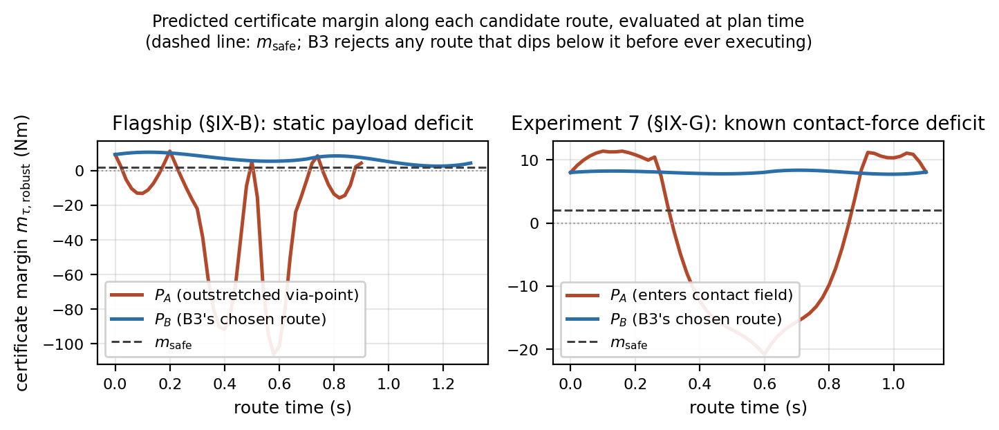
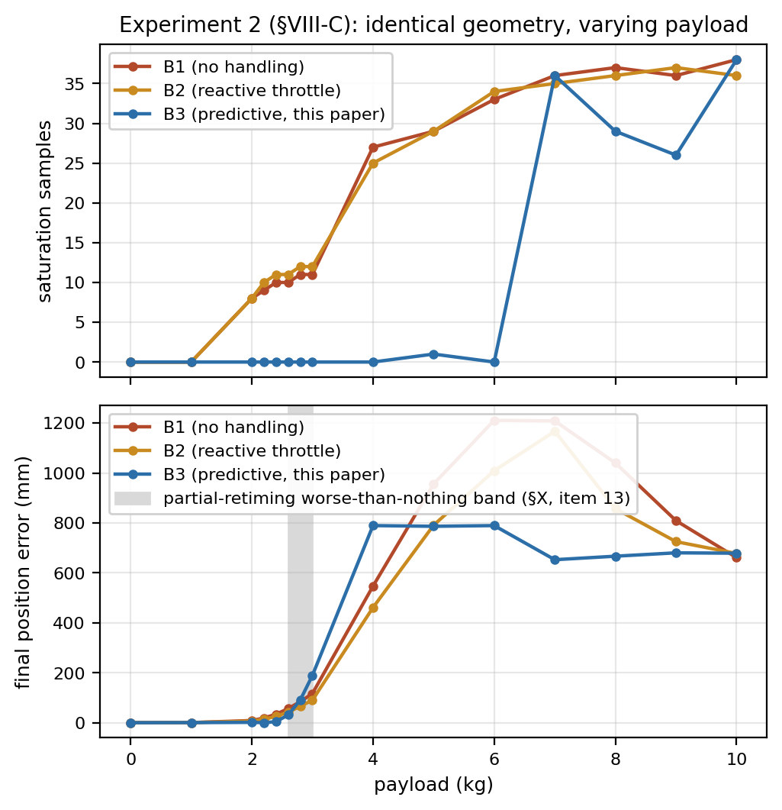

# 预测性物理可实现性：面向运动规划的统一规划-执行反馈架构

**草稿状态：** 内部工作草稿，尚未达到投稿标准。整理自原始规划文档及配套研究计划。这些文档中标记的每一个未决事项均在下方以明确、可见的方式保留，而非被悄悄解决——在将本文中的任何论断视为定论之前，请先阅读文末的*草稿状态与未决事项*一节。按照原始文档自身关于发表顺序的说明，实质性的对外投稿应等到 `mp_main`（ICRA 2027）与 HAE（IJSS）两篇论文均获得审稿结果之后再进行。

---

## 摘要

运动规划器——无论是基于采样的、基于优化的，还是固定结构的时域规划器——都只认证几何与运动学可行性：即路径无碰撞、且满足声明的速度/加速度约束。然而，目前广泛部署的规划栈都没有认证*动态物理可实现性*：即在机器人当前构型、接触状态、负载和扰动环境下，其执行器是否真的能够执行所规划的运动。由于执行器的驱动能力是状态和环境的函数，一条运动学上可行的轨迹仍可能在不久的将来使一个或多个关节趋向饱和。本文提出**预测性物理可实现性**这一反馈信号：它在滚动时域上预测执行器驱动能力的未来损失，并在这种损失真正演变为执行失败之前，将其反馈给运动规划环节。我们定义了一个以预测状态、接触、负载和扰动信息为条件的、覆盖整个时域的可实现性证书；一个分级的规划器响应——重新定时、重塑、改道或安全制动——由局部适应能否在当前路线上恢复可行性来决定；在何种条件下路线级别的变更是可证明必要的；以及一个终端安全集，在其上制动回退是递归可行的而非启发式的，同时明确说明该认证在何处止步于被执行的闭环之前。该架构在证书评估和 0-1 级（重新定时）上保留了底层局部规划器固定结构的计算特性：状态与环境相关的信息通过线性/向量项进入优化问题，而无需在线重建优化结构。这一特性目前并不适用于 2 级（重塑）：其二次规划（QP）在每次调用时都需从头重建，其实际、公开披露的代价见 §IX。我们将这一贡献与参考调节器理论、面向执行能力的腿式规划工作以及 MoveIt 2 的混合规划（Hybrid Planning）架构进行了对比定位，并提出了一套基准测试套件——目前可在固定基座机械臂上实现，腿式/人形机器人扩展不属于本文范围，留待未来工作——旨在分离出预测性反馈相较于反应式饱和处理所带来的额外价值。

---

## I. 引言

机器人运动规划通常按流水线方式组织：全局或基于采样的规划器搜索出一条几何上有效的路径，时间参数化阶段将该路径转换为一条满足声明速度/加速度约束的带时标轨迹，随后由执行层跟踪该结果。当机器人的动态能力与状态无关时，这种分离方式是有效的，但实际上并非如此：实现给定加速度所需的力矩取决于构型、速度、当前接触、负载、相互作用力和外部扰动，其关系为

$$
\tau = M(q)\,u + C(q,\dot q)\,\dot q + g(q) + J_c^\top F_c + \tau_{\mathrm{ext}}.
$$

一条在规划时刻几何和运动学上均有效的轨迹，仍可能在接触、负载或扰动条件发生变化后使某个执行器趋向饱和——而这一事实目前的流水线只有在其真正发生时才能发现，而非提前预见。我们将其写为

$$
\text{运动学可行} \;\not\Rightarrow\; \text{物理可实现}.
$$

**以 MoveIt 2 作为这一差距的具体锚点。** 我们并不将此视为一种假设性的失效模式。MoveIt 2 的默认流水线——OMPL 用于几何搜索，时间最优轨迹生成（Time-Optimal Trajectory Generation, TOTG）作为默认的时间参数化阶段，并可选配 Ruckig 加加速度受限平滑——正是本文所针对的这种"路径优先"架构。一个可直接验证的、具有说明性的数据点记录在 [moveit/moveit2#2600](https://github.com/moveit/moveit2/issues/2600) [1] 中：TOTG 在路径拐点处重构出约 200 rad/s² 的加速度，而声明的限制仅为 0.2 rad/s²。我们引用这一议题，是因为它可以直接验证和复现，而不是因为它表明 TOTG 或整个 MoveIt 2 存在普遍性的病理问题——该议题的报告者本人将这一具体故障归因于一种不受支持的边缘情形（关节整整转动 180°）以及原始 TOTG 类中 `path_tolerance=0.0` 的默认值（MoveIt 标准的 `RobotTrajectory` 封装已经通过设置不同的默认值规避了这一问题），我们在此说明这一限定条件，而不让引用暗示比原始来源所支持的更多内容（见*草稿状态与未决事项*，第 1 项）。本工作早期内部草稿中引用的另外两份报告，在后续检索中未能重新定位，因此本文*不*引用它们。独立于任何具体缺陷，MoveIt 2 自身的**混合规划（Hybrid Planning）**架构已经将较慢的全局规划器与更快的、周期性运行的局部规划器分离开来，并明确支持事件驱动、传感器反应式的重新规划——这正是本文所提出的反馈机制的一个真实的、当前尚未被占用的接口位置，而非一个人为构造的集成目标。

**相对于 OMPL 的定位。** OMPL 回答的问题是：*从起点到终点是否存在一条无碰撞路径？* 本文提出的问题则严格地处于其下游：*给定机器人的构型、接触状态、负载和预测环境，沿着这条路径是否存在一条物理可实现的轨迹？* OMPL 在本文中的任何位置都不是竞争对手；它是标准的上游全局规划器，而本文的贡献位于 MoveIt 自身混合规划架构的局部规划器接口处，消费 OMPL 的输出而非取代它。

我们并不宣称传统的规划流水线毫无用处。我们主张的是：由于执行器的驱动能力是状态与环境的函数，而几何/运动学可行性检查无法感知这一点，因此传统流水线的可行性表示是不完整的。

**核心研究问题。** *能否在执行过程中预测未来物理可实现性的损失，并将其足够早地反馈给运动规划，使机器人能够在执行器裕度不足导致任务失败、碰撞或跌倒之前完成适应、改道或安全制动？*（该证书预测的是 $m_{\mathrm{phys}} < m_{\mathrm{safe}}$——一个刻意设置为在执行器真正饱和之前就会触发的裕度阈值——而不是更强的动力学系统意义上的"失控"；本文不作后者的论断，并在全文中始终使用"执行器裕度/驱动能力"这一表述，以保持这一区别清晰可见。）

### A. 贡献

1. **一个问题表述**，将几何/运动学可行性与未来的执行器可实现性区分开来，并定义了现有流水线并未联合认证的综合安全集 $\mathcal{F}_{\mathrm{safe}} = \mathcal{F}_{\mathrm{kin}} \cap \mathcal{F}_{\mathrm{obs}} \cap \mathcal{F}_{\mathrm{dyn}}$。
2. **一个预测性可实现性证书** $m_{\mathrm{phys}}$，以预测的状态、接触、负载和扰动信息为条件，在滚动时域上对执行器裕度给出界限，且无需在线重建局部规划器的优化结构。
3. **一个分级的规划响应**——执行、重新定时、重塑、改道或安全回退——并配有一个可检验的充分条件（定理 3），用以判断该架构自身已实现的局部适应机制何时已被穷尽、路线级别的重新规划何时是合理的，这一条件不同于（虽然成立但仅为定义性质的）理想化论断：无法在一条不可行路线上通过任何修改使其变得可行。
4. **一个用于最后手段回退的终端安全集**（定理 4），精确刻画出架构的制动级在哪些状态上是递归可行的——其判定所依据的标量正是证书已经在计算的量——并给出执行该级别的控制律所对应的闭环结果（定理 5），以及对两者不重合区域的实测说明（命题 6）。
5. **一个实时架构与基准测试设计**，面向 MoveIt 2 的混合规划接口，并配有一套通过消融实验分别分离出预测、适应和改道各自贡献的实验套件。

我们刻意*不*宣称自己是第一个在运动规划中考虑执行器限制的工作，不宣称发明了基于裕度的反馈机制，也不宣称能在任意扰动下保证安全——见下文 §XI 及*本文不作出的论断*一节。我们所宣称的创新更为狭窄：一个将来自执行层的未来物理可实现性信息，转化为规划器层面适应与路线级重新规划的预测性反馈接口，在一个统一的分级响应下同时覆盖几何与物理两类失效模式。

---

## II. 相关工作

**A. 运动规划与时间参数化。** 诸如 OMPL 之类基于采样的规划器认证几何可行性；时间参数化方法（TOTG、TOPP-RA、Ruckig）随后拟合出满足声明运动学约束的时间律。这些方法都没有将与构型、接触或负载相关的执行器驱动能力表示为一个规划时刻的信号。一份已记录的 MoveIt 2 议题，moveit/moveit2#2600 [1]，说明了名义上的时间参数化限制本身并不能保证重构出的轨迹满足预期的加速度约束——该议题中 TOTG 在路径拐点处重构出的加速度约为声明限制的 1000 倍——尽管该议题的报告者本人将这一具体故障归因于一种不受支持的边缘情形（整整 180° 的关节转动）以及 MoveIt 标准 `RobotTrajectory` 封装已经通过设置不同默认值规避的 `path_tolerance=0.0` 默认值（见*草稿状态与未决事项*，第 1 项）；我们并不将其呈现为一种普遍性的架构病理，而只是一个可直接验证的、具有说明性的数据点。

**B. 反应式与混合运动规划。** MoveIt 2 的混合规划架构将较慢的全局规划器与更快的、周期性运行的局部规划器分离开来，并明确支持事件驱动、传感器反应式的局部适应，包括对表面条件变化的适应。本文的贡献并非这一混合架构本身，而是一个占据该架构局部规划器接口的新反馈信号与局部规划约束。

**C. 参考调节器与安全滤波器。** 参考调节器与显式参考调节器（Reference Governors 与 Explicit Reference Governors；Garone、Di Cairano 与 Kolmanovsky 的 *Automatica* 综述，2017 [2]；其源头可追溯至 Bemporad、Casavola 与 Mosca，1997 [3]）预测一个到约束违反的标量裕度——动态安全裕度（Dynamic Safety Margin）——并调制参考指令，使闭环系统在违反约束之前始终保持在一个安全不变集内。这在概念上是与本文核心的裕度反馈思想最接近的既有架构，我们并不宣称"预测一个裕度并在约束违反之前将其反馈回去"这一一般性原则本身具有新颖性：这一原则已有三十年历史。据我们所知，参考调节器文献尚未涉及的是：一个专门针对执行器/力矩驱动能力定义的裕度，联合以预测的接触、负载和地形信息为条件，并与一个包含路线级重新规划（而不仅仅是在固定路线内进行参考调制）的规划器响应相耦合。

一个密切相关的近期架构是**路径可行性调节器**（Path Feasibility Governor，PathFG；Zhang、Liu 与 Liao-McPherson，arXiv:2507.09134，2025 [4]，已完整阅读——见*草稿状态与未决事项*，第 4 项），它在路径规划器与非线性 MPC 控制器之间插入一个调节器：给定一条路径 $p(s)$，$s \in [0,1]$，PathFG 沿路径选择一个辅助参考点 $s_k$——尽可能朝目标方向前进，以一个构造出的终端不变集所允许的范围为限——它使用*上一个*周期的最优终端预测状态作为真正的（难以计算的）N 步后向可达集的一个廉价、一维的代理量，因此其更新只是在 $s \in [0,1]$ 上做二分搜索，而非在线求解一个集合。这一高层架构与本文提出的架构（§III–§V）十分接近：两者都在路径/路线规划器与更底层的控制器之间插入了一个可行性过滤层。我们在三个方面有所不同。（i）本文明确地以预测的环境、接触和负载信息为条件构建可实现性证书，而不仅仅依赖名义路径；PathFG 自身文本明确将扰动排除在外（"为简洁起见，我们聚焦于不显式考虑扰动的名义 MPC"），将其推迟到未来与鲁棒 MPC 方案结合时再处理，且其通用理论及所用的四旋翼算例中都没有负载、接触或力矩裕度的概念。（ii）本文定义了一个明确的几何失效与物理失效分类体系，并配有分级的、按机制区分的响应（§V）；PathFG 采用单一、统一的机制（辅助参考点选择），而非分级的重定时/重塑/改道/回退响应。（iii）本文专门针对执行器/力矩可实现性；PathFG 的约束集 $\mathcal{X}, \mathcal{U}$ 是抽象的多面体——在其四旋翼算例中体现为推力/角速度约束，但其通用框架中并无任何针对力矩的专门内容。

还有两点是对我们不利的，在此明确说明，而非留给审稿人自行发现。第一，PathFG 证明了本文定理 1 明确没有做到的事情：一个*闭环*保证。其定理 1（递归可行性，通过对不变集成员关系的归纳证明）与定理 2（渐近稳定性，通过一个关于跟踪误差的输入到状态稳定性（ISS）引理，加上一个有限时间收敛论证来界定辅助参考点可以停滞多久）是针对调节器+MPC 联合策略闭环系统的完整的、基于不变集的证明。而本文自身的定理 1 仅对*预测*轨迹本身具有定义性质，并明确说明了这一点（"它本身并不能说明在反馈、重新规划或不准确的 $\Delta\tau_i$ 参与的情况下，闭环行为会如何"）——这是一处真实的不对称，而非一个次要的文体差异，也是本文尚未弥合的一处差距。第二，PathFG 这种严谨性是以真实代价换来的：其构造性的终端不变集方法（基于 Riccati 的 LQR 终端区域，其假设 4–6 及引理 3）仅适用于线性或线性化系统，其数值验证（一个四旋翼外环）恰好就是这样一个线性化系统——这对光滑连续动力学而言是一种自然的适配，但对于一个接触模式会切换、由执行器裕度驱动、可行集特性会随模式改变的系统而言，这仍是一个尚未解决的问题，而这恰恰更接近本文所针对的场景。这里将其视为两篇论文选择不同技术路线的原因（不变集方法 vs. 带显式不确定性界限的直接逐步裕度方法），而非 PathFG 特有的弱点：两篇论文都针对一般非线性系统给出理论，却都在一个简化实例上进行验证（PathFG 的线性化四旋翼；本文的降阶平面机械臂，见 §IX），这在该领域是标准做法，值得将其明确指出为一个共有的局限，而非暗示这是本工作降阶研究所特有的问题。

**D. 面向执行能力与动力学的规划。** 已有研究工作将力矩限制、可行力旋量集合以及动态可行性纳入轨迹优化与腿式运动规划中。在预测的力矩饱和条件下对名义轨迹进行重新定时本身是一个成熟的子领域；Eom、Suh 与 Chung [7] 给出了一个早期实例，他们在每个关节处使用扰动观测器获得一个简化的解耦双积分器模型，并在任一执行器出现饱和时在线修改笛卡尔空间参考轨迹——这正是本文将重新定时（本文的 1 级，见 §V）视为一种成熟基线机制、而非本文贡献所依据的同一思路。一项相关的任务空间关节力矩限制投影见于 Orsolino、Focchi、Mastalli、Dai、Caldwell 与 Semini [8] 的工作，他们通过机器人雅可比矩阵将执行能力限制投影到任务空间中一个六维的驱动力旋量多面体，并将其与接触力旋量锥求交，其动机明确来自地形复杂度；不过该文自身的验证（HyQ 质心轨迹）并未像同一团队的可行区域姊妹论文 [5] 用其托盘穿越实验那样单独考察非平坦地形的情形；我们引用 [8] 是取其任务空间投影这一机制本身，而非取其非平坦地形结果。这两条引用均通过文献检索找到，并未像 [1]、[4]、[5]、[6] 那样被完整拉取并通读全文（见*草稿状态与未决事项*第 8 项）。

对于腿式系统而言，有两项既有工作是最接近的邻近研究，目前均已完整阅读（见*草稿状态与未决事项*，第 4 项）。Orsolino、Focchi 及其合作者提出的*可行域*（Feasible Region）[5] 通过一个迭代投影算法，将摩擦（支撑）域与一个由各腿关节力矩力旋量多面体导出的新执行域相交，计算出一个同时满足摩擦一致性和执行一致性的质心 $(x,y)$ 位置二维凸集，并以在线方式（100–133 Hz）用其选择能最大化该区域面积的落脚点和质心目标，已在 HyQ 四足机器人负重 10 kg、跨越 0.22 m 高台的场景中得到验证。据我们所知，这是最接近于将关节力矩限制通过接触构型投影为一个面向执行能力的规划量的既有工作，也是 §IV 中面向腿式平台的环境条件化思想的来源。有两处差异是实质性的，而非细枝末节。第一，该可行域明确是一个**准静态、几何**的集合成员判定，而非一个覆盖时域的预测信号：该论文明确指出，其构造"仅在机器人基座速度为零时有效"，并将*动态*扩展（通过动态力旋量多面体和质心加速度项）列为未来工作，而非该论文已完成的内容。本文的证书则不同，它是在预测的未来状态、接触、负载和扰动的滚动时域上评估的一个标量裕度——这种时间维度上的预测性，正是已发表的可行域工作所缺乏的。第二，可行域在规划中的用法是单一机制（选择落在该区域内部或最接近该区域的质心/落脚点目标），没有任何分级响应的类比，也没有该单一机制被穷尽时应如何处理的条件；本文的 0–4 级层级结构以及定理 3 的穷尽条件在其中都没有对应物。

Acosta 与 Posa 提出的面向欠驱动双足在崎岖地形上行走的感知式混合整数落脚点控制（MPFC）（*IEEE Transactions on Robotics*，2025）[6] 是发表在本文目标期刊上、与执行能力相关的、面向腿式/地形的最接近工作，现已被完整阅读并加以区分，而非作为一个未决事项搁置。MPFC 是一个混合整数二次规划，在一个降阶的角动量线性倒立摆（ALIP）模型上以超过 100 Hz 的频率在线求解（硬件上均值 2.2 ms，99.9 分位数 7.7 ms），联合优化在感知到的凸地形多边形中进行的离散落脚点选择、连续的落脚点位置与时机，以及一个单一的踝关节力矩输入，并配有一个专门为对抗显式平面分割的时间"闪烁"不稳定性而设计的实时地形分割感知栈（Stable Steppability Segmentation）。有三处差异同样是实质性的。第一，MPFC 的离散与连续决策变量是*每个周期都联合重新求解*的；不存在一种更廉价的、先尝试局部适应再考虑更昂贵的离散（落脚点/路线）变更的机制，也不存在局部适应已被穷尽这一可检验条件的类比——本文的 0–4 级递进机制与定理 3 在 MPFC 的架构中都没有对应物，这是一种同样合理但不同的设计取向（每个周期都付出联合优化的代价，而不是大多数周期只付出一个较廉价的证书检查成本，仅在需要时才付出路线级别的代价）。第二，MPFC 的力矩处理范围较窄且处于下游：踝关节力矩只是降阶落脚点优化中的一个决策变量，更广泛的全身关节力矩可实现性则完全交由一个独立的 1 kHz 操作空间控制二次规划来处理——MPFC 中没有任何部分扮演本文证书所承担的角色，即一个联合跨执行器计算、并反馈给更高层规划器决策的预测性、带不确定性界限的裕度。第三，也是最根本的一点，MPFC 的贡献集中在 $\mathcal{F}_{\mathrm{kin}} \cap \mathcal{F}_{\mathrm{obs}}$ 上，即在离散的、感知到的地形下*从几何和运动学角度看哪里踩踏是安全的*——这一问题被解决得非常出色，并在硬件上得到了广泛验证；而本文的贡献专门针对 $\mathcal{F}_{\mathrm{dyn}}$——*一旦选定了落脚位置，执行器是否真的能够物理实现该运动*——MPFC 并未将其表示为一个独立于踝关节力矩决策变量本身的规划时刻信号。MPFC 也是一篇系统/硬件论文，没有形式化的定理结构，这反而凸显（而非削弱）了本文自身（诚然较为有限，见 §VI）的理论贡献：不存在与之竞争的形式化穷尽或递进条件需要调和。

**E. 本工作的定位。** 就我们所检索到的范围而言，没有任何一份既有工作同时具备以下三点：（i）一个统一覆盖几何与物理失效模式的失效分类体系，（ii）一个"先适应、再改道、最后回退"的分级响应，并配有路线级变更的明确必要性条件，以及（iii）一个联合以预测的接触、负载、地形和扰动为条件的证书，且三者均已在固定基座机械臂上得到验证（见 §IX）。然而，每一种单独的机制都已相当成熟，我们对贡献的宣称也据此相应地设定了范围（见 §I-A，以及下文*本文不作出的论断*一节）。我们不宣称本文在腿式或人形平台上具有通用性：本系列工作目前不存在任何腿式/人形机器人流水线，构建这样一条流水线在架构上与上文的固定基座机械臂工作截然不同（是一个浮动基座、接触调度的动力学模型，而非在其基础上的扩展），本文也未尝试这样做——§IV 的环境条件化表述在写法上足够通用、原则上可推广至该场景，但这只是一种设计意图，而非已展示的结果（见 §VIII-K）。

---

## III. 问题表述

设 $x_k = (q_k, \dot q_k)$ 为离散时刻 $k$ 的机器人状态，设 $E_{k:k+N}$ 表示在长度为 $N$ 的时域上预测的环境信息——地形高度与坡度、预期的接触位置与时机、摩擦、负载，以及预期的外部扰动或相互作用力。名义运动规划器 $\mathcal{P}$ 生成一条候选轨迹 $u^{\mathrm{nom}}_{0:N-1}$（及其导出的状态序列 $x_{0:N}$），并针对现有流水线已经能够表示的两个可行性集合进行认证：

$$
\mathcal{F}_{\mathrm{kin}}(x) \quad \text{（运动学可行性：速度、加速度、关节限位约束）},
$$
$$
\mathcal{F}_{\mathrm{obs}}(x, E) \quad \text{（在给定预测环境 } E \text{ 下的碰撞/障碍物可行性）}.
$$

我们引入第三个集合，现有流水线并未表示这一集合：$\mathcal{F}_{\mathrm{dyn}}(x, E)$，即在环境 $E$ 下，实现所请求运动所需的执行器指令处于执行器限制以内的状态 $x$ 的集合。

规划器应当认证的联合安全集为

$$
\mathcal{F}_{\mathrm{safe}} = \mathcal{F}_{\mathrm{kin}} \cap \mathcal{F}_{\mathrm{obs}} \cap \mathcal{F}_{\mathrm{dyn}}.
$$

现有的规划流水线在规划时刻认证 $\mathcal{F}_{\mathrm{kin}} \cap \mathcal{F}_{\mathrm{obs}}$，而对 $\mathcal{F}_{\mathrm{dyn}}$ 的违反通常只在执行时刻才被发现——典型表现为执行器饱和、跟踪误差增长，或者在浮动基座/腿式平台上，表现为失去平衡。本文所解决的核心问题是：*在何种条件下可以在执行之前预测出 $\mathcal{F}_{\mathrm{dyn}}$ 成员关系的丧失，以及当预测显示未来会丧失该成员关系时，规划器应当如何响应？*

本文的贡献及其证据都专门限定在 $\mathcal{F}_{\mathrm{dyn}}$ 上，而不是对整个 $\mathcal{F}_{\mathrm{safe}}$ 进行认证：全文的证书、层级结构和理论结果都是关于物理（执行器）可实现性的，§IX 中的降阶验证是在完全不考虑碰撞检测的情况下进行的（见 §IX-F）。之所以在上述联合安全集定义中包含 $\mathcal{F}_{\mathrm{obs}}$，是因为一个完整的规划器需要对其进行认证，也因为 MoveIt 2 的 OMPL 层已经完成了这一部分——本文不重复也不扩展这一部分工作，本文所报告的是 $\mathcal{F}_{\mathrm{kin}} \cap \mathcal{F}_{\mathrm{dyn}}$ 层面的证据，而非 $\mathcal{F}_{\mathrm{safe}}$ 层面的证据。我们用*物理可实现性*一词指代本文实际关注的执行器/力矩/负载/接触问题，并保留*（整体）运动安全性*一词指代本文并未论断的完整 $\mathcal{F}_{\mathrm{kin}} \cap \mathcal{F}_{\mathrm{obs}} \cap \mathcal{F}_{\mathrm{dyn}}$ 主张。

我们假设模型不确定性是有界的（即用于预测的动力学模型与真实被控对象之间的误差有界），并假设在整个时域上外部/接触力的预测误差同样有界；这两条假设都在使用它们的每一处明确说明，且不宣称在无条件情况下成立（见定理 1，§VI，其中给出了这些假设的精确范围）。

我们在全文中还假设，执行器裕度总体上是一种应当被保留的资产，而不是任务本身意图消耗的资源：$\mathcal{F}_{\mathrm{dyn}}$ 成员关系的定义带有一个严格为正的安全阈值 $m_{\mathrm{safe}}$，因此一条刻意在执行器极限附近或极限上运行的轨迹，会与一条即将非本意地丧失控制权限的轨迹被同等对待——二者都会被判定为 $m_{\mathrm{phys}} < m_{\mathrm{safe}}$。这是一个真实的适用范围边界，而非细节：在力矩约束下的最短时间轨迹，按照构造，几乎处处呈现为 bang-bang 控制（经典的时间最优控制结果，例如 Bobrow 等人；庞特里亚金极大值原理），因此一条真正时间最优的参考轨迹按设计会具有接近零或为负的裕度，而本架构会将其重新定时至偏离其本应达到的最优状态。§XI 将其列为一条明确的非论断。

---

## IV. 预测性物理可实现性证书

对于名义预测轨迹 $\mathbf{x}_{0:N}, \mathbf{u}_{0:N}$，定义逐关节、逐时域步的力矩裕度

$$
m_{\tau,i}(k+j) = \tau_{i,\max} - |\tau_i(k+j)|,
$$

以及其经不确定性收紧后的形式，使用预测的力矩估计 $\hat\tau_i$ 和一个显式的不确定性界限 $\Delta\tau_i$（用以覆盖模型失配以及接触/扰动预测误差）：

$$
m_{\tau,i}^{\mathrm{robust}}(k+j) = \tau_{i,\max} - |\hat\tau_i(k+j)| - \Delta\tau_i(k+j).
$$

综合的时域证书——我们在 §VI 的理论结果中所使用的唯一标量——为

$$
m_{\mathrm{phys}}(k) = \min_{j=0,\dots,N} \; \min_i \; m_{\tau,i}^{\mathrm{robust}}(k+j).
$$

另有三个互补信号作为实验诊断量报告，而非纳入形式化结果——这是为了使证明所需的工作量与一篇有 3–4 项贡献的论文相称：方向性驱动能力 $\alpha_{\mathrm{dir}}(k+j)$（沿当前任务所需方向剩余的控制/加速度权限，有助于区分"仍有一些裕度剩余，但方向不对"与一个聚合标量所能表达的情形）；损失时间 $T_{\mathrm{loss}} = \min\{\,j\Delta t : m_{\mathrm{phys}}(k+j) \le 0\,\}$；以及累积风险 $J_{\mathrm{phys}} = \sum_j \phi(m_{\mathrm{phys}}(k+j))$，其中 $\phi$ 为选定的惩罚函数。

**环境条件化。** 该证书同时是预测环境/接触信息和状态的函数：

$$
\big(E_{k:k+N},\, x_k,\, u^{\mathrm{nom}}_{k:k+N}\big) \;\longrightarrow\; \tau_{k:k+N} \;\longrightarrow\; m_{\mathrm{phys}}.
$$

正是这一步将本文的贡献与一个单纯的力矩限位检查器区分开来：一条轨迹完全可能无碰撞，却仍然违反 $\mathcal{F}_{\mathrm{dyn}}$，原因是沿路线*预测*的地形、接触或负载状态所需的力矩超出了可用范围，即

$$
\text{无碰撞} \;\not\Rightarrow\; \text{物理可实现}.
$$

一个具有代表性的例子（说明性质，尚未实际运行——见*草稿状态与未决事项*）：在平地上，一个腿式平台的踝关节力矩裕度为 $m_{\mathrm{ankle}} = 0.42$；同一个名义落脚轨迹进入一个预测中的浅坑后，裕度变为 $m_{\mathrm{ankle}} = 0.05$；若继续执行未经修改的名义轨迹，将在接触瞬间使 $m_{\mathrm{ankle}} < 0$。该证书能在迈出这一步之前就揭示这一点，从而使规划器有机会调整落脚位置、时机或质心轨迹，而不是在接触时才发现这一缺陷。

---

## V. 反馈规划架构

### A. 失效分类

我们沿用本系列既有工作中的几何/拓扑失效信号（$\sigma_1 \vee \sigma_2 \vee \sigma_3$：分别对应二次规划不可行、规划器停滞，以及预测/雅可比线性化漂移），并加入一个物理可实现性信号：

$$
\sigma_{\mathrm{geo}} = \sigma_1 \vee \sigma_2 \vee \sigma_3, \qquad \sigma_4 = \big[\, m_{\mathrm{phys}}(k+j) < m_{\mathrm{safe}} \text{ 对某个 } j \in [0,N] \,\big].
$$

这两类信号要求结构上不同的响应，$\sigma_4$ 不应被简单地并入既有的几何逃逸机制、当作该触发条件的第四种实例来处理：

$$
\begin{aligned}
&\sigma_{\mathrm{geo}} \Rightarrow \textbf{改变去哪里}, \\
&\sigma_4 \Rightarrow \textbf{先改变怎么走，只有当适应无法恢复可行性时才改变去哪里。}
\end{aligned}
$$

这一区分之所以在架构上重要，原因如下：几何逃逸机制会在底层二次规划中重新设定路线目标（即 $h_{\mathrm{esc}}$），同时保持运动学可行集不变。这对拓扑陷阱而言是正确的响应，但对 $\sigma_4$ 而言毫无帮助：如果 $m_{\mathrm{phys}}$ 的崩溃是因为*当前*路线所需力矩超出了可用范围，那么在同一路线的局部邻域内重新设定目标并不必然能恢复力矩裕度，只有重新定时、重塑，或者真正的路线级变更才能做到这一点。

### B. 分级响应

- **0 级——正常执行。** 若 $m_{\mathrm{phys}}(k) \ge m_{\mathrm{safe}}$，则不加修改地执行名义轨迹。
- **1 级——重新定时。** 路线本身在动态上仍然可实现，但名义时间律对执行器提出了过高的要求：沿同一条几何路径将 $q(s) \to q(t_{\mathrm{new}})$ 重新参数化，降低速度/加速度。这一机制是一种成熟的基线做法（见 §II-D），而非本文的贡献。
- **2 级——轨迹重塑。** 在保持同一路线不变的前提下，修改加速度剖面、质心运动、接触时机或局部目标，以在不改变路线的情况下恢复 $m_{\mathrm{phys}} > 0$。重塑问题被表述为一个关于逐步状态变量 $(q_j, \dot q_j, \ddot q_j)$ 的二次规划，通过双积分器积分约束锚定在真实的当前状态上（因此在其输出上评估的证书所认证的是系统真正能够被指令跟踪的轨迹，而不仅仅是一个孤立的加速度序列），其目标函数为
$$
w_a\sum_j\|\ddot q_j - \ddot q_j^{\mathrm{nom}}\|^2 + w_q\sum_j\|q_j - q_j^{\mathrm{nom}}\|^2 + w_{\dot q}\sum_j\|\dot q_j - \dot q_j^{\mathrm{nom}}\|^2,
$$
即寻找与规划器最初意图最接近的、动态可行的轨迹，而不是加速度最小的轨迹——这是刻意为之，因为直接最小化 $\sum\|\ddot q\|^2$ 没有任何理由会倾向于一个接近规划器原始意图的结果。
- **3 级——改道/重新规划。** 如果沿当前路线的任何重新生成都无法恢复可实现性——先按顺序尝试重新定时和重塑（见 §IX-H），二者均告失败——那么路线本身必须改变：$p \to p'$。定理 3（§VI）在形式上仅覆盖重新定时适应裕度 $m^\star_1(p) < m_{\mathrm{safe}}$（这是针对理想化条件 $\mathcal{T}_{\mathrm{dyn}}(p) = \emptyset$ 的一个充分、可检验的条件）；将已实现并经过实证验证的重塑检查纳入一个形式化的、扩展后的适应类别 $m^\star(p)$ 尚未完成，我们在相关之处（§V-C、§IX-H）明确说明这一点。
- **4 级——安全制动/回退。** 若在可用的反应时域内不存在任何可行的延续方案，则触发制动或终端安全集策略。设立这一级别是为了使本架构不会隐含地假设每一种失效都可以通过进一步的重新规划来解决。其制动参考是一段以最大减速度减至静止、随后保持不动的轮廓，并且该回退是*粘滞的*：一旦触发即保持位置而不恢复原计划，因为恢复需要一次本架构不会自动作出的全新路线决策。定理 4（§VI）构造了使该级别递归可行的终端安全集 $\mathcal{X}_f$——$\mathcal{X}_f$ 中的每一个状态都能制动到一个它可以静态保持的构型，且全程处于执行器限值之内——定理 5 则覆盖执行它的那个闭环；§VI 同时精确说明了两者在何处分道扬镳，以及什么仍未被认证。

### C. 3 级机制

定理 3（§VI）通过可检验的条件 $m^\star_1(p) < m_{\mathrm{safe}}$ 回答了*何时*架构应当停止尝试局部适应、转而触发 3 级。本小节则明确规定*3 级接下来应当做什么*，精确陈述该机制的显式目标，并将已经解决的部分与真正仍然开放的部分区分开来——而不是像本节此前版本那样，把整个问题都当作一个占位符搁置不谈。

**已实现机制的精确表述。** 本代码库既没有路线生成器，也没有其自身的几何逃逸机制——`local_planner.py` 自身的模块文档字符串明确写道："本代码库中不存在任何路线生成器。"本节此前版本提到要调用"既有的几何逃逸机制"，那描述的其实是本系列工作中的既有工作（$\sigma_{\mathrm{geo}}$，§V-A），而并非 3 级在此处实际调用的任何东西；这一表述已在下文更正。`plan_route`（§IX-H）实际实现的，是在调用方提供的候选路线 $\{p, p'\}$ 之间进行的一次约束选择，其目标显式且可检验：对每个候选路线依次尝试 1 级（重新定时）、再尝试 2 级（重塑）再生，并返回第一个——先 $p$ 后 $p'$——其重生成后的整条路线证书满足 $m_{\mathrm{phys}} \ge m_{\mathrm{safe}}$ 的候选路线。这正是下文方向 (b) 的一种最窄形式的实现：路线选择上的一条物理可行性*约束* $m_{\mathrm{phys}}(P) \ge m_{\mathrm{safe}}$，其评估范围仅限于调用方所提供的有限候选集合——而非在一个生成出来的候选集合上执行 $\min_P J_{\mathrm{geometric}}(P)$ 搜索，因为并不存在可供搜索的生成器。实验 5–7 的 $P_A/P_B$（§VIII-F/G/L）路线对正是手工构造出来、专门用以练习这一选择机制的，而非由规划器发现的。

**已解决的部分与仍然开放的部分。** 方向 (b)——赋予 $\sigma_4$ 触发的改道一个不同于几何逃逸机制的显式目标——就"在调用方提供的候选集合中选择"这一情形而言现已解决：上文的目标正是代码实际强制执行的内容，且它是一条物理可行性约束，而非仅仅是一种偏好，正好符合当初提出的要求。方向 (a)——证明在给定条件下、基于几何动机选出的逃逸目标相较于原路线在动态上更可实现——仍然完全开放，且尚未尝试：本代码库并不存在这样一种通用的逃逸/路线生成机制可供刻画，因而这一论断在此处没有对象可供证明。一个*通用*路线生成器所产生的输出是否倾向于满足 $m_{\mathrm{phys}} \ge m_{\mathrm{safe}}$，是一个与上文已解决问题实质不同、也更困难的问题，留待未来工作，不应与已解决的部分混为一谈。

**将 2 级纳入形式化的适应类别 $\mathcal{A}(p)$：已经尝试，但发现目前尚未达到定理 3 自身的严谨标准——而不仅仅是尚未实现。** 既然重塑现已在路线规划时被尝试（§IX-H），自然的下一步是将定理 3 从 $\mathcal{A}_1(p)$（重新定时）扩展为 $\mathcal{A}(p) = \mathcal{A}_1(p) \cup \mathcal{A}_2(p)$（重新定时 $\cup$ 重塑），并以"重塑二次规划不可行"作为 $\mathcal{A}_2(p)$ 的可检验穷尽条件。但这尚未达到定理 3 本身被重写时所要满足的标准（见 §VI）：重塑二次规划（`_try_reshape`）将力矩线性化为 $\tau_j = M(Q_j)\,\ddot q_j + h(Q_j, \dot Q_j)$，其中 $M$ 与 $h$ 在每一步都在*名义*轨迹的 $Q_j, \dot Q_j$ 处取值并保持固定，而非在优化变量处取值——这是一种刻意保持凸性的近似（§VI，"计算结构"一节），当重塑后的轨迹在一个较短的在线时域内始终贴近名义轨迹时是合理的，但尚未被验证为对整条路线上真实非线性重塑类别可行性的上界或下界。因此，"二次规划不可行"目前尚不能确知蕴含"真实（非线性）重塑类别中不存在任何能恢复 $m_{\mathrm{phys}} \ge m_{\mathrm{safe}}$ 的轨迹"——该线性化原则上既可能在真实非线性重塑本可成功之处报告不可行，也可能反过来；因此若要在定理 3 的严谨程度上陈述 $m^\star(p) < m_{\mathrm{safe}} \Leftrightarrow$ "$\mathcal{A}(p)$ 已穷尽"，则需要（i）一个类似于重新定时引理（§VI）的、将线性化二次规划的可行集与真实非线性可行集相关联的单调性或界的论证，或者（ii）直接针对整条路线上的真实动力学给出线性化误差的界，而这两者目前都尚未完成。这如今已成为一个被精确界定的未决事项——具体需要证明什么、以及当前实现为何尚未证明它——而不再是此前那种笼统的"尚未针对重塑类别陈述或检验任何类似于单调性假设的条件"。

---

## VI. 理论分析

在下文中，我们在与具体结果相关之处，用 $\xi_k$ 泛指跟踪误差或偏差状态，并沿用 §III 中定义的集合 $\mathcal{F}_{\mathrm{kin}}$、$\mathcal{F}_{\mathrm{obs}}$、$\mathcal{F}_{\mathrm{dyn}}$、$\mathcal{F}_{\mathrm{safe}}$。

**定理 1（可实现性证书）。** *在模型不确定性有界、且整个时域上外部/接触力预测误差有界的假设下，若对所有 $j \in [0, N]$ 都有 $m_{\mathrm{phys}}(k+j) \ge 0$，则预测的名义轨迹在整个时域上满足执行器约束。*

*证明思路。* 在明确给出上述假设之后，这一结果具有定义性质：按照 $m_{\tau,i}^{\mathrm{robust}}$ 的构造，$m_{\mathrm{phys}}(k+j) \ge 0$ 意味着对每一个关节 $i$ 和每一个时域步 $j$，都有 $\tau_{i,\max} - |\hat\tau_i(k+j)| - \Delta\tau_i(k+j) \ge 0$。如果真实力矩 $\tau_i(k+j)$ 满足 $|\tau_i(k+j) - \hat\tau_i(k+j)| \le \Delta\tau_i(k+j)$——这是有界不确定性假设，将其重新表述为一个显式的逐步保证，而非一个无条件的论断——那么直接可得 $|\tau_i(k+j)| \le |\hat\tau_i(k+j)| + \Delta\tau_i(k+j) \le \tau_{i,\max}$，对每一个关节和每一个时域步均成立，这正是"在整个时域上满足执行器约束"这一论断。该定理的强度恰好等于用于构造它的不确定性界限 $\Delta\tau_i$ 的强度，它所认证的是*按预测执行*的、约束未被激活的预测轨迹本身——它本身并不能说明在反馈、重新规划或不准确的 $\Delta\tau_i$ 参与的情况下，闭环行为会如何；这一点将分别由定理 2 和定理 3 各自的假设所处理，本定理并不对此作出论断。

**定理 2（保持可实现性的适应）。** *假设名义路线上至少存在一条满足 $\mathcal{F}_{\mathrm{kin}} \cap \mathcal{F}_{\mathrm{obs}} \cap \mathcal{F}_{\mathrm{dyn}} \ne \emptyset$ 的轨迹（一个显式的前提条件）。如果局部适应问题（1/2 级，见 §V-B）包含预测性的动态可行性约束且该问题可行，那么所得到的轨迹在恢复执行器可实现性的同时仍保持几何可行性，且不必改变全局路线。*

*证明思路。* 根据所述前提条件，在当前路线的邻域内存在一个非空的目标集合。1/2 级适应问题被表述为在重新定时/重塑参数上、联合针对 $\mathcal{F}_{\mathrm{kin}} \cap \mathcal{F}_{\mathrm{obs}} \cap \mathcal{F}_{\mathrm{dyn}}$（而非传统重新定时阶段仅针对的 $\mathcal{F}_{\mathrm{kin}} \cap \mathcal{F}_{\mathrm{obs}}$）的一个约束优化问题；如果该受约束的问题返回一个可行解，那么按照问题本身的构造，该解就是对联合集合成员关系的证明，而其属于 $\mathcal{F}_{\mathrm{kin}} \cap \mathcal{F}_{\mathrm{obs}}$ 这一事实本身就意味着结果在几何路线上保持不变。这一结果本质上是一个以求解器可行性为条件的存在性论断，而不是宣称适应问题在前提条件成立时总是可行的——前提条件只保证沿路线*存在某条*可行轨迹，而不保证 1/2 级所使用的具体重新定时/重塑参数化方式有足够的表达能力去到达它。针对某一具体参数化方式弥合这一表达能力差距是与实现相关的问题，下文定理 3 专门针对重新定时这一参数化方式处理了这一问题。

**定理 3（改道必要性的充分、可检验条件）。** *设 $p$ 为一条路线，$\xi_0$ 为局部规划器沿该路线生成的名义轨迹。对于允许范围 $\Lambda = [1, \lambda_{\max}]$ 内的重新定时因子 $\lambda$，设 $\xi_\lambda$ 表示 $\xi_0$ 按 $\lambda$ 重新参数化时间后的结果（1 级，见 §V-B），并定义*重新定时适应类别*$\mathcal{A}_1(p) = \{\xi_\lambda : \lambda \in \Lambda\}$——即架构的预执行路线决策在触发 3 级之前实际搜索的轨迹集合——以及*重新定时适应裕度*$m^\star_1(p) = \sup_{\lambda \in \Lambda} m_{\mathrm{phys}}(\xi_\lambda)$，即在 $\xi_\lambda$ 下、覆盖整条路线评估的综合时域证书（§IV）。在假设 $\lambda \mapsto m_{\mathrm{phys}}(\xi_\lambda)$ 在 $\Lambda$ 上非减（重新定时单调性——以显式假设的形式陈述，方式与定理 1 中不确定性界限的处理方式相同，并非针对一般非线性情形从第一性原理推导得出；见证明）的前提下，若 $m^\star_1(p) < m_{\mathrm{safe}}$，则 $\mathcal{A}_1(p)$ 中没有任何轨迹能够恢复该证书，重新定时是真正被穷尽的，而非仅仅被假定为穷尽：此时越过 1 级、升级至架构的下一个适应机制是合理的。本定理仅覆盖重新定时类别 $\mathcal{A}_1(p)$；已实现的预执行决策（见 §V-C、§IX-H）在此之后会尝试 2 级重塑，只有当重塑同样无法恢复证书时才会升级至 3 级改道——这一点本定理自身并未加以形式化（见下文及 §V-C）。*

*这是针对理想化论断 $\mathcal{T}_{\mathrm{dyn}}(p) = \emptyset$（即沿 $p$ 路线*所有*动态可实现轨迹的集合，其中"$\mathcal{T}_{\mathrm{dyn}}(p) = \emptyset \Rightarrow$ 停留在 $p$ 上的任何修改都不是动态可实现的"这一观察是从定义直接得出的，本身并非一个实质性的论断——本定理的早期版本恰好陈述了这一理想化观察并将其作为主要结果，这正是 T-RO 审稿人会合理质疑的"近乎同义反复"的表述方式）的一个充分、而非必要条件。由于每当 $\mathcal{A}_1(p)$ 中某个元素恰好动态可行时就有 $\mathcal{A}_1(p) \subseteq \mathcal{T}_{\mathrm{dyn}}(p)$，$m^\star_1(p) < m_{\mathrm{safe}}$ 并不意味着 $\mathcal{T}_{\mathrm{dyn}}(p) = \emptyset$：沿 $p$ 可能仍然存在一条动态可实现的轨迹，但只能通过当前预执行决策尚未尝试的更丰富的适应机制才能到达——最直接地说，就是 2 级重塑，它在线上是可用的（见 §V-B），但尚未被纳入这一路线级检查。通过定义一个联合的重新定时与重塑类别 $\mathcal{A}(p) \supseteq \mathcal{A}_1(p)$ 来弥合这一差距，已被明确列为下一步具体工作，目前尚未实现（见 §V-C、*草稿状态与未决事项*）。*

*证明。* 在单调性假设下，$\sup_{\lambda \in \Lambda} m_{\mathrm{phys}}(\xi_\lambda) = m_{\mathrm{phys}}(\xi_{\lambda_{\max}})$，因此 $m^\star_1(p) < m_{\mathrm{safe}}$ 等价于 $m_{\mathrm{phys}}(\xi_{\lambda_{\max}}) < m_{\mathrm{safe}}$，只需在 $\Lambda$ 的边界处做一次评估即可检验（在具体实现中，是一个只需排除 $\lambda_{\max}$ 即可证明整个类别不可行的、在 $\Lambda$ 上的二分搜索）。单调性本身并未针对完全一般的非线性情形加以证明：在按 $\lambda$ 的均匀时间膨胀下，路径上的速度和加速度分别按 $1/\lambda$ 和 $1/\lambda^2$ 缩放，因此来自质量矩阵和科里奥利/离心项的力矩贡献会随 $\lambda$ 增大而在幅值上收缩，而重力项以及任何与速度无关的外力贡献则不随 $\lambda$ 变化——在这种结构下，放慢速度不会增大一个与重力同号的力矩贡献的幅值，但下文的引理精确地指出了这一假设何时会失效，而不是将其作为一个未加量化的模糊限定条件留下。在该假设成立的前提下，对每一个 $\lambda \in \Lambda$ 都有 $m_{\mathrm{phys}}(\xi_\lambda) \le m_{\mathrm{phys}}(\xi_{\lambda_{\max}}) < m_{\mathrm{safe}}$，即 $\mathcal{A}_1(p)$ 中没有任何元素能够恢复证书，这正是已实现的预执行决策正确地越过重新定时、升级至重塑、并在重塑同样不足时进一步升级至改道的条件所在。$\blacksquare$

**引理（重新定时单调性的逐关节符号条件）。** *固定一条路线 $p$ 和一个路径分数 $s$，设 $\tau_i(\lambda)$ 为在该路径分数处、$\xi_\lambda$ 下所需的关节 $i$ 力矩。根据机械臂方程，对于一个可能与位置相关（而非与时钟时间相关——见下文）的外力 $F_{\mathrm{ext}}(q)$，有*
$$
\tau_i(\lambda) = \frac{A_i}{\lambda^2} + B_i, \qquad A_i \equiv M_i(q)\,\ddot q_0(s) + C_i(q,\dot q_0(s))\,\dot q_0(s), \qquad B_i \equiv g_i(q) + J_i(q)^\top F_{\mathrm{ext}}(q),
$$
*其中 $A_i$（惯性与科里奥利/离心贡献，在该路径分数处按 $\lambda=1$ 时的速度/加速度评估一次）在均匀时间膨胀下按 $1/\lambda^2$ 缩放——因为 $\dot q_\lambda = \dot q_0/\lambda$，$\ddot q_\lambda = \ddot q_0/\lambda^2$，且 $C(q,\dot q)\dot q$ 对 $\dot q$ 是双线性的——而 $B_i$（重力加上与速度无关的外力贡献）不随 $\lambda$ 变化。若对每一个关节 $i$ 及所评估的每一个时域/路线步，都有 $A_i = 0$ 或 $\mathrm{sign}(A_i) = \mathrm{sign}(B_i)$，则 $\lambda \mapsto m_{\mathrm{phys}}(\xi_\lambda)$ 在 $\Lambda$ 上单调非减，且定理 3 中仅检验边界的方法能够正确计算出 $m^\star_1(p) = m_{\mathrm{phys}}(\xi_{\lambda_{\max}})$。*

*证明。* 当 $\mathrm{sign}(A_i) = \mathrm{sign}(B_i)$（或 $A_i = 0$）时，$|\tau_i(\lambda)| = |A_i|/\lambda^2 + |B_i|$——当 $A_i \ne 0$ 时严格随 $\lambda$ 递减，当 $A_i = 0$ 时保持恒定——因此逐关节、逐步的裕度 $m_{\tau,i}(\lambda) = \tau_{i,\max} - |\tau_i(\lambda)| - \Delta\tau_i$ 在 $\Lambda$ 上非减。综合量 $m_{\mathrm{phys}}(\xi_\lambda) = \min_{i,\text{步}} m_{\tau,i}(\lambda)$ 是有限个这样的函数的逐点最小值，因此本身在 $\Lambda$ 上也非减。$\blacksquare$

**该条件何时失效，以及为何这并非一种边缘情形。** 如果在某个起决定作用的关节处反而有 $\mathrm{sign}(A_i) \ne \mathrm{sign}(B_i)$——即惯性/科里奥利力矩*部分抵消*了重力/外力力矩，例如在一次下摆动作的后半段减速时，或者来自另一个关节运动的科里奥利耦合恰好在该构型下抵消了重力——那么 $\tau_i(\lambda)$ 会在 $\lambda_i^\star = \sqrt{-A_i/B_i}$（当其为实数且落在 $\Lambda$ 内时）处穿越零点，$m_{\tau,i}(\lambda)$ 会在*内部*的 $\lambda_i^\star$ 处而非在 $\lambda_{\max}$ 处取得极大值：此时仅检验边界的方法可能会报告 $m^\star_1(p) < m_{\mathrm{safe}}$（重新定时"已被穷尽"），而实际上某个内部的 $\lambda$ 本可以使裕度达到 $m_{\mathrm{safe}}$。在本平台的实现上（见 §IX）对 3000 个随机场景进行的搜索中，发现了 23 个（约 0.8%）这种确切的失效实例——例如有一个实例中 $m_{\mathrm{phys}}(\lambda_{\max}) = 1.66 < m_{\mathrm{safe}} = 2.0$，而 $m_{\mathrm{phys}}(1.55) = 2.86$——证实了该条件失效的频率足以造成实际影响，而不仅仅是理论上可能。该引理的条件可以以可忽略的边际代价加以检验，因为 $A_i$ 与 $B_i$ 都可以从与 $\tau_i(1)$ 相同构型下的一次额外的零速度/零加速度逆动力学求值中恢复得到（$B_i$ 可直接得到，$A_i = \tau_i(1) - B_i$）。这里有两个不同的问题不应被混为一谈，后续的一次检验发现二者的答案截然不同。上文的 23/3000 这一数字衡量的是符号条件的*违反在多大程度上实际翻转了仅边界检验的最终结论*（重新定时被错误地判定为已穷尽）。而后续一次单独的检验衡量的是一个不同、更严格的量——原始的逐 $(i,\text{步})$ 符号条件在*整条路线上处处成立*的频率——结果发现它几乎从不成立（在一次大范围随机扫描中为 0/3000，甚至连 §IX-B 中在聚合层面确实单调的旗舰场景，在其 138 个独立的 $(i,\text{步})$ 对中也有 65 个违反了该条件）。原因在于：上文的推导假设的是理想化的、无摩擦的操作臂方程，而本基准测试的实际动力学（`models/planar3r.xml`）包含理想化方程无法表示的真实逐关节粘性阻尼：在重新定时下，线性阻尼力矩按 $1/\lambda$ 而非 $1/\lambda^2$ 缩放，这是上述两项分解式中根本没有位置容纳的一项。一个非约束（非起决定作用）的 $(i,\text{步})$ 处的局部符号违反并不会影响聚合结果，这正是这两个数字如此悬殊却仍能同时成立的原因。因此，实现中不再将这一具体的符号条件用作运行时的快速路径判据；它转而直接检验 $\lambda_{\max}$（代价低廉、精确、不依赖任何假设），只有在该检验失败时才会转入候选搜索。

**密集扫描的精确闭式替代方案现已实现**，其形式超出了上文推导的范围：由于真实的、包含阻尼的力矩模型是 $\tau_i(\lambda) = A_i x^2 + D_i x + B_i$（其中 $x = 1/\lambda$）——这是关于 $x$ 的一个精确二次式，已直接确认（将模型的阻尼清零后，两项式 $A_i/\lambda^2+B_i$ 与仿真器的真实力矩在所测试的每个 $\lambda$ 下都精确匹配到数值精度；而在阻尼存在——即本基准测试实际使用——的情况下，该两项式偏差达百分之几，且随 $\lambda$ 增大而增大）——实现中通过三次在缩放后的速度/加速度下的逆动力学求值来拟合 $A_i, D_i, B_i$，而非假设某个具体的被动力模型，将残差收窄到约 0.02 Nm（与更小的、非二次的库仑摩擦项相符，该项本就不是任何闭式多项式能精确捕捉的），并精确地评估一个有限候选集——$\{1, \lambda_{\max}\}$，再并上每个 $(i,\text{步})$ 所对应二次式的零点与顶点——这正是本引理讨论最初针对更简单的两项式所提议要做的事。诚实地报告，而非仅作论断：在 3000 场景随机扫描中，需要在 $\lambda_{\max}$ 之外进行搜索的案例里，这一闭式候选集单独就足够的比例仅为 21/1084（1.9%）——与未考虑阻尼版本的同一思路相比基本没有改善，因为瓶颈是结构性的，而非曲线精度问题：*聚合*的 $m_{\mathrm{phys}}(\lambda) = \min$（取自一整条路线上数十条逐 $(i,\text{步})$ 曲线）的上确界，可能出现在两条不同曲线之间的交叉点处，而非任何一条曲线自身的极值处，而任何逐曲线的闭式方法都无法解决这一点。因此，密集网格安全网（与上文版本相比未作改动）被保留下来，并且在实践中——而不仅仅是在理论上——被证实是必要的：在同一次扫描中，有两个案例的闭式候选集遗漏了一个更细密网格能找到的可行 $\lambda$，而保留下来的安全网成功地挽回了这两个案例。完整数字与方法见 `code/README.md`。

这与目前针对该假设所测试的唯一一个负面案例（见 §IX）是一致的：一种纯静态（仅重力）的力矩缺陷——此时由速度/加速度驱动的贡献在整个过程中都为零（即对每个关节都有 $A_i \equiv 0$，这正是引理条件平凡成立的情形），重新定时在理论上无论 $\lambda$ 取何值都无法有所帮助，正确地导致 $m^\star_1(p) < m_{\mathrm{safe}}$ 并跌落至 1 级之外——这并不能证明单调性在一般情形下成立，但确实是一个引理自身的依据恰好精确成立（而非近似成立）的案例。本文实际引用的两个结果（§IX-B 的旗舰场景与 §IX-G 的实验 7）都已直接针对该引理的符号条件进行了检验，而非想当然地假设成立：旗舰场景在整个过程中确实是单调的（经密集扫描验证），而实验 7 在技术上是非单调的，但其内部偏差（约 0.5）相较于其在整个过程中远低于 $m_{\mathrm{safe}}$ 的程度（约 -20）而言可以忽略不计——两个已报告的结论均未因此改变。还有一个相关但独立的细节值得明确指出：当 $E$ 确实是时钟时间的函数、即 $E = E(t)$（一个独立于时间驱动的扰动，不受机器人通过该处速度快慢的影响），而不是构型或路径进度的函数、即 $E = E(q)$（例如沿路线在某个具体点遇到的地形/接触特征，无论到达该点需要多久——这正是上述引理所限定的情形）时，将 $\xi_0$ 重新定时为 $\xi_\lambda$ 会改变某个给定构型所对应的预测环境样本 $E(k+j)$。对于 $E(q)$ 类型的环境，重新定时不会改变构型到环境的对应关系，$m^\star_1(p)$ 的评估是一致的；而对于 $E(t)$ 类型的环境，放慢速度会改变路线上某一点所遇到的 $E(k+j)$，因此 $m^\star_1(p)$ 隐含地假设无论 $\lambda$ 取何值，所适用的都是*同一个*预测的 $E(t)$ 时间表——只有当环境预测本身在重新定时后的时间表上被重新采样时，这一假设才成立，本架构确实做到了这一点（实现中的力/环境接口以 $(t, q)$ 为联合输入，并在每一个被测试的 $\lambda$ 下重新采样，因此当前实现对此处理正确），但本定理本身尚未将其陈述为一种独立的情形。

**定理 4 与 4 级终端安全集：已尝试，并以两部分的形式得到解决。** 本节的早期版本完全推迟了定理 4——"未证明，未证伪，未尝试"——并沿用了原始规划文档给出的决策规则：仅当所需假设能够在不至于对 §VIII 所述平台变得空洞的前提下建立时才去尝试，否则就省略它，并将 4 级呈现为一种工程化的回退方案。现在它已经被尝试过了，而该决策规则得到的答案有两个部分而非一个，因为**证书所评估的对象与架构所执行的对象结果并不是同一条轨迹**。两个部分都在下面给出；其中第二部分正是承载着该决策规则本就要防范的"空洞化"风险的那一部分，我们连同其实测边界一并报告，而非仅作断言。

**设定与假设。** 将 §V-B 的 4 级制动参考生成器记作一个映射 $\mathcal{B}$，它把状态 $x = (q,\dot q)$ 映为一段 $N$ 步参考 $(Q_j, \dot Q_j, \ddot Q_j)_{j=0}^{N-1}$，由时不变递推 $x_{j+1} = f(x_j)$ 生成：

$$
\ddot Q_j = -\mathrm{clip}\!\big(\dot Q_j/\Delta t,\; \pm \ddot q_{\max}\big), \qquad
\dot Q_{j+1} = \dot Q_j + \ddot Q_j \Delta t, \qquad
Q_{j+1} = Q_j + \dot Q_j \Delta t + \tfrac12 \ddot Q_j \Delta t^2,
$$

其中逐分量的截断以及对 $\dot Q_{j+1}$ 的变号钳位，恰好就是实现中所施加的操作（`local_planner._brake_profile`）。共用到三条假设，每一条都在其真正起作用之处给出，而非作为全局前提：

- **(A1) 环境依赖于构型。** 沿回退过程，外部/接触力是构型的函数 $F_{\mathrm{ext}} = F(q)$，而非墙钟时间的函数——这与上面重新定时引理所限定的 $E(q)$ 对 $E(t)$ 的区分是同一条，并且在此处起作用的理由也相同。
- **(A2) 不确定性界。** 定理 1 的逐步界 $|\tau_i - \hat\tau_i| \le \Delta\tau_i$ 沿制动运动成立。
- **(A3) 标称执行。** 被控对象真实实现所发出的参考。下面的定理 5 正是要去掉这条假设，而去掉它并非形式上的琐事。

定义**保持力矩** $\eta_i(q) = |g_i(q) - (J(q)^\top F(q))_i|$——关节 $i$ 为在 $q$ 处静止不动所必须提供的力矩——以及**保持集**

$$
\mathcal{H} \;=\; \{\, q \;:\; \eta_i(q) + \Delta\tau_i \le \tau_{i,\max} \ \ \forall i \,\},
$$

与**制动可认证集**

$$
\mathcal{X}_f \;=\; \big\{\, x \;:\; r(x) \le N-1 \ \text{ 且 } \ m_{\mathrm{phys}}\big(\mathcal{B}(x)\big) \ge 0 \,\big\},
$$

其中 $r(x)$ 是该轮廓到达静止的步数，而 $m_{\mathrm{phys}}(\mathcal{B}(x))$ 是在制动轮廓自身之上求值的 §IV 证书。

**引理（制动递推的结构）。** *(i) $\mathcal{B}$ 由一个时不变状态递推生成，故 $\mathcal{B}(x)_j = f^j(x)$ 且 $\mathcal{B}(f(x))_j = \mathcal{B}(x)_{j+1}$：从后继状态出发的轮廓，正是从 $x$ 出发的轮廓精确平移一步的结果，末尾追加一步。(ii) $\|\dot Q_j\|_\infty$ 单调不增，并在 $r(x) = \max_i \lceil |\dot q_i| / (\ddot q_{\max}\Delta t) \rceil$ 处到达零，因此 $r(x) \le N-1$ 当且仅当 $\|\dot q\|_\infty \le (N-1)\,\ddot q_{\max}\Delta t$。(iii) 静止状态是不动点：$f(q,0) = (q,0)$，且 $\ddot Q = 0$。*

*证明.* (i) 由该递推不含任何显式的 $j$ 依赖即得。对 (ii)，逐关节考虑：若 $|\dot Q_{j,i}| \le \ddot q_{\max}\Delta t$，则 $\ddot Q_{j,i} = -\dot Q_{j,i}/\Delta t$ 且 $\dot Q_{j+1,i} = 0$ 恰好成立；否则 $|\dot Q_{j+1,i}| = |\dot Q_{j,i}| - \ddot q_{\max}\Delta t$，而变号钳位阻止了在边界处的过冲——归纳给出步数，再对关节取最大即得 $r(x)$。(iii) 在 $\dot Q_j = 0$ 处截断返回 $\ddot Q_j = 0$，故 $\dot Q_{j+1} = 0$ 且 $Q_{j+1} = Q_j$。$\blacksquare$

这三部分都是精确的而非近似的，并且三者都直接对照实现做了检验，而不仅仅是推导出来的：(i) 中的平移性质在 1000 个随机状态上重现为 $0.000$（逐位相同，一个确定性递推本就必须如此），而 (ii) 的闭式与 (iii) 的不动点性质各自在 3000 个状态上有 $0$ 处不符（`code/experiments/theorem4_terminal_set.py`，A 部分）。在本平台上（$N=15$，$\Delta t = 0.02$s，$\ddot q_{\max} = 8$ rad/s²），该完成条件即 $\|\dot q\|_\infty \le 2.24$ rad/s。

**定理 4（4 级回退的递归可行性，参考层面）。** *在 (A1)–(A3) 之下：(i) $\mathcal{X}_f$ 在制动递推下正向不变，即 $x \in \mathcal{X}_f \Rightarrow f(x) \in \mathcal{X}_f$；(ii) 所得运动的每一步都满足执行器约束；(iii) 该运动在至多 $(N-1)\Delta t$ 秒内到达静止，所处构型 $q_\infty(x) \in \mathcal{H}$，且 $\mathcal{H} \times \{0\} \subseteq \mathcal{X}_f$ 自身不变。$\mathcal{X}_f$ 的成员判定由在制动轮廓上对 §IV 证书求值一次完成。*

*证明.* (i) 设 $x \in \mathcal{X}_f$。由制动引理 (ii)，$r(f(x)) \le \max(r(x)-1, 0) \le N-2$，故 $f(x)$ 满足完成条件。由制动引理 (i)，$\mathcal{B}(f(x))$ 的第 $0,\dots,N-2$ 步即 $\mathcal{B}(x)$ 的第 $1,\dots,N-1$ 步，其裕度均非负，因为 $x \in \mathcal{X}_f$。唯一真正新增的一步是最后一步 $f^{N}(x)$。由于 $r(x) \le N-1$，制动引理 (iii) 给出 $f^{N-1}(x) = f^{N}(x) = (q_\infty(x), 0)$，两处的加速度均为 $\ddot Q = 0$——相同的构型、相同的（零）速度与加速度，并且由 (A1)，相同的外力采样，因而所需力矩相同、裕度相同，而该裕度非负。于是 $\mathcal{B}(f(x))$ 的每一步裕度都非负，即 $f(x) \in \mathcal{X}_f$。(ii) 即在每一步应用定理 1，用到 (A2)。(iii) 在 $j \ge r(x)$ 处状态为 $(q_\infty(x), 0)$ 且加速度为零，故所需力矩为 $g_i(q_\infty) - (J^\top F(q_\infty))_i$，该步裕度非负恰好就是 $q_\infty(x) \in \mathcal{H}$ 这一陈述；而 $\mathcal{H}$ 中的一个静止状态有 $r = 0$，其制动轮廓为一串常值的、已认证的保持步，故它落在 $\mathcal{X}_f$ 中且是 $f$ 的不动点。$\blacksquare$

上述证明中有两条假设是真正在起作用而非装饰性的，并且两者都会在可识别、并不罕见的情形下失效。完成条件 $r(x) \le N-1$ 是使追加的那一步成为一个已认证步的重复的原因；当 $r(x) = N$ 时，新增的那一步是真正未经检验的，论证随之失效——而这并非边角情形，因为测试套件自身的高速制动用例（$\|\dot q\|_\infty = 3.18$ rad/s，对照 2.24 rad/s 的界）恰恰就是这样一个状态，它*不会*在时域内到达静止。假设 (A1) 则是使那个重复出现的构型携带相同外力采样的原因；在 $E(t)$ 型扰动之下，追加的那一步所面对的力是证书从未检验过的，定理 4 并不覆盖这种情况。这两点正是上面重新定时引理已经分离出来的同样两条警示，只是经由另一条路径到达。

**这为实现带来的具体好处。** 成员判定 $m_{\mathrm{phys}}(\mathcal{B}(x)) \ge 0$ 并不是一项新计算：`local_planner.online_step` 在每一个 4 级周期上都已经在制动轮廓上对证书求了值，目前只是把它作为一个诊断量返回而未据以行动。定理 4 指出，那个被丢弃的标量恰恰就是区分"经认证的回退"与"未经认证的回退"的决策变量，且边际代价为零。

**定理 5（被执行的 4 级控制律：指数制动与力矩界）。** *实际执行的回退（§V-B，粘滞式）在测得构型 $q$ 处下发参考 $(q, 0, 0)$，在 §IX-A 的共用计算力矩控制器之下化为*
$$
\tau \;=\; g(q) - J(q)^\top F(q) \;-\; K_d\, M(q)\, \dot q .
$$
*假设预测模型中重力/外力补偿是精确的，且没有执行器饱和。则 $V(q,\dot q) = \tfrac12 \dot q^\top M(q) \dot q$ 满足 $\dot V \le -2K_d V$，故 $V(t) \le V(0)e^{-2K_d t}$；滑行位移满足 $\|q(t) - q(0)\|_2 \le \rho(V_0) := \sqrt{2V_0/\underline\lambda}\,/\,K_d$，其中 $\underline\lambda$ 是 $\lambda_{\min}(M)$ 在滑行区域上的一个下界，$\mathcal{N}(q,\rho)$ 表示以 $q$ 为心、$\rho$ 为半径的球；且下发力矩满足 $|\tau_i| \le \eta_i(q) + K_d\sqrt{2 M_{ii}(q)\,V}$。因此集合*
$$
\begin{aligned}
\mathcal{X}_f^{\mathrm{exec}}(V_0) \;=\; \Big\{ (q,\dot q) \;:\;\; & V(q,\dot q) \le V_0, \ \text{ 且对每个关节 } i, \\[2pt]
& \sup_{q' \in \mathcal{N}(q,\rho(V_0))} \Big[\eta_i(q') + K_d\sqrt{2 V_0\, M_{ii}(q')}\Big] + \Delta\tau_i \;\le\; \tau_{i,\max} \Big\}
\end{aligned}
$$
*在被执行的控制律下正向不变且无饱和。*

*证明.* 取 $q^{\mathrm{ref}} = q$ 时位置误差项消失，速度误差项在加速度量纲上贡献 $-K_d\dot q$，即得所述的 $\tau$。代入被控对象 $M\ddot q + C\dot q + g + D\dot q + f_c - J^\top F = \tau$，被补偿的各项相消，得 $M\ddot q + C\dot q + D\dot q + f_c = -K_d M\dot q$。于是 $\dot V = \dot q^\top M\ddot q + \tfrac12 \dot q^\top \dot M \dot q = -2K_d V + \tfrac12 \dot q^\top(\dot M - 2C)\dot q - \dot q^\top D\dot q - \dot q^\top f_c$。中间一项因 Christoffel 符号形式的 $C$ 所对应的 $\dot M - 2C$ 反对称性而消失；对半正定黏性阻尼 $D$ 有 $\dot q^\top D \dot q \ge 0$；对库仑摩擦 $f_c = \mu\,\mathrm{sign}(\dot q)$ 有 $\dot q^\top f_c \ge 0$，两者皆为耗散项。故 $\dot V \le -2K_dV$。位移界由 $\|\dot q\|_2 \le \sqrt{2V/\underline\lambda}$ 并对指数式积分得到。力矩界由 $|(M\dot q)_i| = |e_i^\top M \dot q| \le (e_i^\top M e_i)^{1/2}(\dot q^\top M \dot q)^{1/2} = \sqrt{M_{ii}}\sqrt{2V}$ 得到，即 $M$ 内积意义下的柯西–施瓦茨不等式。不变性：只要状态位于该集合内就不会有执行器饱和，故衰减成立，故 $V$ 永不超过 $V_0$ 且 $q$ 永不离开球 $\mathcal{N}(q,\rho(V_0))$——这正是定义成员资格的两个条件。$\blacksquare$

与定理 4 不同，这是一个连续时间论证被应用于一个 50 Hz 的离散实现，并且它假设预测模型中的补偿是精确的，而不是把模型失配折进 $\Delta\tau_i$；这两处缺口都通过数值检验而非一笔带过。在从 $\mathcal{X}_f^{\mathrm{exec}}$ 中的状态出发、跨越 $0$–$12$ kg 负载的 300 次离散 MuJoCo 推演中：$V$ 在**每一次**推演中都单调不增，实测 $|\tau_i|/\tau_{i,\max}$ 峰值为 $0.34$–$0.89$（无饱和），实测衰减率为所保证的 $2K_d$ 的 $1.36$–$1.44$ 倍（即该保证确实是一个下界，正如界中被略去的耗散项所蕴含的那样），实测行程为位移界的 $0.33$–$0.57$。

**命题 6（这两个集合在基准平台上究竟包含什么，以及两者之间的落差）。** 集合大小以在 $[-\pi,\pi]^3$ 中均匀采样的构型（对 $\mathcal{X}_f$ 还包括在可制动盒内均匀采样的速度）中被各集合接纳的比例报告，末端负载分别为 $0/2/5/8/12$ kg：

- $\mathcal{H}$（可静态保持）：$100/100/64.8/38.3/24.6\%$。$\mathcal{X}_f$（定理 4）：$100/98.8/42.9/19.4/7.3\%$。两者都不空洞，也都不平凡——集合随负载收缩的方式正是物理所要求的，而 12 kg 处的残余是一块真实区域，不是数值假象。
- **递归可行性本身在每一次检验中都成立**：跨全部五种负载的 $6{,}708$ 次后继检验中有 $0$ 次不变性违例。这正是该证明所预言的；之所以值得精确报告，恰恰是因为该证明是精确的而非概率性的——哪怕出现一次违例，都意味着定理中的 $\mathcal{B}$ 与实现之间存在失配。
- $\mathcal{X}_f^{\mathrm{exec}}$（定理 5）保守但在任何负载下都不空洞：在制动能量 $V_0 = 0.02$ J 时它接纳 $100/100/45.7/25.8/13.2\%$，在 $V_0 = 0.10$ J 时接纳 $100/100/25.0/5.3/0.5\%$，到 $V_0 = 1.0$ J 时在 0 kg 以上为空。因此该认证区域在本平台上处处存在，但随制动能量收缩，大致如成员条件中的 $\sqrt{V_0}$ 项所预言。这就是对本段开头所引决策规则的诚实回答：执行层面的保证*并非*空洞，但其限制性足以使它认证的是低能量的停止，而非任意的停止。
- **两者之间的落差很大，并且这才是实质性的发现。** $\mathcal{X}_f$ *并不是*被执行策略保持在限值之内的充分条件：从 $\mathcal{X}_f$ 中的状态出发模拟被执行的控制律，在 $0/2/5/8/12$ kg 下分别有 $0/36/57/85/94$ 次（共 150 次）推演出现下发力矩饱和。原因是结构性的而非偶然的：被认证的轮廓以 $\ddot q_{\max} = 8$ rad/s² 减速，而被执行的控制律以 $K_d\|\dot q\|$ 减速，在可制动速度界处高达 $44.8$ rad/s²——证书检验的是一种比架构实际执行的更温和的制动。一个廉价的逐点替代判据（同样的力矩条件，但仅在触发状态处求值，仅多一次矩阵–向量乘法）弥合了大部分但并非全部落差，仍有 $0/0/3/3/4$ 次推演饱和，因为随着机械臂滑行进入需求更高的构型，保持力矩 $\eta_i$ 会增大——这恰恰说明定理 5 中对滑行球取上确界是起作用的，而不是无谓的保守。
- **对照套件自身的 4 级触发。** §IX 的实验实际产生的唯一一次 4 级触发（实验 6，8 kg）发生在静止状态，$\|\dot q\|_\infty = 0$，制动轮廓证书为 $m = 7.90$ N·m 且 $q_\infty \in \mathcal{H}$——落在 $\mathcal{X}_f$ 内，也平凡地落在 $\mathcal{X}_f^{\mathrm{exec}}$ 内（因为 $V_0 = 0$）。整段推演的实测峰值 $|\tau|/\tau_{\max}$ 为 $0.618$，无饱和。因此本文实际报告的那一次回退是一次经认证的回退，而 §IX-D 关于该处 4 级以任务完成度换取安全性的观察，现在是一项经认证的安全性论断，而不再只是一个观察到的结果。


完整数字、方法与可复现上述每一个数据的随机种子：`code/experiments/theorem4_terminal_set.py`。

**这把 4 级置于何处——作为范围边界而非结果来陈述。** 定理 4 回答了那个被推迟的事项所提出的问题：一个具有递归可行性性质 $x_k \in \mathcal{X}_f \Rightarrow x_{k+1} \in \mathcal{X}_f$ 的终端安全集是存在的，被精确刻画，在基准平台上不空洞，并且由实现已经在计算的一个标量判定。它是针对制动*参考*、在标称执行之下回答这个问题的。定理 5 覆盖被执行的控制律，并且做到了可靠，但仅限于一块保守的低能量区域。*未*确立、也不作论断的是：一个能够容忍任意闭环跟踪误差的鲁棒不变性结果——那才是能让 4 级在其每一次触发的状态上都被无保留地称为"经形式化认证"的东西。那个具体的候选修正——让被执行的策略去跟踪被认证的轮廓，而不是下发瞬时保持指令，从而使定理 4 的对象与被执行的对象重合——已在同一批状态上实现并测试，它带来了实质改善但未能弥合落差：在 $0/2/5/8/12$ kg 下，饱和次数从 $0/36/57/85/94$ 降到 $0/0/2/4/15$（共 150 次），但并未归零，且在 12 kg 时闭环直接发散，因为该轮廓固定的 $\ddot q_{\max}$ 减速在该负载下本身就不可实现，由此产生的跟踪误差会不断放大。调和两者——最可能的途径是让制动轮廓的减速度成为一个经认证的、随负载而变的量，而非一个固定的运动学常数——是一个具体的、已被指名的开放问题（§XI），而不是本文所弥合的缺口。

**计算结构。** 有一个特性我们从底层固定结构局部规划器原样继承下来，明确限定于证书评估以及 0–1 级：预测矩阵与二次规划的 Hessian 矩阵（$H, \Phi, \Gamma, C_{\mathrm{kin}}$）在线上保持固定不变；状态与环境相关的信息仅通过向量项（$h(x,E)$、$d(x,E)$、裕度向量）进入，与既有障碍物行所使用的机制相同。数值上可自适应并不等同于求解器结构本身可自适应，保持这一区分正是使该部分架构在加入更多预测性信号后（见 §VII）仍能保持实时能力的关键所在。这一特性明确*不*适用于 2 级（重塑）：在当前实现中，其二次规划没有类似的固定、可复用结构，每次调用都需从头重建，§IX-E/H 直接测量了由此产生的实时代价，而非想当然地忽略它——一种参数化/热启动的重新表述是自然的修复方向，但尚未实现（见 §IX-E）。因此本文的实时性论断被恰当地限定于证书评估与 0–1 级，而非完整的 0–4 级层级结构。

---

## VII. MoveIt 2 集成架构

我们以 MoveIt 2 混合规划作为本架构的集成接口。目前已建立了一个真实的集成，报告于 §IX-I：即针对 B2/B3 实现的 C++ `LocalConstraintSolverInterface`/`TrajectoryOperatorInterface` 插件，运行在一个真实的 Franka FR3 运动学/动力学模型上，并在 MuJoCo 中执行。该平台目前实现了下述层级结构中的 0/1/2/4 级（重新定时、重塑、制动）以及证书本身；3 级（改道）尚未在该平台上运行过。3 级已在 §IX-B/G/H 的降阶平台上运行过，但所使用的并非下方目标架构图中所示的几何逃逸机制 $\sigma_1..\sigma_3$——该机制概念上继承自本系列工作中的既有工作，本代码库并未实现它（见 §V-C）。降阶平台的 3 级实际上是在调用方提供的候选路线之间进行证书引导下的选择（见 §V-C）；几何逃逸机制本身尚未在任一平台上运行过。以下内容陈述的是本次集成所面向的目标架构；§IX-I 报告了实际已运行和测量的内容，包括仍然开放的部分。该集成保持 MoveIt 2 的全局规划器（OMPL）不变，只替换 MoveIt 混合规划接口中的局部规划器组件——该接口本身就是为接受自定义的全局/局部规划器插件以及事件驱动的规划逻辑而设计的：

```
MoveIt 全局规划器 (OMPL)
        |
        v
    全局轨迹
        |
        v
预测性物理可实现性感知局部规划器
        |
        +-- 固定结构局部规划器（名义轨迹）
        +-- 几何逃逸机制 (sigma_1..sigma_3)
        +-- 预测性物理可实现性证书 (sigma_4, 第 IV 节)
        |
        v
   控制器 --> 机器人 --> 状态/接触/力反馈
```

局部规划器接口以其原生速率运行固定结构规划器，每个周期使用当前状态估计和最新可用的环境/接触预测在滚动时域上评估 $m_{\mathrm{phys}}$，并根据 $\sigma_{\mathrm{geo}}$ 和 $\sigma_4$ 触发 §V 所述的 0–4 级响应。由于证书与几何逃逸机制都只通过向量项进入底层二次规划、而不重构其结构，因此每个周期评估 $m_{\mathrm{phys}}$ 所增加的实时代价，只是在整个时域上做一次力矩预测（每一步一次逆动力学求值）加上一次裕度计算，而不是改变二次规划的稀疏结构或规模。§VIII-J 报告了这一新增开销的实测代价，而非断言其可以忽略不计。

---

## VIII. 实验评估——提议的基准测试设计

本节在整体上仍是一份设计规范，而非结果报告：对于实验 4-7 以及整个实时/消融协议而言，下文的每一个数字都仍是一个计划中的参数，而非实测结果。但这对实验 1-3 而言已不再成立：§IX-I 现已报告了这三项实验在一个真实的 MoveIt 2 混合规划/FR3 运动学平台（动力学通过 MuJoCo 仿真，而非下文的降阶代理平台）上的实测结果，而不仅仅是计划。§IX 还报告了对完整设计（证书、层级结构、消融实验、实时协议，包括实验 5-7 的旗舰改道对应实验）在一个更小、迭代更快的三自由度平台上进行的初步降阶检验；在这两者之间，本节没有任何一项实验同时在 FR3 尺度上运行、且以本节所规定的完整形式运行过，二者都应被严格地视为其本身的样子（§IX-I：真实尺度下的部分覆盖；§IX-B–H：降阶尺度下的完整覆盖），而非把其中任何一个当作对完整研究的替代。本节中的所有实验都限定在当前可及的范围内（固定基座机械臂，仿真环境，可选真实硬件验证）；腿式/人形机器人扩展在 §VIII-K 中单独描述，明确不属于本文范围。

### A. 平台与基线

**平台。** Franka FR3（或 Panda）、MoveIt 2、ROS 2、MuJoCo（或 Isaac Sim）作为主要仿真器，若条件允许可在 FR3 上进行可选的真实硬件验证。选择这一平台的原因是它拥有成熟的 MoveIt 集成、特性明确的逐关节力矩限制，以及易于设计的负载/相互作用力实验——与原始规划文档中第一阶段的平台安排相符。

**基线与被测系统。**
- **B1——MoveIt 标准方案。** OMPL（全局）$\to$ TOTG（时间参数化）$\to$ 执行。不含任何预测性反馈。
- **B2——MoveIt 混合规划，反应式局部规划器。** OMPL（全局）+ 一个对*当前*状态饱和作出响应（例如，当力矩超出限制时对指令进行裁剪或重新缩放）但不进行预测的常规反应式局部规划器。
- **B3——本文所提出的架构。** OMPL（全局）+ 固定结构局部规划器 + 几何逃逸机制 + 预测性物理可实现性证书（本文的贡献）。

B2 与 B3 之间的比较是主要的、公平的比较：二者共享同一个全局规划器以及 MoveIt 架构中同一个局部规划器接口，唯一的区别在于局部规划器是反应式的还是预测式的。B1 作为未经修改的默认参照点保留。

### B. 实验 1——基准操作轨迹

在 B1/B2/B3 上执行一条具有代表性的取放式（pick-and-place）轨迹（无负载变化，静态障碍物）。度量指标：规划时间、执行时间、逐关节峰值力矩、执行过程中达到的最小力矩裕度、声明加速度限制的违反次数、跟踪误差（均方根与峰值），以及最小障碍物间隙。这一实验用于确认本文提出的架构在引入下文更难的场景之前，不会使普通情形下的性能相对于 B1/B2 有所退化。§IX-I 报告了本实验在 FR3 尺度 MoveIt 2 平台上的真实结果。

### C. 实验 2——负载变化（无几何变化下的驱动能力损失）

在实验 1 相同的几何轨迹上，依次改变负载质量，覆盖机械臂额定负载能力的一系列水平（例如额定负载的 0%、40%、70%、90%、100%、110%——刻意设置 110% 这一点以稍微超出额定值）。由于几何路径和时间律保持不变，本实验专门用于验证"相同的几何形状并不意味着相同的物理可行性"这一核心论断。主要度量指标：每种基线首次出现力矩限制违反或跟踪误差增长时所对应的负载水平，与 B3 的证书首次报告 $m_{\mathrm{phys}} < m_{\mathrm{safe}}$ 并触发 1/2 级适应时所对应的负载水平——二者之间的差距（如果存在）才是我们所关心的量，而不是单一的通过/失败结果。§IX-I 报告了本实验在 FR3 尺度 MoveIt 2 平台上的真实结果，并附有一条重要的表述限定：由于 B2 与 B3 在构造上使用不同的触发阈值，这一差距更适合被理解为一种触发阈值上的分离，而非"预测提前量"（后一种表述留给实验 3，其比较才真正关乎前瞻性）。

### D. 实验 3——外部相互作用力（检测提前量）

在执行实验 1 轨迹的过程中，在末端执行器或指定连杆上施加一个外部力旋量 $F_{\mathrm{int}}(t)$（例如一个带有斜坡起始的脚本化推力剖面，其幅值在一个由机器人额定负载/受力能力所决定的范围内变化）。比较对象：B1（不作处理）、B2（反应式，仅处理当前状态饱和）、B3（本文方案）。主要度量指标：

$$
T_{\mathrm{warning}} = T_{\mathrm{failure}} - T_{\mathrm{detection}},
$$

即系统首次拥有"失败即将发生"这一可据以行动的信息的时刻，与在未经修改的名义轨迹下失败实际发生的时刻之间的提前量。按照构造，B1 的 $T_{\mathrm{warning}} = 0$ 或无定义（因为它没有检测机制）；我们真正关心的比较是 B2 与 B3 之间——因为 B2 只有在力矩已经达到限制时才会检测到，而 B3 能在越过该限制之前就预测到这一点。§IX-I 报告了本实验在 FR3 尺度 MoveIt 2 平台上的真实结果，还包括对证书自身未来裕度预测的一次直接的预测值-观测值准确性检验，而不仅仅是它是否比 B2 更早检测到。

### E. 实验 4——预测中的环境/接触转变（接触刚度/负载阶跃不连续性）

原始规划文档中最初的地形实验（平地/斜坡/坑洞/台阶）预设了一个腿式或移动平台，而这不在第一阶段的可及范围之内（见 §VIII-K 及*草稿状态与未决事项*）。我们用同一个通用 $E(q)$/$E(q,t)$ 环境条件化框架（§IV）在固定基座机械臂上的一个实例来替代——这不是地形实验，本文也不将其呈现为地形实验，但它是未来腿式地形案例最终也会体现出的同一种现象：一条轨迹可以是无碰撞的，同时沿路线*预测*的环境变化了所需的力矩。这里所使用的实例，在不需要地形装置的情况下，是末端执行器接触刚度的阶跃变化，或者一次突然的、脚本化的负载变化（例如一次模拟的交接，或者从自由空间到刚性表面的接触转变），发生在原本固定的几何轨迹上的某个已知点。环境预测信号 $E_{k:k+N}$ 就是这一已知的、即将到来的接触/刚度转变；我们比较的是 B3 的证书是否能在转变发生之前就预见到并适应（1/2 级），相对于 B1/B2 只有在真正进入接触后才发现该转变的影响。这一实验在不完全推迟到第二阶段的情况下，展示了环境条件化这一贡献（§IV）；未来一个腿式实例中的同一框架自然会体现为地形 $\to$ 接触力 $\to$ $m_{\mathrm{phys}}$。在 FR3 尺度 MoveIt 2 平台上，本实验的实现已经完成，但目前尚不可运行，原因是一个与证书架构本身无关的平台层面限制；§IX-I 报告了是什么阻碍了它，以及在诊断这一障碍过程中学到了什么。

### F. 实验 5——旗舰实验 1（构型/负载引发）：几何可行但动态不可行的路线

在同一起点和终点构型之间构造两条候选路线：$P_A$，路径长度更短，但会经过一个持续处于高静态力矩、重力不利的构型（例如，在负载下的一个伸展姿态，仅重力本身就要求较大的关节力矩，与速度无关）；以及 $P_B$，路径更长，但在相同负载下始终保持在一个条件良好、静态需求较低的"收拢"区域内。一个常规规划器仅凭路径长度会选择 $P_A$。本实验无需任何地形装置即可在 FR3 上实现——这里的"环境"就是机械臂自身在固定负载下的构型相关调节特性，而这已经完全由 FR3 的运动学和动力学模型所刻画。预期比较：B1/B2 选择并尝试 $P_A$，在执行过程中才发现其动态不可行（力矩饱和、跟踪失败或停滞）；B3 的证书在提交 $P_A$ 之前就预测出 $m^\star_1(P_A) < m_{\mathrm{safe}}$（重新定时无法恢复裕度），并触发 3 级改道至 $P_B$。这是最直接验证定理 3 的实验，也是本文提出的两个旗舰结果之一，另一个是实验 7（§VIII-L）——本实验分离出的是一种由构型/负载引发的缺陷，实验 7 分离出的是一种由环境引发的缺陷，二者共同表明同一个改道机制能够对真正不同的原因作出响应，而不仅仅是针对某一个脚本化场景。这种"重力不利 vs. 收拢"的表述方式（而非早期草稿中近奇异腕部的例子）是刻意选择的：一条经过近奇异构型的路线容易被读作运动学调节问题，而非专门的物理可实现性问题，而在一个条件良好的姿态下的静态力矩需求，则能够明确地体现出这是一个物理性（而非仅仅运动学性）的缺陷。这也不是一个假设性的修复方案——它正是在 §IX-B 的降阶平台上已经实现并验证过的构造（那里报告的"伸展"与"收拢"姿态），因此本节的设计规范目前已经与实际构建的内容相符，而不再滞后于它。

### G. 实验 6——适应与改道之间的连续谱

用一个严重程度参数（例如扫描负载或相互作用力幅值）来参数化一个单一场景族，产生四种情形，直接验证 §V-B 的 0–4 级层级结构，而不仅仅是其两端：
- **情形 A（小幅裕度损失）：** 仅 1 级重新定时即足以恢复 $m_{\mathrm{phys}} \ge m_{\mathrm{safe}}$。
- **情形 B（中度损失）：** 仅重新定时不足；需要且足以使用 2 级重塑。
- **情形 C（严重损失）：** 沿当前路线的重新定时或重塑均不足；3 级改道成功。
- **情形 D（在可用反应时域内不存在安全路线）：** 触发 4 级制动/回退。
度量指标：在每一个严重程度水平上，实际解决该场景的层级与证书*预测*足以解决该场景的层级之间的比较——我们真正关心寻找的失效模式是证书对所需响应级别的低估或高估，而不仅仅是场景最终是否被解决。

### H. 消融实验

- **A1——无预测性反馈。** 等价于 B1。
- **A2——仅当前状态饱和，无预测。** 等价于 B2。
- **A3——有预测但无规划器反馈。** 证书被计算并记录，但不与规划器响应相连接（只检测，不适应）。用于分离出预测本身（作为一种监控信号，例如用于操作员告警）是否具有独立于据此采取行动之外的价值。
- **A4——有预测和适应，但无改道。** 仅 0–2 级；3/4 级被禁用。用于专门分离出改道本身的边际价值，预期会在实验 5/6 情形 C 上表现出明显的性能下降。
- **A5——完整的本文系统。** 0–4 级（等价于 B3）。

### I. 度量指标（完整集合）

任务成功率；碰撞率；达到的最小执行器裕度；饱和样本计数；跟踪误差（均方根、峰值）；最小障碍物间隙；重新规划次数；重新规划延迟；局部规划器每周期计算时间；全局规划器调用频率；以及**保守性**——系统在名义轨迹实际上是可实现的情况下，仍触发 2/3/4 级响应的执行比例（即 $\sigma_4$ 的假阳性率）。本文将保守性与每一项安全性改善论断一并报告，而非将其作为次要指标：一个过度保守的证书可以通过持续触发回退，轻易地"消除"上述每一种失效模式，这会使其他每一项指标看起来都很好，而系统实际上却无法完成任务。任何关于失效率降低的核心论断都必须同时报告相应的保守性数字。这一指标在构造上是单边的：它只界定假阳性（不必要的触发），而不界定假阴性（证书未能及时捕捉到的一次真实违反，例如源于一个不准确的 $\Delta\tau_i$ 或超出假设范围的环境预测误差）。目前本基准测试设计中的任何地方都没有测量假阴性率，这需要单独设计一个实验；这是一个明确列出的差距，而不是被悄悄忽略的疏漏。

### J. 实时性能

在实验 1 的名义轨迹和实验 5 的重力不利压力场景下，直接实测（而非假定）B2 与 B3 的局部规划器每周期计算时间，报告均值、95 分位数和最大值，并与局部规划器的目标周期速率进行比较。新增的证书评估是否能够在压力场景下（而不仅仅是名义场景下）满足实时预算，被视为一个必须由实验回答的、开放的实证问题，而不是一个设计假设。

### K. 不属于本文范围：腿式/人形机器人扩展

与原始规划文档中原始地形场景相匹配的非平坦地形、落脚点适应和人形机器人平衡实验，仍是本基准测试套件有价值的未来扩展方向，但明确**不属于本文范围**：本系列工作目前不存在任何腿式/人形机器人仿真或硬件流水线，构建一个浮动基座、接触调度的动力学模型在架构上与上文的固定基座机械臂工作截然不同（并非在其基础上的增量扩展），本文也不承诺构建这样一条流水线。这是一条明确的范围边界，而非一个悬而未决的资源投入问题——弥合 §IV 的通用框架与其腿式实例化之间的差距，完全留待未来工作。

### L. 实验 7——旗舰实验 2（环境引发）：环境条件化改道

实验 5（§VIII-F）展示了由构型/负载缺陷引发的改道——所需的力矩来自机械臂自身的运动学和惯量，而非环境中的任何因素。实验 4（§VIII-E）展示了对一次已知环境转变的适应，但规划器始终只被给予一条路线，因此无法展示*因为*该转变而引发的改道。本实验直接弥合了这一空白：候选路线 $P_A$、$P_B$ 与实验 5 中一样共享相同的起点和终点构型；$P_A$ 的路径进入一片已知的环境需求区域——复用实验 4 脚本化的接触刚度模型（一个施加与穿透深度成比例的力的虚拟表面），而不引入新的环境机制——而 $P_B$ 的路径则完全避开该区域。按设计需要验证的区分特征是：$P_A$ 的缺陷在仅有负载、去除环境力时应当是不存在的（应有健康的静态裕度），而只有在纳入已知的力之后才会出现，从而将本场景的成因隔离为环境本身，而非构型或负载（这与实验 5 不同）。与实验 5 一样，该力是末端执行器位置（而非速度）的函数，因此在路线自身零速度/零加速度的途经点边界处出现的缺陷预期会对重新定时具有抗性，理由与实验 5 静态缺陷的情形相同，仅凭 1 级不应能够解决它。预期比较：B1/B2 尝试 $P_A$，只有在已经进入该区域后才发现该缺陷（力矩饱和、跟踪失败）；而 B3，与实验 4 一样在规划时就获知该接触模型（`force_known_at_plan_time=True`），能在真正进入该区域之前就预测出 $P_A$ 的裕度不足，并改道至 $P_B$。

---

## IX. 初步降阶验证

自 §VIII 的基准测试设计写就以来，其所规定的机制——证书、0–4 级层级结构、消融实验集合以及实时协议——已经过实现和运行，但并非在 §VIII-A 所规定的 FR3 尺度平台上，而是在一个更小的降阶系统上，用以在投入那项更大规模的研究之前，先检验该设计是否按预期运作。§IX-A 至 §IX-H 完整报告了这些结果：证书、层级结构、消融实验、实时协议，以及两个旗舰改道场景（分别对应实验 5 和实验 7）。§IX-I 随后报告了第二条、独立的证据线：在 §VII 所述的真实 FR3 尺度 MoveIt 2 平台（而非降阶代理平台）上运行实验 1-3 的真实结果。这两者是互补的，而非重叠的——降阶平台在缩小的物理尺度上覆盖了完整的设计广度（包括改道），FR3 平台在真实的 MoveIt 2/FR3 尺度上进行，但只覆盖了设计的一部分（0/1/2/4 级，而非 3 级）——二者单独都不足以确立 §VIII 完整的研究规范。§VIII 自身的 $\mathcal{F}_{\mathrm{obs}}$/碰撞维度以及任何腿式/人形机器人扩展（§VIII-K）在这两者中都完全尚未涉及。

### A. 范围与平台

一个三自由度的平面旋转臂，在竖直平面内运动，因此重力会带来真实的、与构型相关的力矩需求，逐关节力矩限制（87/87/12 N·m）选取为在数值尺度上具有 FR3 代表性，尽管在运动学结构上并不相同。动力学由物理引擎（MuJoCo）计算，而非手工推导，并在信任任何证书结果之前独立进行了检验：在随机构型上质量矩阵对称且正定，某已知构型下的静态力矩与闭式重力计算相符，任务空间雅可比与有限差分检验相符——一个在坐标轴约定或符号上存在细微错误的刚体模型，是一种经典且极易被忽略的失效模式，而证书的论断只能与其底层的力矩预测一样可靠。使用与 §VIII-A 相同的三基线结构（B1 不作处理，B2 反应式当前时刻节流，B3 本文提出的架构），并共享同一个计算力矩跟踪控制器，以保证 B2 与 B3 之间的比较公平。

### B. 证书与层级结构按预期运作

在一条证书从未触发的良性轨迹上，B1/B2/B3 逐比特完全相同（最终误差 0.3mm，无饱和）——在不需要预测层时，加入它不会带来任何代价。在旗舰场景（§VIII-F 的设计：在固定重负载下前往邻近目标的两条路线，一条经过持续处于高静态力矩的"伸展"姿态，一条始终停留在低需求的"收拢"区域）中，B1 和 B2 都尝试较短的路线，且都未能到达共同的目标（峰值力矩比均为 1.00，最终位置误差分别为 0.94m 和 0.82m，饱和样本数分别为 45 和 54）；B3 的证书在执行之前就预测出 $m^\star_1(P_A) < m_{\mathrm{safe}}$——重新定时无法在 $P_A$ 上恢复裕度，即使在所测试的最大重新定时因子的 8 倍下依然如此——从而改道至安全的备选路线，并以 0.001m 的最终误差和零饱和样本到达同一目标。这是定理 3 在真实（虽为降阶）动力学上被端到端地实际演练：在这里触发 3 级的预执行决策，正是该定理所形式化的、对 $\lambda \in \Lambda$ 的二分搜索本身，而非一个占位符。



§VIII-H 的 A1–A5 消融实验分离出了原因所在。在一个仅凭重新定时即可解决的场景中，A3（有预测但不采取行动）与 A1（完全没有预测）逐比特完全相同——相同的饱和计数，相同的失败——干净利落地证实了一个只检测、从不反馈给规划器的证书，对结果没有任何影响；预测作为监控信号可能具有的任何价值（§IV 所述的诊断信号，本处未加评估）是与本架构所作论断不同的、另一个独立的主张。在旗舰场景中，A4（预测、重新定时并重塑，但 3/4 级被禁用）失败了，而且事实上*比什么都不做更糟*（饱和样本 53 个，最终位置误差 1.35m，相比 A1 的 0.94m；二者均未到达共同目标），而 A5（完整层级结构）则干净利落地成功了，以 0.001m 误差和零饱和样本到达了相同目标——这分离出了改道本身、而非泛泛的适应，才是这里起决定作用的因素，正是 §VIII-H 消融实验设计所要产生的那种分离。（A4 的数字从早先报告的 0.98m/47 有所变动，原因是 2 级重塑二次规划的目标函数被修正为惩罚相对于名义轨迹的偏差，而非原始加速度幅值——一次代码与论文对照审查发现，原始目标函数没有任何理由会倾向于一个接近规划器原始意图的重塑运动；具体的修正前后对比见仓库 README。定性结论并未改变，甚至可以说更强了：在这一场景中，不改道的重塑不仅无助于解决问题，反而会主动使结果变得更糟。）

### C. 检测提前量与保守性

在一次未预料到的外部扰动下（实验 3，§VIII-D），B2 的反应式检查只有在力矩已经达到限制时才会触发（按构造 $T_{\mathrm{warning}} = 0$）；B3 的证书提前 0.42 秒触发，且仅使用了一个 0.3 秒的、有界的在线预测时域，而非对扰动时间表的先验知识。当同一类扰动改为作为预测环境的一部分提前已知时（实验 4，§VIII-E：一次接触刚度转变），B3 会在转变发生之前完成适应，最终以零饱和样本完成，相较之下两个基线分别为 27（B1）和 8（B2）个饱和样本。保守性（§VIII-I）：在一次覆盖从无需适应到严重缺陷的负载扫描中（实验 2，§VIII-C），证书在所测试的 13 个负载水平中触发了适应，其中零次触发是假阳性。这是一个单一场景族的结果，而非一个普遍的保守性界限，但它正是本架构需要在其中取得成功的方向，之所以特别报告这一点，正是因为一个过度保守的证书本可以通过持续触发回退，使上述其他每一个数字都显得很好。这一扫描没有测量到的是假阴性的一面（§VIII-I）：证书是否曾经未能在真实违反之前触发。在本节所报告的实验中未观察到任何假阴性实例，但这些实验没有一个是专门为压力测试这一点而设计的（例如通过一个刻意低估的 $\Delta\tau_i$，或一个超出假设范围的环境预测误差），因此不应将此解读为一个已实测的假阴性率。

### D. 负面与边界结果

有两项发现是反对夸大本架构益处的，我们将其保留在此而非删去。第一，**部分适应并不总是优于不作任何处理**：在负载扫描中，一旦负载超过 1 级重新定时能够完全恢复裕度的临界点（本平台上为 2.6–3.0kg），部分重新定时后的轨迹会使机械臂处于比未经修改的基线*更差*的最终跟踪状态（例如在 3.0kg 时为 189.6mm，相比之下为 117.2mm）——一次证书触发但只部分成功的修正，并不保证优于什么都不做。第二，**4 级是一种安全性结果，而非任务完成结果**，这是一个真实的权衡，而非一个附带的实现细节：与 4 级"终端安全集策略"的定位（§V-B）相一致，一旦触发，它会使机器人保持在其停止时的构型，而不会自动恢复——这一点在实现过程中被确认为必要：早期版本允许证书在停止后重新评估原始计划，一旦机器人已经真正偏离该计划，就会产生一个不稳定的闭环。其后果是：从实验 3 中 25N 起（B1/B2/B3 均在 24N 以内成功；已直接重新验证，并确认与 §IX-H 的路线级重塑工作无关——在完全禁用 2 级的情况下边界依然相同），B3 会通过永久保持不动来使任务失败，而在这些扰动幅值下 B1/B2 仍能完成任务，尽管有短暂的饱和——这是一种真实的安全性与完成度之间的权衡，而非一次干净的胜利。同一实验中还暴露出一个更深层的、真实存在的物理限制：一旦不断增长的扰动达到其完整幅值，4 级停止时所处姿态下的*静态*保持力矩本身就可能超出执行器限制——一个固定的保持姿态无法保证能够抵抗一个超出其静态承受能力的扰动，弥合这一点需要一个能够重新选择保持姿态的 4 级，或者与 3 级耦合，而非在首次触发时就冻结不动，这留作未来工作。定理 4（§VI）现在把这一失效精确地命名了出来，而不再只是一个观察：它就是 $q_\infty \notin \mathcal{H}$ 的情形，即终端构型落在保持集之外，而这正是该定理的成员判定所能提前检测到的。定理并未消除这一限制，因为假设 (A1) 把它限定于构型依赖的力 $F(q)$——一个在机器人停下之后仍按自身墙钟时间表继续增长的扰动，恰恰是 (A1) 所排除的 $E(t)$ 情形，而本实验的斜坡扰动正属此类。第三，在负载扫描实际的任务成功临界点（2.4kg——在以比早前一次更精细的分辨率重新运行后得到修正，早前一次曾错误地报告为 3.0kg）处，B2 的反应式节流与 B3 的预测性重新定时表现得同样成功；这一具体场景并未展示出预测相对于反应的优势，这种优势体现在实验 3–5 中，而非无一例外地体现在所有场景中。



### E. 证书的实时代价

在良性轨迹上，B3 的在线逐周期代价可以忽略不计（均值 0.27ms，相较于 §VIII 全文所用的 20ms/50Hz 预算）。在旗舰压力场景下，真正起决定作用的在线步骤是证书回退至（粘性）制动之前触发的一次 2 级二次规划求解：在同一台机器上、跨两次验证过程共七次独立的全新重跑中汇总多次重复测量，这一次性求解耗费约 42–45ms——相当于预算的 212–227%，即它是彻底*超出*预算，而不仅仅是逼近预算，并且是持续如此而非偶发的尾部现象（每次重跑中 p95 都紧贴最大值，而非远低于它）；禁用 2 级后可以分离出，该二次规划（通过一个通用凸求解器求解，每次调用都从头重构优化问题，而非复用一个经编译、参数化的形式）在其触发时占据了在线步骤代价的约 100%。（早前一次验证曾报告此处为 49–54ms/245–270%；后续一次复核发现该数字随普通的机器/环境差异而漂移，而非所测代码路径发生了任何逻辑变化，故根据更大规模的重跑样本将其更新为上述区间。）（这一代价在一次代码与论文对照审查发现该二次规划在动态上并不一致——见 §V-B 对 2 级的描述——之后大致翻倍；修正它需要向同一问题添加状态轨迹变量和积分约束；这一增长是该二次规划现在真正认证一条它能够实际产生的轨迹所付出的诚实代价，而非一次需要被隐藏的退化。）这里将其报告为一个真实的、尚未解决的实现局限：单单一次 2 级求解的代价就超过了整个实时预算，弥合这一差距需要在对照 §VII 的 MoveIt 集成进行任何实时部署之前，采用一种参数化/热启动的二次规划表述形式。

### F. 本节确立与未确立的内容

这是一个三自由度平面降阶平台，用于检验证书、层级结构和定理 3 的改道论断是否按设计运作——在一个足够简单、可在每一步独立验证的系统上——而非 §VIII 所规定的 FR3 尺度评估。§VIII 自身的基准测试设计、消融实验集合和实时协议已按原样在这一降阶系统上执行。本平台未能确立的内容：真实 FR3 尺度下的结果（§IX-I 现已覆盖这一差距中的实验 1-3，运行在 §VII 的真实 MoveIt 2 集成上，但未覆盖 4-7 或该尺度下的实时/消融协议）、障碍物/碰撞可行性集合 $\mathcal{F}_{\mathrm{obs}}$（不在本降阶研究的范围内，本研究只针对 $\mathcal{F}_{\mathrm{dyn}}$，在 §IX-I 中同样不在范围内），以及任何腿式/人形机器人扩展。完整代码、上述数字背后的每一个场景参数，以及本次验证过程中发现并修复的三个实现缺陷的详细记录——按照本文自身对"什么应当保持开放"的一贯标准，予以保留而非悄悄改正——均可在配套仓库中获取。

### G. 环境条件化改道

在一次代码审查发现一个真正的空白后，作为后续工作添加：§IX-B 的旗舰结果和 §VIII-F 的设计都是因为构型/负载缺陷而改道的，§VIII-E 的已知转变实验展示了适应，但始终只给规划器一条路线——二者都没有展示*因为环境本身*而发生的改道。实验 7（§VIII-L）弥合了这一空白：$P_A$ 与 $P_B$ 如旗舰场景一样共享 $q_0$ 与 $q_g$，但这里 $P_A$ 的途经点在仅有（较轻的，1.0kg）负载时具有健康的静态裕度（**9.87 N·m**）——与旗舰场景不同，这不是一个构型/负载缺陷——只有在纳入来自 §VIII-E 的同一脚本化接触刚度力后，作为已知预测环境的一部分，才变得不可行（**-20.22 N·m**）；$P_B$ 的途经点从未进入该力场，其裕度不受影响（**8.63 N·m**，无论是否施力）。证书自身的有界重新定时搜索确认该缺陷对重新定时具有抗性，原因与旗舰场景静态缺陷的情形相同：该力是末端执行器位置的函数，在路线自身零速度/零加速度的途经点边界处评估，因此不会在任何重新定时因子下收缩。B1 和 B2 都尝试了 $P_A$，在该力场中发生饱和（峰值力矩比均为 1.00，饱和样本数分别为 40 和 44），均未能到达目标（最终位置误差分别为 0.234m 和 0.366m）；B3 在规划时就获得了与 §VIII-E 实验相同的接触模型（`force_known_at_plan_time=True`），能在真正进入该力场之前就预测出该缺陷，改道至 $P_B$，并以 0.000m 的最终误差、零饱和样本到达完全相同的目标，`replans=1`。这与旗舰结果所用的是同一个定理 3 机制，只是作用在一种真正不同的成因上：一个提前已知的环境特征，而非机械臂自身的运动学或负载。

### H. 改道之前的路线级重塑

在一次概念性讨论（而非代码审查）之后添加，讨论的主题是"预测到的饱和"究竟应当触发什么。预执行的路线决策（`plan_route`）此前只在升级为改道之前尝试重新定时，尽管重塑（2 级）与重新定时一样，也是一种重新生成*同一条*路线的方式，而此前它只在线上、按控制周期尝试过，从未在路线规划阶段被尝试过——这正是 §V-C 早已标记出的空白（"弥合这一表达能力差距……已被识别为下一步具体工作，尚未实现"）。`plan_route` 现在的顺序是：先重新定时，再重塑，最后改道，对主路线和（如果到达）备选路线都对称地适用。这一重塑检查是在线所用同一个二次规划的整条路线版本，扩展了一个显式的终端状态约束、将其钉在同一个静止目标上——如果没有这一约束，整条路线的重塑可能会悄悄漂移到一个不同的最终构型，重新打开曾为 3 级修复过一次的、完全相同的目标改变失效模式（见 §IX-B/*草稿状态*第 9 项）。

此处最初报告了三项发现，每一项都经过直接检验，而非想当然假定；其中第二项此后在一次验证过程中发现了一处代码缺陷，现予以更正，而非照原样重述（见 `README.md` 第 19 项）。第一，重塑确实无法解决本基准测试现有的任何一个需要改道的场景：在旗舰场景（§IX-B）和实验 7（§IX-G）上，整条路线的重塑二次规划都无法恢复 $m_{\mathrm{phys}} \ge m_{\mathrm{safe}}$——这一点已针对 SCS（而不仅仅是 OSQP 自身的状态标志）作为独立求解器进行了确认，因为在这种规模的问题上，OSQP 单独只会报告一个不确定的迭代上限状态，而非一个干净的不可行性证明。因此在这两种情形下，3 级改道仍然是真正必要的，而非重塑从未被尝试过所导致的假象。第二，此前曾报告：一条进入与实验 7 相同脚本化接触力场的路线，但力常数更小、路线时长更宽裕，它对重新定时具有抗性，但重塑能将 $m_{\mathrm{phys}}$ 恢复到 2.55（$\ge$ $m_{\mathrm{safe}}$）。**这一结果是错误的**：它源于证书复核环节的一处代码缺陷，而非真正的成功。`_search_reshape_whole_route` 的事后可行性复核，其所用的（位置相关的）接触力仅在*名义*轨迹上采样过一次，随后在验证*重塑后*的轨迹时又原样复用了这一过时的力值——但此处重塑后的路径实际上比名义路径更深地陷入了接触力场（本文此前的文字已经从几何上注意到这一点，"重塑后路径的末端执行器最低高度，如果有区别的话，甚至比名义路径还要更低"，却未能意识到这会使可行性检验中所用的力项失效）。若在重塑后路径的真实位置处重新采样该力，得到的是 $m_{\mathrm{phys}} = -0.14$，而非 $+2.55$：该场景实际上并不满足力矩可行性，在修复了此缺陷（该缺陷位于本节各处共用的同一段代码路径中）之后，路线决策会正确地判定无法恢复可行性（与实验 7 结构上完全相同的情形一致，需要 3 级改道）。就目前所验证的范围而言，**本基准测试中没有任何场景表明路线级重塑能在位置相关的力场下取得成功**；本文报告的、在此类力场下的每一次适应成功（实验 7）都是通过改道，而非重塑。一次更广泛的经验性检验（3000 次试验，涵盖对抗性与真实幅值两种情形）证实这确实只是一处力值过时的缺陷，而非证书更广泛的健全性问题：在修复后的接受门限实际接受的重塑解中，两种情形下均未发现任何真实力矩层面的反例——该门限之所以是健全的，正是因为它在真实返回轨迹上使用真实的非线性动力学，而非重塑二次规划自身的冻结线性化搜索。

第三，也是对部署而言最具实质影响的一点：这一整条路线的二次规划远比在线时域所用的规模更大（其规模随路线时长除以离散化步长而增长，而非一个固定的在线时域长度），OSQP 无法在实际可行的迭代预算内可靠收敛——这一点已直接确认：在旗舰场景上，即使迭代到 50000 次，OSQP 仍会命中迭代上限状态，而 SCS 能在一秒以内将同一个问题求解到一个干净的最优解。采用"OSQP 优先、失败后回退至 SCS"的方案后，路线决策的一次性预执行代价从单纯重新定时的水平（当 $\lambda_{\max}$ 本身就已满足 $m_{\mathrm{safe}}$ 时约为 20ms——这是多数情形，在一次 3000 场景扫描中占 63.9%——在需要*草稿状态*第 14 项所述的闭式/密集网格搜索的场景中最高约为 100ms，据该项所述，这一数字如今实测上比其所取代的、仅用密集网格的版本更高）上升到尝试重塑时的 300ms–900ms 范围，无论重塑最终成功与否都需要付出这一代价。这仍然是一次性代价，而非逐周期代价，因此本节没有将其与 20ms 的实时预算作比较——但在 FR3 尺度的路线时长下，它完全有可能成为机器人开始移动之前等待时间中的主导项，我们在此明确披露这一点，而非将其隐含地留给读者去发现。这正是促成本次增补的那场概念性讨论所预期的证据形态：评估路线级重新生成在升级为改道之前是否足够，本身并非没有代价，而这一代价现在已被实测，而非被假定不存在——这与重塑在此处所试场景中能否成功（见上文第二项发现，现为否定结论）是两个独立的问题。

### I. FR3 尺度 MoveIt 2 混合规划平台：实验 1-3 的真实结果

在 §IX-A–H 之后，我们建立了第二条、独立的验证路线：不是一个降阶代理平台，而是 §VII 目标架构的一次真实集成——针对 B2 和 B3 实现的 C++ `LocalConstraintSolverInterface`/`TrajectoryOperatorInterface` 插件，一个真实的 Franka FR3 URDF/运动学/动力学模型（B2 与 B3 共享同一条逆动力学代码路径，与 §IX-A 一样保证比较的公平性），以 OMPL 作为未经修改全局规划器的 MoveIt 2 混合规划，以及 MuJoCo 仿真的执行动力学。该平台目前实现了 0/1/2/4 级（直通、重新定时、重塑、粘性制动）以及证书本身；3 级（改道）尚未在此运行过，仅在降阶平台上运行过（§IX-B、§IX-G）。完整代码、构建说明，以及构建过程中发现并修复的每一个缺陷的完整记录，均在配套仓库中（`ros2_ws/`，出于其属于工程基础设施而非论文内容的考虑，已从本论文自身的仓库中 `.gitignore` 排除，拥有自己独立的 git 历史）。

**下述所有结果共用的方法论说明。** 本平台上实验 2 和实验 3 的早期版本会为每个单元/基线触发一次全新的、未设种子的 OMPL 规划，这无法保证这两项实验各自设计（§VIII-C、§VIII-D）所要求的"相同的几何轨迹、几何路径和时间律保持固定"这一比较条件。这一问题已被发现并修复：现在只通过原始、未经修改的全局规划器规划一次轨迹，并逐字重放（一个专门的 `ReplayGlobalPlanner` 全局规划器插件会反序列化并重新发布一条已捕获的 `moveit_msgs/MotionPlanResponse`），用于扫描中随后的每一个单元。这一确定性已被直接验证，而非想当然假定：两次独立的、使用同一份已捕获轨迹的重放启动，产生了逐比特相同的全局轨迹消息，最终关节位置的匹配精度达到约 $3\times10^{-7}$ 弧度。以下所有数字都使用这一重放轨迹方法论。

**实验 1（无退化）。** 在标准的、处于限制范围内的目标上，B1（原始 MoveIt）、B2 和 B3 都以几乎相同的最终跟踪误差成功完成，B2/B3 均为零次在线干预——这与 §IX-B 在降阶平台上报告的"在不需要预测层时加入它不会带来任何代价"是同一个结果，现在在真实 FR3 尺度、真实 MoveIt 2 机制参与的情况下得到了确认。（真实控制器存在一个真实的稳态关节空间跟踪残差，约 0.045-0.05 弧度 L2 范数，在一个稳定窗口内保持不变而非瞬态；本平台全程所用的成功容差正是基于这一实测下限设定的，而非一个理想化的零值。）

**实验 2（负载扫描，触发阈值分离）。** 在末端执行器负载 $\{0,3,5,6,7,8,10\}$kg 下重新执行同一条重放轨迹。B3 的证书首次报告在线干预出现在 6kg；B2 的反应式检查首次干预出现在 10kg——即触发阈值上相差 4kg（$m_{\mathrm{phys}}$ 在整个扫描过程中的趋势为 $9.65\to5.79\to3.21\to1.91\to1.10\to-0.10\to-2.54$ N·m，在独立重复运行中以所述精度可复现）。我们刻意将这一结果报告为触发阈值上的分离，而非"预测提前量"：B2 与 B3 在构造上就是基于不同的条件触发的（B2 基于当前时刻力矩已经超出、且没有裕度的限制，B3 基于预测到的未来裕度跌破 $m_{\mathrm{safe}}$），因此这 4kg 差距中的一部分反映的是这一阈值本身的不同，而不完全是 B3 的预测时域——真正关乎前瞻性的论断留给下文的实验 3，那里两个基线共享同一种触发逻辑（当前时刻力矩），差异仅在于是否提前已知该扰动。本平台特有的一条关于任务完成度的限定：此处所用的负载扫描目标在关节空间上的行程足够大，会遇到下文实验 4 中所讨论的一种平台层面的执行脆弱性限制，因此本实验度量的是每个基线自身的触发条件在一个固定的逐单元时间预算内首次触发时所对应的负载，而不是每个负载水平下的完整任务完成情况——这与 §VIII-C 所规定的主要度量指标（首次违反/首次触发）是一致的，而非一个更强的论断。

**实验 3（相互作用力，真正的检测提前量）。** 在执行一个处于限制范围内目标的过程中施加一次未预料到的斜坡扰动，B3 在局部执行开始后约 0.32-0.34 秒检测到即将到来的违反；由于扰动本身是在这一窗口进行到一部分时才开始的（而非在执行开始时），这实际上是在扰动本身开始后约 0.06 秒，得到 $T_{\mathrm{warning}}\approx$ 0.40-0.41 秒。B2 在违反发生之前从未检测到它。（早期内部将这一数字标注为"力施加之后"的时间是不准确的，此处予以更正——它测量的是局部执行开始之后的时间，依据本平台自身的仓库历史记录。）除了检测提前量这一比较之外，本平台还增加了一项 §IX 降阶结果所没有报告的检验：对证书自身未来裕度预测进行一次直接的预测值-观测值准确性验证，比较 $m_{\mathrm{phys}}$（在规划时刻预测得到）与该未来周期真正到来后、在真实测得状态下重新评估的 $m_{\mathrm{phys}}$。在本次运行中已验证的预测（样本量较小，$n=4$，来自单次运行自身的在线窗口——如实报告，未作外推）上，RMSE $\approx$ 0.19 N·m，MAE $\approx$ 0.18 N·m，均值误差 $\approx$+0.10 N·m，最大绝对误差 $\approx$ 0.24 N·m，预测时域为 0.28 秒。这验证的是在实测机器人状态演化下的预测准确性——预测和其后续比较点所用的力输入是同一个指令/建模力，而非一个独立测得的力——而不是对扰动模型本身的完整独立验证；我们在此明确说明这一区别，而非让读者仅从 RMSE 数字本身过度解读。

**实验 4（已知接触转变）：受阻，及其原因。** 本实验的实现已经完成，但目前在本平台上无法运行，原因与证书架构本身无关：在关节空间上有足够行程、足以体现一次有意义的末端执行器转变的目标，会遇到一种平台层面的执行器出力饱和限制，我们对此进行了直接的根因分析，而非将其留作一个未加解释的失败。其直接机制是一种持续的继电器式/bang-bang 振荡——每个关节的指令 PID 出力在 42-60% 的运行时间内处于或超出其真实力矩限制，峰值达到超出预算 2.7-3 倍——追溯其原因是原始控制器的增益（照搬自真实机器人自身的配置）在每单位跟踪误差上要求的修正力矩，超出了低力矩腕关节预算（12 N·m）在已经积累了有意义跟踪误差之后所能提供的范围。一个专门为解决这一问题而构建的重力与科里奥利前馈控制器，彻底消除了这一振荡（每秒极值数从 22.5-57.1 降至 0-0.45），是相对于原始控制器的一次真实、永久性改进，但它本身并不能在测试过的最大目标上实现完整的任务完成；剩余的限制被直接在 MuJoCo 中隔离定位为一个真实的、明确的逐关节力矩阈值，而非一个调参差距（见仓库自身的根因分析记录）。这次调查中有一项发现值得独立于目标本身是否被修复而在此提出：**该证书对这一具体失效模式存在一个真实的、已公开披露的盲区。** $m_{\mathrm{phys}}$（以及其以状态为条件的对应量，即在真实测得状态下重新评估的 $m_{\mathrm{phys}}$）二者评估的都是*理想化参考轨迹*所需的力矩，而不是真实闭环跟踪控制器在跟踪误差与控制器增益相互作用后最终指令的力矩——在上述振荡期间，证书在整次运行中报告了健康的裕度（9.65-10.0 N·m，从未低于 4.0），而真实指令出力当时正在每一个关节上饱和。这并非证书按其规范所定义的一个缺陷（§IV 将 $m_{\mathrm{phys}}$ 以预测的状态、接触、负载和扰动为条件——一种由控制器引发的饱和病理不属于这些因素中的任何一种），但这确实是本平台所揭示的一个真实的适用范围边界，是降阶研究自身所用的计算力矩跟踪控制器（§IX-A）没有机会揭示出来的，我们在此如实报告：这是证书当前适用范围所能"看见"的一个局限，而不是宣称它本应捕捉到这一点。

**实验 5-7（旗舰改道、适应-改道连续谱、环境条件化改道）：本平台尚未尝试。** 这些实验都需要 3 级，本平台的 `TrajectoryOperatorInterface` 插件已将其实现为一种机制（§VII），但尚未在一个 FR3 尺度场景中运行过；§IX-B 和 §IX-G 报告了这些机制在降阶平台上按设计运作的情况，截至本文写作时，这仍是定理 3 改道论断和环境条件化贡献（§IV）在任何物理尺度上唯一的证据。

**实时代价。** 与 §IX-E 的降阶实测不同，本平台上 C++ 插件的逐周期求解时间代价尚未经过系统性刻画，本文在此不作报告；这是一个尚未解决的事项，而非通过省略来暗示代价可忽略不计。

---

## X. 讨论

**保守性与响应性之间的权衡。** §V 中的每一种机制都是在安全裕度与不必要干预之间进行权衡；§VIII-I 的保守性指标正是本文对以下这一担忧的回应：任何预测性安全架构都可以通过拒绝采取行动而轻易地"解决"每一种失效模式。§IX-C 的降阶扫描报告了零假阳性触发，这是一个有希望的方向，但作为一个单一场景族、降阶规模的结果，它还不是回答这一担忧在 FR3 尺度上所需的普遍保守性界限。这也只是问题的一半：该指标只界定假阳性，而非假阴性（证书未能及时捕捉到的一次真实违反），本文中没有任何实验专门设计用于压力测试这一面——我们在此将其列为一个明确的差距，而非因为没有观察到反例就暗示其为零。

**模型与环境预测不确定性。** 定理 1 的保证强度恰好等于用于构造鲁棒裕度的不确定性界限 $\Delta\tau_i$；如果环境预测 $E_{k:k+N}$ 本身是错误的（例如一次未预料到的接触），该证书会随该预测的准确度优雅地退化，而非灾难性地失效，但这一论断尚未有一个专门针对环境预测误差进行压力测试的实验支持，不应被断言得比这更强。

**认证参考并不等于认证机器人。** 定理 4 的构造（§VI）让一处仅靠实验看不见的区分浮现出来：证书评估的是某一级别所*发出的参考*，而安全性是闭环所*执行*的对象的性质，而对 4 级而言，这两者在本平台上结果是实质不同的两条轨迹——被认证的制动以规划器的运动学界减速，被执行的制动则以跟踪控制器的速度增益所要求的减速度减速。其实测后果很大（命题 6）。我们把这一点标记为裕度反馈类架构的一个普遍隐患，而非本实现的偶发产物：只要一个预测层认证的是某条参考，而另一个独立的反馈层可以自由地重塑它，证书的保证就止步于两者之间的接口，除非该接口被显式化。这与 §XII 就与交互控制器复合所提出的是同一个结构性问题，也与 §IX-I 中 FR3 尺度实验 4 从相反方向暴露出的问题相同——一种证书看不见的、由控制器诱发的饱和。同一个接口问题有三条互相独立的路径通向它，这已足以把它当作本架构首要的未决设计问题，而非若干彼此分离的注意事项。

**感知延迟与计算规模化。** §IX-E 的降阶实测发现，在线证书检查本身可以忽略不计，但单单一次 2 级二次规划求解的代价就接近整个实时预算——这是一个真实的、尚未解决的代价，应被视为本段所提出问题的一个代表性案例，而非本段已经完全解决的问题：§VIII-J 所要求的 FR3 尺度实测仍有待完成，如果同样的瓶颈在该尺度上重现，一种参数化/热启动的二次规划表述是最有可能的修复方向。

**与学习式/世界模型规划器的关系。** §XII 勾勒了一个更长期的架构，其中一个学习式的高层规划器（一个世界模型或视觉-语言-动作策略）决定机器人*应当做什么*，本架构的局部规划器决定它*应当如何移动*，而预测性可实现性层决定在当前及预测条件下机器人是否*能够*物理执行该行为。这被呈现为一个长期方向，而非本文的近期交付物，本文尚未尝试任何学习式规划器的集成。

---

## XI. 本文不作出的论断

为了使贡献的论断经得起推敲，本文明确不宣称：自己是第一个考虑执行能力或力矩感知的运动规划器；MoveIt 无法处理动态约束；本文提出的方法能在任意扰动下保证安全；4 级的制动回退在其每一次触发的状态上都经过形式化认证——定理 4 在标称执行之下认证的是终端安全集 $\mathcal{X}_f$ 上的制动*参考*，定理 5 认证被执行的闭环时仅限于保守的低制动能量区域 $\mathcal{X}_f^{\mathrm{exec}}$，两者之间的落差是实测出来的而非被回避掉的（§VI，命题 6）；已经为 4 级建立了能够容忍任意闭环跟踪误差的鲁棒不变性结果——事实上并没有；预测性饱和反馈能保证一个腿式平台不会跌倒；没有任何既有工作考虑过运动规划中的力矩限制；或者本架构适用于那些其最优行为按设计就运行在执行器限制附近或之上的任务——最短时间轨迹以及其他消耗裕度（而非保留裕度）的任务不在本文范围之内（见 §III），因为本文所定义的证书无法区分一个刻意达到的最优边界解与一次非本意的控制权限丧失，并会将前者拉离其本应达到的最优状态。参考调节器与显式参考调节器自 1990 年代起就已经在预测裕度并在约束违反之前将其反馈回去（见 §II-C）；在预测的力矩饱和条件下进行重新定时是一个成熟的子领域（见 §II-D）；地形/接触条件化的执行限制在腿式规划中也已有既有的发表工作，本文必须对其加以引用和区分，而不能只是顺带提及（见 §II-D）。本文实际提出的论断更为狭窄：一个将来自执行层的未来物理可实现性信息，转化为运动规划层面适应、并在必要时进行路线级重新规划的预测性反馈接口，在一个统一的分级响应下同时覆盖几何和物理两类失效模式——而不是单独考虑力矩限制、裕度或饱和约束本身的存在性。

---

## XII. 长期方向（并非本文的交付物）

$$
\begin{gathered}
\text{世界模型 / VLM} \to \text{全局运动规划器} \to \text{预测性物理可实现性} \\
{} \to \text{全身/交互控制器} \to \text{机器人 + 环境},
\end{gathered}
$$

由可实现性层自身的反馈闭合这一循环。高层系统决定机器人*应当做什么*；规划器决定它*应当如何移动*；可实现性层决定在当前及预测条件下机器人*是否能够*执行该行为。这被提出作为一种面向基于模型的 Physical AI 技术栈的长期组织性思路，而非由本文任何结果所支撑的贡献。**现已有一份配套文档正是承接这一链条并尝试为其提供论证**：`world_model_realizability_core.md`（代号 `wm_interface`）为世界模型与机器人之间的接口确定了一个形式化内核——由世界模型逐周期发出的环境假设、以该假设为前件因而可在运行时被证伪的条件性证书，以及三条定理，其中第二条推导出了本文靠人工调定的安全阈值。它目前是一个内核而非一篇完成的论文，其自身的 §7 记录了在动笔撰写正文之前必须完成的文献核查。本草稿中的任何内容都不依赖于它。

**与交互控制器层之间的裕度组合关系：已直接核查，而不仅仅是被标记出来。** 上图中"全身/交互控制器"这一环节，在一条与本文同期、独立开展的工作中被具体实例化为一个滚动时域的阻抗控制器，该控制器以最高 500 Hz 的频率求解自身的二次规划，其施加力矩约束为 $-\tau_{\max} \le \tau_{\mathrm{base},i} + J_{v,i}^\top F_{\mathrm{mpc},i} \le \tau_{\max}$，其中所用的每关节力矩限制 $\tau_{\max}$ 与本文证书所依据的正是*同一个*限制。该约束是在原始 $\tau_{\max}$ 处施加的硬约束，而非在其基础上再减去的第二重裕度，因此这两层并不会天真地在同一限制上叠加两重安全缓冲——本文的 $m_{\mathrm{safe}}$ 裕度（§IV）是针对一条*预测*名义轨迹的规划时缓冲，而交互层的约束则是该交互控制器在其内部进行优化时所遵守的一个实时硬边界，而非叠加在其上的独立裕度。然而，二者并非简单地互不相干：本文的不确定性界 $\Delta\tau_i$（§IV）被明确限定为"模型失配与接触/扰动*预测*误差"——即对名义轨迹力矩预测可能存在多大偏差——而并未涵盖一个主动的、以抵御扰动为目的的交互控制器为在证书自身较慢的预测时域未能预见的实时力扰动下维持接触跟踪，而可能刻意额外施加的力矩。定理 1 的保证（预测轨迹在整个时域内满足执行器约束）是针对预测轨迹本身陈述的，其证明本身并未将该保证延伸到这样一条轨迹上：其实际实现的力矩此后又被一个针对同一 $\tau_{\max}$、但目标不同（在扰动下维持接触跟踪，而非规划时的可实现性）进行优化的反馈控制器在线重塑过。当前 $\Delta\tau_i$ 的取值范围是否足以吸收这一额外项，抑或这两层之间需要一个显式接口——例如，交互层遵守一个预先约定好的预算 $\tau_{\max} - m_{\mathrm{safe}}$，而非原始的 $\tau_{\max}$——两篇论文均未对此进行过核查，这里将其作为一个具体、明确列出的开放问题，而非一个想当然认为没问题的组合方式（见*草稿状态与未决事项*第 16 项）。

---

## XIII. 结论

运动规划流水线只认证一条轨迹能否在几何上生成、在运动学上执行；它们通常不会持续追问，随着构型、接触、负载和扰动的演变，机器人是否仍将保持物理上能够实现该轨迹的能力。本文提出预测性物理可实现性作为这一缺失的反馈信号——一个覆盖滚动时域、以预测环境和接触信息为条件的执行器裕度证书，与一个"先适应再改道、先改道再回退"的分级规划器响应相耦合，并配有一个由定理支撑的、明确的条件，用以判断适应何时已被证明不足，以及一个终端安全集，在其上最后手段的回退是递归可行的，而不只是工程化搭建出来的。本架构设计为占据 MoveIt 2 自身混合规划接口中一个既有的、当前空置的接口位置，而非提出一个新的集成目标。剩下的问题是实证性的：证书的预测提前量在实践中是否足够大到有意义，以及为此付出的保守性代价是否足够小、值得承担——这两个问题都是 §VIII 的基准测试设计所要回答的，也都在 §IX-A–H 中得到了初步的降阶回答（在一次未预料到的扰动上有 0.42 秒的检测提前量；在一个 13 点扫描中零假阳性触发），令人鼓舞，但明确不能替代 §VIII 所规定的 FR3 尺度研究。目前在真实 FR3 尺度上也已存在第二个、部分的答案（§IX-I）：一个真实的 MoveIt 2 混合规划集成复现了无退化结果（实验 1）、负载变化下的触发阈值分离（实验 2），以及一个真正约 0.40 秒的检测提前量，加上对证书自身未来裕度预测的一次直接预测值-观测值准确性检验（实验 3）——同时也如实地揭示了一个真实的适用范围边界，这一边界是降阶平台更简单的跟踪控制器从未有机会揭示的：证书无法看见由闭环控制器误差本身所要求的力矩，只能看见理想化参考轨迹所要求的力矩，这正是本平台上实验 4 受阻的原因，且与证书自身的正确性无关。§IX-A–H 还揭示了一个降阶平台能够及早、廉价地展现出来的权衡：部分适应并不总是优于不作任何处理，一个终端安全响应是在用任务完成度换取安全性、而非保证二者兼得，当前实现中单单一次二次规划求解的代价就接近整个实时预算。这些都没有弥合与一个达到投稿标准的结果之间的差距——3 级/改道以及实验 4-7 在 FR3 尺度上仍未得到验证，实时代价在该平台上也尚未刻画——它们正是诚实的下一步应当是完成这项 FR3 尺度研究、而非宣称本文已经完成这项研究的原因。

---

## 参考文献

[1] M. Prats, "TOTG not respecting acceleration limits," moveit/moveit2 GitHub Issue #2600, reported Dec. 2023, closed Jan. 2024. [Online]. Available: https://github.com/moveit/moveit2/issues/2600

[2] E. Garone, S. Di Cairano, and I. Kolmanovsky, "Reference and command governors for systems with constraints: A survey of their theory and applications," *Automatica*, vol. 75, pp. 306–328, 2017.

[3] A. Bemporad, A. Casavola, and E. Mosca, "Nonlinear control of constrained linear systems via predictive reference management," *IEEE Transactions on Automatic Control*, vol. 42, no. 3, pp. 340–349, 1997.

[4] S. Zhang, J. Y. Z. Liu, and D. Liao-McPherson, "Integrating Planning and Predictive Control Using the Path Feasibility Governor," arXiv:2507.09134, Jul. 2025. Submitted to *IEEE Transactions on Automatic Control*.

[5] R. Orsolino, M. Focchi, S. Caron, G. Raiola, V. Barasuol, and C. Semini, "Feasible Region: an Actuation-Aware Extension of the Support Region," *IEEE Transactions on Robotics*, vol. 36, no. 4, pp. 1239–1255, Aug. 2020. arXiv:1903.07999.

[6] B. Acosta and M. Posa, "Perceptive Mixed-Integer Footstep Control for Underactuated Bipedal Walking on Rough Terrain," *IEEE Transactions on Robotics*, vol. 41, pp. 4518–4537, 2025. arXiv:2501.19391.

[7] K. S. Eom, I. H. Suh, and W. K. Chung, "Disturbance observer based path tracking control of robot manipulator considering torque saturation," *Mechatronics*, vol. 11, no. 3, pp. 325–343, 2001.

[8] R. Orsolino, M. Focchi, C. Mastalli, H. Dai, D. G. Caldwell, and C. Semini, "Application of Wrench based Feasibility Analysis to the Online Trajectory Optimization of Legged Robots," *IEEE Robotics and Automation Letters*, vol. 3, no. 4, pp. 3363–3370, 2018, doi:10.1109/LRA.2018.2836441. arXiv:1712.06833.

条目 [1]–[6] 均已针对其原始来源独立核实（GitHub 议题通过 `gh issue view` 直接拉取；论文通过 arXiv/出版商页面核查），是在本文的审阅过程中完成的，而非未经核实就直接照搬原始规划文档——具体核实内容和未能核实的部分，见*草稿状态与未决事项*第 1 项和第 4 项。[8] 现已通读全文，其页码范围（已加入上方引用条目）也已通过两个原始来源（Crossref、Semantic Scholar 的结构化记录）独立核实，达到了与 [1]、[4]、[5]、[6] 相同的核实标准。[7] 的文献信息（含其页码范围，原文已正确）也已通过 Crossref——一个权威的原始文献元数据来源，而非二次索引——独立核实无误；但 [7] 本身仍未通读全文：这是一篇 2001 年 Elsevier 期刊论文，没有 arXiv 预印本或作者自存版本，直接尝试获取全文（ScienceDirect、ResearchGate、Semantic Scholar）均因付费墙或反爬虫机制被拦截，并非未做尝试。其引用信息已确认准确；其在 §II-D 中的论断表述仍基于二手摘要总结，而非通读全文（见*草稿状态与未决事项*第 8 项）。

---

## 草稿状态与未决事项

本节用于追踪仍然开放的事项，因此不会在后续编辑中被悄悄删去。已完全解决、且已在正文中体现的事项以指引的方式简要标注，而非完整重述；只有真正开放的内容才会详细描述。（本文中引用的所有数字，都已在本次审阅之前针对配套代码 `code/run_all.py` 的一次全新运行重新核实过——§IX-A–H 中的每一个核心数字都精确匹配——本轮的定理 4/5 工作并未改变其中任何一个，因为它新增的是一个验证模块，而非改动任何规划器行为——且 `pytest tests/` 以 18/18 通过，新增的三项测试覆盖制动递推的平移性质与有限步静止性质，以及定理 4 的不变性结论。）

1. **引用来源。** 只有 moveit/moveit2#2600（[1]）是一个已确认的、独立拉取核实过的数据点（§I、§II-A）；早前引用的另外两个 MoveIt 2 议题未能重新定位，本文未予引用。#2600 可能存在过度宣称的两处风险——§I 与 §II-A——现均已在正文中明确注明边缘情形/`path_tolerance` 的限定条件，而非将其作为普遍性证据呈现。
2. **3 级机制的空白（§V-C）如今已基本解决，但解决的形式比最初提出时更窄，其余部分也已被精确界定。** 已解决：原始定理 3 近乎同义反复，现已替换为一个经代码验证、非平凡的充分条件（§VI）。同样已解决：3 级如今拥有一个显式、可检验的物理可行性目标（原先开放事项方向 (b)）——在调用方提供的候选路线中，选择第一个（经 1/2 级重新生成后）满足 $m_{\mathrm{phys}} \ge m_{\mathrm{safe}}$ 的候选路线，与 `plan_route` 的实际实现相符；§V-C 与 §VII 均已改正，不再将其描述为调用"几何逃逸机制"——本代码库根本没有实现这一机制（这是本轮修改中发现并修正的一处真实的不一致，而非仅仅是一处未填补的空白）。仍然开放：方向 (a)——本系列工作中不存在任何通用的几何逃逸/路线生成机制可供刻画，因此这样一种机制的输出是否倾向于可动态实现，仍因缺乏对象而无法处理，而非因疏漏而未处理；以及将 2 级纳入一个形式化的 $\mathcal{A}(p)$，本轮已尝试但发现受阻于一处具体、现已记录在案的空白——重塑二次规划对 $M(q), h(q,\dot q)$ 在名义轨迹处的线性化，尚未被证明能够界定真实非线性重塑类别的可行性，因此"二次规划不可行"目前尚不能在定理 3 自身的严谨标准下等价于"$\mathcal{A}_2(p)$ 已穷尽"（见 §V-C）。
3. **定理 4（递归可行性）现已尝试，并以两部分的形式得到解决，其中“什么已被认证、什么尚未”之间的边界是实测出来的而非断言出来的。** 已解决：原事项所要求的终端安全集 $\mathcal{X}_f$ 是存在的，已被精确刻画（§VI），并以一个精确证明具备递归可行性性质 $x_k \in \mathcal{X}_f \Rightarrow x_{k+1} \in \mathcal{X}_f$，其判定所依据的标量正是 `local_planner.online_step` 在每一个 4 级周期上已经在计算的量。它在 §VIII 的平台上并不空洞——在 0/2/5/8/12 kg 负载下分别接纳所采样状态的 100/98.8/42.9/19.4/7.3%——这正是原始规划文档为“是否收录该结果”所设的条件，并且在 6,708 次后继检验中发现 0 次不变性违例。同样已解决的，是原事项第二个分句所预期的方向：*被执行的*回退与被认证的参考是不同的对象，定理 5 通过一个李雅普诺夫论证单独覆盖它，结论可靠但仅限于一块保守的低制动能量区域。仍然未决、但现在被精确指名而非隐而不宣的是：一个能够容忍任意闭环跟踪误差的鲁棒不变性结果——那才是能让 4 级在其每一次触发的状态上都被无保留认证的东西。该落差的实测大小（从 $\mathcal{X}_f$ 中的状态出发的 150 次执行推演中有 0/36/57/85/94 次饱和），以及经过测试、把它收窄到 0/0/2/4/15 但并未弥合的候选修正，见 §VI 的命题 6；完整数字与随机种子见 `code/experiments/theorem4_terminal_set.py`。
4. **既有工作——PathFG、Orsolino/Focchi 以及 Acosta/Posa 均已完整阅读**，而非仅从摘要概括，§II-C/D 对每一项工作的区分均反映了这一直接阅读的结果。仍有一处细节未经核实：文献 [4] "已投稿至 *IEEE Transactions on Automatic Control*" 这一说法来自 arXiv 列表元数据，而非论文正文本身，投稿前应针对 arXiv 摘要页面重新核实。
5. **腿式/人形机器人的资源投入问题如今已作为一项明确的范围决定得到解决，而非一个悬而未决的问题。** 本系列工作目前不存在任何腿式/人形机器人流水线，本文也不承诺构建这样一条流水线——§VIII-K、摘要以及 §II-E 如今均将其表述为一条范围边界，而非一项"待定"事项，§II-E 与 §I-A 中的贡献论断也相应收窄为实际已展示的内容（仅固定基座机械臂）。将 §IV 的通用环境条件化框架实例化到腿式平台上，仍是一个自然的未来工作方向，但本文对此不承担任何资源投入承诺。
6. **发表顺序。** 按照原始规划文档，本文不应在 `mp_main`（ICRA 2027）与 HAE（IJSS）均获得审稿结果之前进行实质性的对外投稿；建议的下一步具体工作是撰写一篇独立于本文更广泛范围的、更窄的饱和证书论文，证明上述定理 1–3。
7. **§VIII 的 FR3 尺度实验目前只部分完成**——见 §IX 自身的引言部分及 §IX-F/§IX-I，此处不再重述。简言之：降阶平台（§IX-A–H）在缩小规模下覆盖了完整设计；真实 FR3 尺度 MoveIt 2 平台（§IX-I）在真实规模下覆盖了实验 1–3。3 级/改道以及实验 4–7 仍仅在降阶规模下得到验证。
8. **§II-D 中此前两处未给出引用的论断如今均已有了具体引用，但其核实标准比参考文献列表中的其他条目要低。** Eom、Suh 与 Chung [7]（*Mechatronics*，2001）直接覆盖了基于扰动观测器的重新定时这一论断。Orsolino、Focchi、Mastalli、Dai、Caldwell 与 Semini [8]（IEEE RA-L，2018）覆盖了任务空间力矩限制投影这一论断，不过该文自身的验证并未像 [5] 用其托盘实验那样单独考察非平坦地形的情形，因此 §II-D 正文如今仅将其作为该投影机制本身的引用，而非一个地形结果的引用。[7] 与 [8] 均未被通读全文，其文献细节也未针对出版商原始记录核实（仅核对了 arXiv/索引元数据）——这与已经如此核实过的 [1]、[4]、[5]、[6] 不同。在投稿前，将二者通读全文并针对出版商核实 [7] 的确切页码范围，是仍需完成的最后一步。
9. **两个由外部代码审查发现、现已修复的实现缺陷，§IX 中的数字已相应更新。**（a）实验 5/6 的"改道"实际上是在改变目标，而非改变路线——$P_A$/$P_B$ 最终落到了不同的构型，导致 B3 可能通过放弃任务、转向一个更容易的目标来"通过"。已通过一种两段式途经点表示法修复，使二者真正共享 $q_0$/$q_g$（同一个缺陷在消融批处理代码中也存在，同样已修复）。（b）重新规划次数指标此前是在每个控制周期都重新计数一个持续存在的标志位，而非统计离散事件；已修复为将路线决策、制动触发和 2 级修正各自作为独立的、以上升沿为准的事件来计数。另外，2 级重塑二次规划此前是针对固定不变的名义轨迹 $(Q,\dot Q)$ 优化加速度，没有任何约束将结果与一条它真正能够产生的轨迹联系起来；已通过在同一个二次规划中添加状态变量和积分约束修复——现已直接体现在 §V-B 的公式中，§IX-E 中大致翻倍的 2 级计时数字正是这一修复的诚实代价。B2 的一步反应式节流也被发现无法保证其自身宣称的力矩界限（重力/科里奥利/外力项不随修正量缩放），已替换为一次精确的一步二次规划投影。
10. **一次从零开始针对已修复代码库进行的后续审查，确认了这些修复是合理的，并发现了四个较小的问题，现已一并解决**：2 级目标函数的修正正是第 9 项自身的修复内容，现已直接体现在 §V-B 中，此处不再重述。其余三项是代码整洁性方面的修复，对本文中的任何论断都没有数值上的影响——一处代码注释此前可能被读作过度宣称定理 3 的理想化情形、而非其实际的充分条件（已收紧措辞）；`saturation_events` 更名为 `saturation_samples`（它统计的是样本数，而非独立事件数）；`min_actuator_margin_nm` 被拆分为指令值/施加值两个变体，使名称与各自实际度量的内容相符。
11. **实验 7**（§VIII-L，结果见 §IX-G）是为了弥合同一次审查所发现的一处空白而添加的：实验 5/6 都是因为构型/负载缺陷而改道，实验 4 展示了适应，但始终只在单一路线上——都没有展示*因为环境本身*而发生的改道。§IX-G 报告了相应结果，此处不再重述。
12. **改道之前的路线级重塑**（§V-B/§V-C，结果见 §IX-H）是在一次概念性讨论之后添加的，该讨论的结论是应当先尝试在当前路线上重新生成轨迹，再升级为改道，而预执行的路线决策此前从未在路线规划阶段尝试过重塑。§IX-H 报告了三项发现（重塑无法解决任何一个现有的需要改道的场景；存在一个重塑成功而重新定时不能的独立场景；整条路线的重塑二次规划代价为 300–900ms，比单纯重新定时高一到两个数量级）；此处不再重述。**第二项发现（重塑成功，$m_{\mathrm{phys}}=2.55$）现已确认为错误——见英文版 `README.md` 第 19 项（本 zh 文档尚未完成向该 README 拆分结构的同步迁移，此处仅就该具体错误论断作出更正）。**
13. **发现并修正了一处真实的数值误差**：实验 3 的安全性与完成度边界最初报告时，在下限处偏差 1N，在上限处偏差约 5N；§IX-D 中"B1/B2/B3 均在 24N 以内成功"这一表述已反映修正后的数值。随后一次完整的代码与论文对照审查进一步确认了本文其余数字与重新运行的结果相符，并完整重新阅读了 `dynamics.py`、`certificate.py`、`baselines.py` 和 `executor.py`，未发现进一步问题。
14. **定理 3 单调性假设中一处真实的空白已被发现、针对实现进行了验证，并已修复**——这正是 §VI 中的重新定时引理，它给出了精确的逐关节符号条件。此处不再重述。本文实际引用的两个结果（旗舰场景、实验 7）均未因此改变：二者都已直接针对该引理的条件进行了检验。**精确的闭式回退方案如今已经实现**（见 §VI），其形式经过了扩展、纳入了阻尼因素，超出了引理自身理想化推导所覆盖的范围：在实现并直接测试该回退方案的过程中，发现了引理"依据操作臂方程"的推导与本基准测试实际动力学之间一处此前未记录的真实差距（`models/planar3r.xml` 具有理想化方程所忽略的真实逐关节粘性阻尼），已通过从额外的逆动力学求值中拟合一个线性于 $1/\lambda$ 的附加项来修复，而非假设某个具体的被动力模型。诚实地报告：这并未在本基准测试上带来实际的时钟加速——需要搜索的情形中，闭式候选集单独就足够的比例仅为 1.9%，阻尼修复对此基本没有改善，因为真正的瓶颈是结构性的（聚合裕度的上确界可能出现在两条不同的 $(i,\text{步})$ 曲线的交叉点处，而非任一曲线自身的极值处）——保留下来的密集网格安全网也被证实在实践中确有必要，而不仅仅是理论上如此。完整数字见 `code/README.md`、`monotonicity_lemma_draft.md`。
15. **两条适用范围说明已添加，并已在正文中体现**：裕度即资产的非论断（§III、§XI），以及将固定结构计算论断明确限定于证书评估和 0–1 级（摘要、§VI）。此处不再重述。
16. **跨论文的裕度叠加问题如今已直接对照 pHRI/交互动力学草稿（`pHRI/arXiv/phri_ICRA.tex`）进行了核查，而不仅仅是被标记出来，结论是：部分得到了调和，但仍存在一处具体的未解决空白。** 这两个裕度并不会天真地叠加：那篇论文的施加力矩约束是在原始 $\tau_{\max}$ 处施加的硬约束，而非在其基础上再减去的第二重缓冲，因此本文的 $m_{\mathrm{safe}}$ 与那篇论文的约束并不是在同一限制上简单相加的关系。但确实存在一处真实、具体的空白：本文的 $\Delta\tau_i$ 仅限定为模型失配与*预测*误差，并未涵盖一个主动的、以抵御扰动为目的的交互控制器（那篇论文实现的正是这样一种控制器）为在证书自身预测时域未能预见的实时扰动下维持接触跟踪而可能刻意额外施加的力矩——因此定理 1 的保证尚未被证明能在与这样一种控制器组合之后依然成立。§XII 如今已精确陈述了这一点，包括一个具体的候选修正方案（为交互层提供一个预先约定好的预算 $\tau_{\max} - m_{\mathrm{safe}}$）作为一个开放问题，而非一个想当然认为没问题的组合方式。以分析或实证方式解决这一问题，留待未来工作，且需要同时改动两篇论文，而不只是本文。
17. **保守性指标的假阴性空白，现已在正文中体现**（§VIII-I、§X）：该指标只界定假阳性；本文中没有任何实验专门设计用于压力测试假阴性这一面。此处不再重述。
